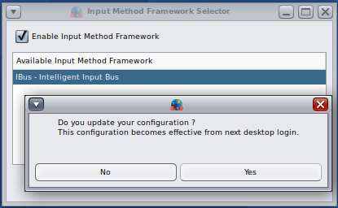
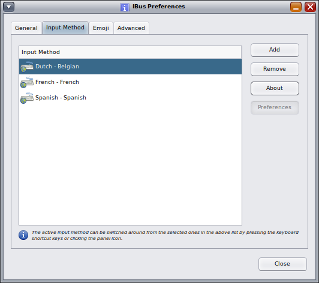

<!--

The contents of this Documentation are subject to the Public Documentation License Version 1.01
 (the "License"); you may only use this Documentation if you comply with the terms of this License.
A copy of the License is available at http://illumos.org/license/PDL.

The Initial Writer of this Documentation is David Stes Copyright (C) 2022
All Rights Reserved. (https://sourceforge.net/u/stes/profile).

Contributor(s): David Stes.

-->

# How to enable the Intelligent Input Bus (IBus)

Input Methods (IM) can be used if you regularly use languages that have large number of characters or complex characters, for example Asian languages like Chinese, Japanese or Korean, but IBus can also be used for Latin languages.

When installing OpenIndiana, you entered a keyboard model for the text console (the keyboard that is used without installing MATE or X11).

See:

```none
    # man kbd
```

The configured keyboard can be retrieved by the command:

```none
    # svcprop -p keymap/layout keymap
    French
```

HAL, the hardware abstraction layer daemon, can probe the layout of self-identifying keyboards but it also uses different methods to figure out the XkbLayout of a keyboard :

```none
    > $ lshal | grep XkbLayout
    >  input.x11_options.XkbLayout = 'fr'  (string)
```

Because X11 auto-configuration can query HAL for the keyboard type, it is useful to check the keyboard type in the lshal output.  HAL uses among other things, the X Keyboard Configuration Database package :

```none
    x11/keyboard/data-xkb
```

This package provides the file:

```none
    /usr/X11/lib/X11/xkb/xkbtable.map
```

Also a default keyboard type (the US keyboard) for HAL is defined in a file provided by xorg itself :

```none
    /etc/hal/fdi/preprobe/10osvendor/10-x11-input.fdi
```

When using MATE and X11, the configured keyboard for X11, which is possibly auto-configured based on the HAL database, because X11 uses HAL on OpenIndiana, can be retrieved by the command:

```none
    # setxkbmap -query
    rules:    base
    model:    sun_type6_euro_usb
    layout:   fr
```

By default IM (Input Methods) are not enabled, and you can configure the keyboard for MATE in the MATE Preferences for Keyboard Hardware.  Choosing a layout there, is usually sufficient for languages that have a smaller number of characters, for example languages using Latin characters as English, Spanish, French, Dutch, German, etc.

IM provides a more complex mechanism for composing characters, and it can be used also for Latin languages.

In the MATE System Menu, under Preferences, select Other and choose Input Method Selector.  There is a checkbox to enable the Input Method Framework.  You can choose an available Input Method Framework, where you have to select the only option, namely IBus - The Intelligent Input Bus.

After clicking OK, the system alerts you to the fact that you have to logout and login again, to apply the new setting :



Note that after enabling the Input Method Framework, there is a $HOME/.imf file in your home directory :

```none
    # more $HOME/.imf
```

The $HOME/.imf file sets the variable GTK_IM_MODULE to ibus and sets XMODIFIERS to @im=ibus to set the IM framework to ibus.

The file /etc/X11/xinit/xinitrc sources the $HOME/.imf file in your home directory by running the 0210.im script in the /etc/X11/xinit/xinitrc.d directory.

After logout and login, you can see that MATE has automatically started a ibus-daemon --xim process.

The IM framework is now enabled (after logout/login) and you can select specific input methods :



The above screenshot shows for example the Dutch-Belgian input method.   Additional input methods such as Spanish or other input methods can be added without a need to login or logoff.

If you disable the IM , the $HOME/.imf file in your home directory will be replaced by an empty file that is created and maintained by the Input Method selector tool.  In order to apply the new $HOME/.imf file, you have to logout and login again.

The OpenIndiana default is not to run IM.

</div>

