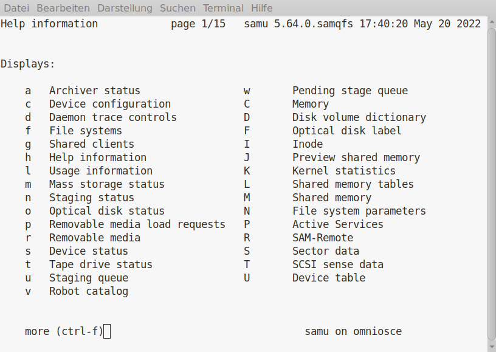

<!--

The contents of this Documentation are subject to the Public Documentation License Version 1.01
 (the "License"); you may only use this Documentation if you comply with the terms of this License.
A copy of the License is available at http://illumos.org/license/PDL.


The Original Documentation is _________________.

The Initial Writer of the Original Documentation is Carsten Grzemba Copyright (C) 2022.
All Rights Reserved. (Initial Writer contact(s): cgrzemba@opencsw.org).

Contributor(s): ______________________________________.

Portions created by ______ are Copyright (C)_________[Insert year(s)].
All Rights Reserved. (Contributor contact(s):________________[Insert hyperlink/alias]).

-->

# Storage Archive Manager File System on OpenIndiana Hipster

Some notes for installation and use of Storage Archive Manager on OpenIndiana Hipster.

<div class="note" markdown="1">
!!! note
    This configuration is not supported by OI nor by Oracle.
</div>

## SamFS versus QFS

It seems like this product contains two different filesystems. QFS (quick file system) can be shared between multiple hosts, if you use shared storge like it is possible in FC-SAN. For QFS you need two different kinds of block storage, one for metadata and one for the file data.

If you configure the archive service then QFS becomes SamFS. Archive service means here, the filesystem content can automatically create up to 4 copies on different storage devices. The archiving is controlled by policies. The archive storage can be inexpensive disk storage, NFS-Share or tape storage. Nowadays tape storage is managed by generic SCSI libraries. So policy based storage tiering is applied.

The benefit of this product is that the archive service stores the copies on archive storage in ordinary TAR files. For instance you lost your SamFS asset and are left with only the tape media, data can simply be restored with the Unix `tar` command.

If the filesystem becomes full the data blocks of a file can be released and the file turns to offline. So the limit of the SamFS file system is determined by the space for the metadata in the metadata device.

SamFS is a good solution, if you:

* have a lot of rarely used data
* you wish to have backup copies of your data, best on tape
* prefer to secure your data by WORM

## Notes about this release

This version is updated in relation to the original version released by Sun Microsystems 2009:

* current OHSM dumps can be restored, NFSv4 ACL's or LTFS information will be ignored
* LTO-5 -- LTO-9 tape drives added and tested
* samst driver replaced by sgen
* Sun Support framework removed
* the Web based managment tool, part of the Sun webconsole was never tested, however the libsammgmt based tools like `samcrondump` are still working.
* userland daemons and tools now build in 64bit

## Install

SamQFS can simply installed by:

```
# pkg install samqfs
```

This will install the entire software, add the filesystem driver `samfs`, two additional pseudo device drivers `samioc` and `samaio` as well as two SMF services:

```
online         Feb_08   svc:/system/samqfs-postinstall:default
online         Feb_08   svc:/system/sam-fsd:default
```

Keep in mind that the service 'sam-fsd' only needs to enabled temporarily.

The `system/samqfs-postinstall` SMF will setup the `/etc/opt/SUNWsamfs` directory from template files. All the configuration files of Storage Archive Manager reside within this directory. The local state files are in `/var/opt/SUNWsamfs`.

## A small home server setup

Let's assume you have a home server running OpenIndiana Hipster. The internal disks are configured in a Zpool. You want to have backup copies of your data so that you are prepared in the case of damaged or lost data.

### SamFS file system

Configure two Zvols, one Zvol `rpool/samfsmm` for metadata e.g. 10g size and one Zvol `rpool/samfsmr` for the file content e.g. 1TB.

Configure the SamFS file system in the `/etc/opt/SUNWsamfs/mcf` (main configuration file) as follows:

```
#
# Sun StorEdge SAM-FS file system configuration example
#
# Equipment       Eq Eq Family Dev Additional
# Identifier      Nm Tp Set    St  Parameters
# --------------- -- -- ------ --- ----------
samfs1            10 ma samfs1
/dev/zvol/dsk/rpool/samfsmm 11 mm samfs1 -
/dev/zvol/dsk/rpool/samfsmr 12 mr samfs1 -
```

run

```
# sam-fsd
```

and check output for errors

and then

```
# sammkfs samfs1
```

then you can mount the SamFS file system

```
# mount -T samfs samfs1 /archive
```

It is suggested to add the following to `/etc/vfstab`.


```
samfs1  -  /sam1   samfs  -  no   -
```

### Archive Storage

The copies should be stored on external USB-drives. Hence we connect two USB-drives and create two Zpools `usbdisk1` and `usbdisk2` on  them. For the archive service create the config file `/etc/opt/SUNWsamfs/diskvols.conf`

```
#
#       diskvols.conf
#
#  VSN Name [Host Name:]Path
#
usbdisk01 /usbdisk1/samarch
usbdisk02 /usbdisk2/samarch
```

On the Zpools two ZFS datasets `usbdisk[12]/samarch` are created.

### Archive Rule

Now we determine the archive policies in the config file `/etc/opt/SUNWsamfs/archiver.cmd`.

```
#
#       Global Directives
#
#
logfile = /var/opt/SUNWsamfs/logs/archiver.log
#
#
#       File System Directives
#
fs = samfs1
        1 4m -norelease
        2 16m
#
#       VSN Directives
#
vsns
samfs1.1 dk usbdisk01
samfs1.2 dk usbdisk02
endvsns
```

We define to create 2 copies of your data files on `/archive`, after 4 minutes write the first copy on `usbdisk1`, the second after 16m on `usbdisk02`. The file should stay online on the filesystem until the second copy is made.

### check the configuration

```
# sam-fsd
...
# archiver -lv
...
```

### activate the configuration

```
# samd config
# pkill -HUP sam-fsd
```

## A VTL setup

For use of a SCSI Tape Library we have to configure `sgen` for use with an autochanger
run the following:

```
update_drv -a -i '"scsiclass,08"' sgen
```

If no physical tape library is available, the Quadstor VTL is a simple alternative.

https://www.quadstor.com/

The VTL will connected via ISCSI. Install ISCSI client:

```
root@oi-sr:~# pkg install network/iscsi/initiator
```

If you have successfully configured ISCSI initiator, then you can see ISCSI devices. In this example we see a Quantum i500 VTL with two tape drives:

```
root@oi-sr:~# iscsiadm list target -S
Target: iqn.2006-06.com.quadstor.vtl.i500.drive2
        Alias: -
        TPGT: 1
        ISID: 4000002a0000
        Connections: 1
        LUN: 0
             Vendor:  IBM
             Product: ULT3580-TD8
             OS Device Name: /dev/rmt/2n

Target: iqn.2006-06.com.quadstor.vtl.i500.drive1
        Alias: -
        TPGT: 1
        ISID: 4000002a0000
        Connections: 1
        LUN: 0
             Vendor:  IBM
             Product: ULT3580-TD8
             OS Device Name: /dev/rmt/3n

Target: iqn.2006-06.com.quadstor.vtl.i500.autoloader
        Alias: -
        TPGT: 1
        ISID: 4000002a0000
        Connections: 1
        LUN: 0
             Vendor:  QUANTUM
             Product: Scalar i500
             OS Device Name: /dev/scsi/changer/c1t0d0

```

Now you are ready to configure the tape library for SamFS. Add to the /etc/opt/SUNWsamfs/mcf:

```
/dev/scsi/changer/c1t0d0 50 rb i500 on i500
/dev/rmt/1cbn   51      tp      i500     on
/dev/rmt/2cbn   52      tp      i500     on
```

Unfortunately the inquiry of the virtual LTO-8 devices does not work, therefore the config has to be manually added to '/kernel/drv/st.conf'

```
tape-config-list= "IBM     ULT3580-TD8", "IBM     ULT3580-TD8", "CFGIBMULT3580TD8";

CFGIBMULT3580TD8 = 2,0x3B,0,0x1018619,4,0x5C,0x5D,0x5E,0x5E,3,60,2340,600,2940,960,960,65535;
```

## SamFS at work

If a SAM files system is mounted, the following system state is seen:

Three kernel modules are loaded:

```
$ modinfo | grep SAM-QFS
204 fffffffff8158000  e8450   6   1  samfs (SAM-QFS: Storage Archiving Mgmt)
205 fffffffff7e787b8    9a0 312   1  samioc (SAM-QFS system call interface)
206 fffffffff8096000   15b8 314   1  samaio (SAM-QFS pseudo AIO driver)
```

Two SMF's are online

```
$ svcs | grep sam
online         Feb._07  svc:/system/sam-fsd:default
online         Feb._07  svc:/system/samqfs-postinstall:default
```

In userland the services are controled by the sam-fsd

```
$ ptree `pgrep sam-fsd`
568    /opt/SUNWsamfs/sbin/sam-fsd -D
  617    sam-archiverd
    737    sam-arfind samfs1
  618    sam-stagealld
  619    sam-stagerd
```

Once you have tape-library configured the library daemons will be started.

```
$ ptree `pgrep sam-fsd`
9043   /opt/SUNWsamfs/sbin/sam-fsd -D
  9044   sam-stagealld
  9054   sam-archiverd
    9057   sam-arfind samfsfc
    9058   sam-arfind samfs1
  9055   sam-stagerd
  9528   sam-amld
    9530   sam-catserverd 201326610 201326611
    9829   sam-scannerd 201326610 201326611
    9830   sam-robotsd 201326610 201326611
      9854   sam-genericd 201326610 201326611 50
      9855   sam-genericd 201326610 201326611 60
      9872   sam-stkd 201326610 201326611 70
        9885 /opt/SUNWsamfs/sbin/ssi_so 9885 50025 23
        9895 sam-stk_helper 201326610 70
    9831   sam-rpcd 201326610 201326611
```

In this example two SAM file systems 'samfsfc' and 'samfs1' are mounted and two libraries configured, one of them via ACSLS. The RPC service is started for remote controlling the SamFS.

## SamFS usage

A SamFS filesystem can never be become full as long as the archive storage is not full. Because the SamFS is a hierachical filesystem it can release data blocks of files which not needed in the moment. On SamFS such file is called 'offline'.

If an attempt is made to open a file which is offline the stager will copy the data blocks back from archive storage.

### File versioning

If you change a file the archive service will automatically create new archive copies.

It is recommended to save the metadata of the filesystem (inodes) for situations where you have to recover the SamFS filesystem.

With assistance of such metadata dumps you are able to recover older versions of the files also.

## SamFS administration

Too much CLI for you? There is a more comfortable terminal tool available: `/opt/SUNWsamfs/sbin/samu`.


These are some of common CLI tools for filesystems. However in SamFS the prefix 's' is added.

| Unix command | SamFS command | notes
| --- | --- | ---
| ls | sls | most commonly user with option `-D`
| find | sfind | extended to manage finding archive copies
| du | sdu | shows real filesystem usage
| tar | star | handles SamFS archives

Detailed explanation of all commands as well as configuration examples can be found in the manual pages.

# External documentation references

An overview on Wikipedia

* [SAM-QFS](https://en.wikipedia.org/wiki/QFS)

Product documentation from wikis.[sun|oracle].com

* [Sun SAM-QFS](http://web.archive.org/web/20150515215725/https://wikis.oracle.com/display/SAMQFS/Sun+SAM-QFS+5.2)
