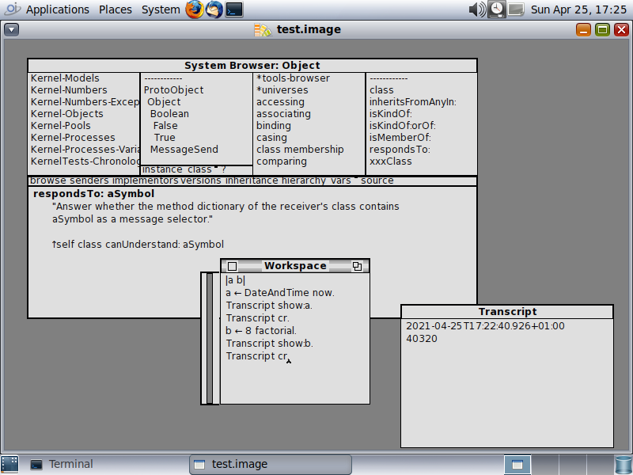
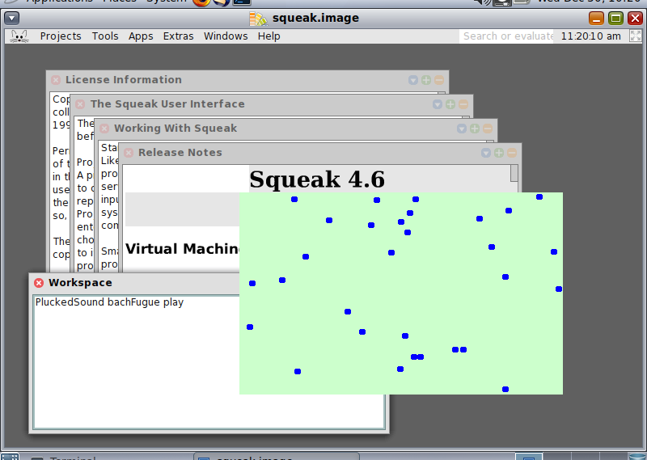
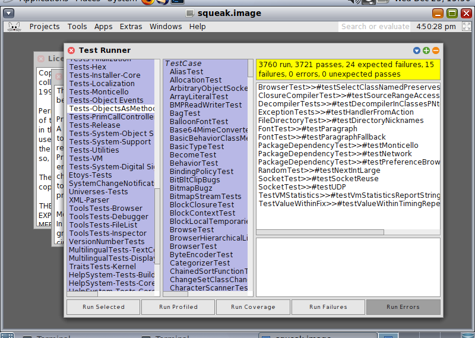
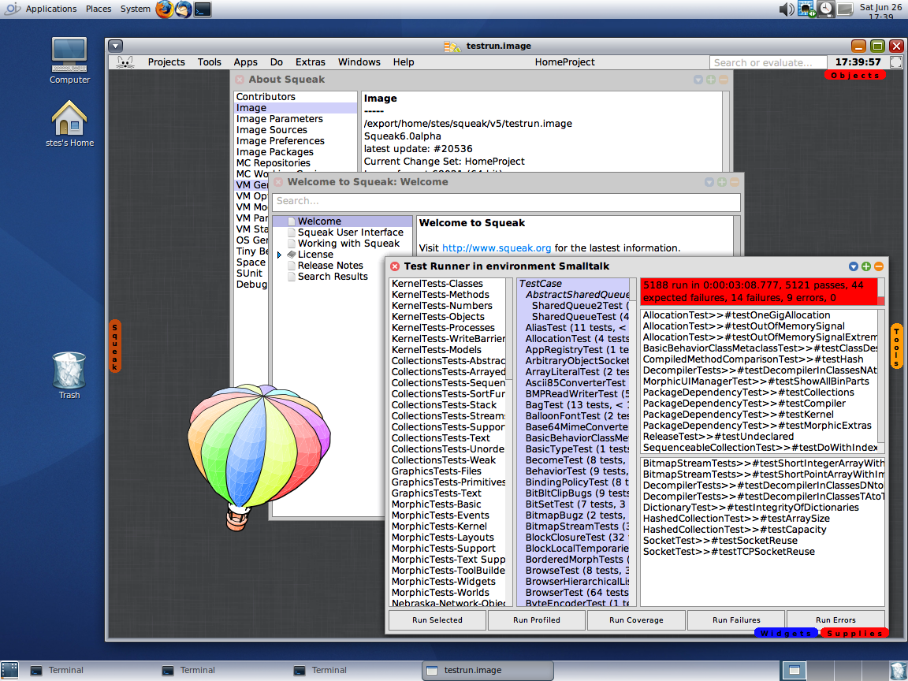
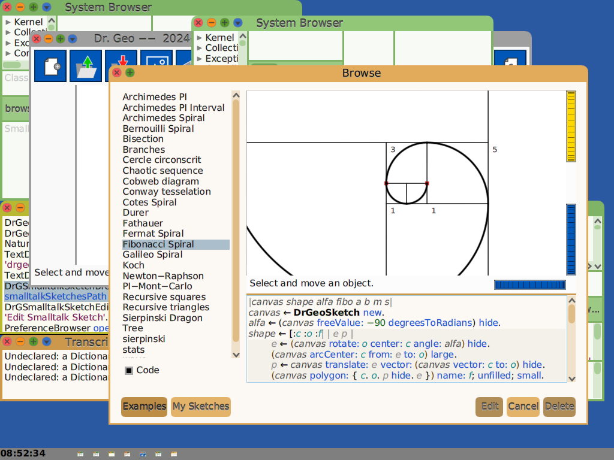

<!--

The contents of this Documentation are subject to the Public Documentation License Version 1.01
 (the "License"); you may only use this Documentation if you comply with the terms of this License.
A copy of the License is available at http://illumos.org/license/PDL.


The Original Documentation is at https://squeak.org/documentation/

The Initial Writer of this Documentation is David Stes Copyright (C) 2020-2024
All Rights Reserved. (https://sourceforge.net/u/stes/profile).

Contributor(s): David Stes.

-->

# Squeak, Cuis and Smalltalk-80

The following notes document the steps to install Squeak and Cuis on OpenIndiana Hipster, and how to use these implementations of Smalltalk-80.

A set of example Vagrantfiles that use the OpenIndiana Hipster operating system to run Squeak Smalltalk can be cloned from github by :

```none
        # git clone https://github.com/openindiana/vagrantfiles
```

These Vagrant guests can be ran on a Linux host or OpenIndiana host, assuming that you have the Vagrant software on the host.  Vagrant forwards the X11 DISPLAY over SSH so that it is possible to forward the Squeak display in an OpenIndiana guest to a Linux host, for example.

Squeak consists of a VM (virtual machine) and Smalltalk images.  You can find Smalltalk images at [files.squeak.org](http://files.squeak.org) or at [cuis.st](https://cuis.st).

Cuis and Squeak both use the Squeak VM, but they offer different Smalltalk images.  The Squeak images have traditional MVC (Model, View, Controller) and Morphic graphical user interface classes.   Cuis has Morphic-3, which is an enhanced set of Morphic classes.

See the [Squeak website](http://www.squeak.org) for more and general information on Squeak, specifically the documentation section.  See [cuis.st](https://cuis.st) for more info Cuis.  Also see the Squeak Wiki : [Squeak Wiki](http://wiki.squeak.org)

## Classic VM and OpenSmalltalk VM

There are currently three Squeak packages for OpenIndiana : squeak, stack-spur and cog-spur.  Their package names begin with pkg:/runtime/smalltalk.  These packages can be installed simultaneously mediated by the squeak mediator (see below).

```none
        # pkg list | grep smalltalk
        runtime/smalltalk/squeak                4.19.6-2020.0.1.4          i--
        runtime/smalltalk/squeak-display-X11    4.19.6-2020.0.1.4          i--
        runtime/smalltalk/squeak-nodisplay      4.19.6-2020.0.1.4          i--
        runtime/smalltalk/cog-spur              5.0.2957-2020.0.1.0        i--
        runtime/smalltalk/cog-spur-display-X11  5.0.2957-2020.0.1.0        i--
        runtime/smalltalk/cog-spur-nodisplay    5.0.2957-2020.0.1.0        i--
```

The basic squeak package corresponds to the classical virtual machine (VM).  The stack-spur and cog-spur packages are OpenSmalltalk based virtual machines, where stack-spur is the OpenSmalltalk stack VM, using the Spur memory management, and cog-spur is the OpenSmalltalk cog VM, also using the Spur memory management; the cog VM is a just-in-time compiler (JIT) which is a faster implementation of Squeak.

A first screenshot illustrates squeak, version 4.19.6, running on OpenIndiana, with an old style MVC (Model, View, Controller) look and feel :



The following screenshot illustrates squeak, version 4.19.3, with the (default) Morphic user interface, running on OpenIndiana, playing bachFugue through pulseaudio, and with a classical Smalltalk bouncing atoms animation :



Squeak has a Test Runner.  The following screenshot illustrates squeak and the results of running a number of tests :



The following screenshot illustrates cog-spur, version 5.0.2967 and the results of running a number of tests on a 64-bit Squeak 6.0.20536 image :



The next screenshot illustrates the squeak 4.19.6 running the Cuis Smalltalk system, with the Cuis Morphic userinterface and SVG (Scalable Vector Graphics) support.   The Squeak VM for OpenIndiana has a SVGPluginEngine for fast rendering and manipulation of Scalable Vector Graphics :


The last screenshot illustrates Cuis running the DrGeo software on OpenIndiana for teaching and exploring mathematics and geometry :



## OpenIndiana Prerequisites

Before installing, the OpenIndiana system should have some required packages installed.

To check the required dependencies for Squeak, use the command:

```none
        # pkg contents -r -t depend squeak
```

or

```none
        # pkg contents -r -t depend stack-spur
```

or

```none
        # pkg contents -r -t depend cog-spur
```

This will list a number of dependencies.  If those are not met, you should upgrade OpenIndiana before attempting to install Squeak.

You can upgrade OpenIndiana and check the dependencies again:

```none
        # pkg update -v
```

Squeak is in the OpenIndiana userland-incorporation package since version 0.5.11-2020.0.1.13018.

Use the following command to check the installed consolidation:

```none
        # pkg list userland-incorporation
```

The installed version should be more recent than 0.5.11-2020.0.1.13018.

Squeak for OpenIndiana provides a vm-display-X11 plugin for using the X11 window system.  By setting the X11 DISPLAY variable or by using X11 forwarding over SSH, it is possible to run Squeak remotely and forward the display to another machine.

It is also possible to run Squeak without display, or headlessly.

## Installing squeak, the classic VM

On OpenIndiana install squeak as follows:

```none
       # pkg install -v squeak
```

After installation, see the squeak(1) manpage for documentation:

```none
       # man squeak
```

After installation you can verify the installation as follows:

```none
       # pkg list squeak
       # pkg list squeak-nodisplay
       # pkg list squeak-display-X11
```

The squeak-nodisplay package is for running squeak with the -nodisplay option, headless, without display.  The squeak-display-X11 adds the necessary plugins for running X11, but still without all plugins.  squeak depends on squeak-nodisplayand squeak-display-X11 and it installs all plugins.

During installation you may also notice:

```none
       Changed mediators:
         mediator squeak:
         version: None -> 4 (system default)
```

The OpenIndiana mediator squeak selects which version of Squeak to use: squeak or one of the stack-spur or cog-spur.

There is a utility included to start using Squeak :

```none
       # inisqueak
```

This is equivalent to downloading the Smalltalk sources and image from the Squeak website:

```none
       # unzip SqueakV46.sources.zip
```

and

```none
       # unzip Squeak4.6-15102.zip
```

You would then launch Squeak as follows (also see the manpage for further details) :

```none
       # squeak Squeak4.6-15102.image
```

## Installing the OpenSmalltalk VM

It is possible to simultaneously install squeak and opensmalltalk as follows:

```none
         # pkg install -v stack-spur
```

At the end of installation the hardlink squeak will point to the stack-spur binary.  You will notice that the mediator changed to version 5.

```none
        # pkg mediator squeak
```

The system-administrator can override the OpenIndiana choice by using the pkg set-mediator or pkg unset-mediator commands.

After installation of opensmalltalk, it is possible again to use inisqueak :

```none
        # inisqueak
```

This is equivalent to downloading sources and Smalltalk images from the Squeak website :

```none
         # unzip SqueakV50.sources.zip
```

and

```none
         # unzip Squeak5.3-19431-64bit.zip
```

You would then launch squeak as follows:

```none
         # squeak Squeak5.3-19431-64bit.image
```

Squeak V5 can also run Cuis images.  See the Cuis website for more details.  Given the CuisV5.sources and Cuis5.0-4112.image :

```none
         # squeak Cuis5.0-4112.image
```

Because both packages can be installed simultaneously it is possible to run side-by-side Squeak 4.6 and Squeak 5.3, Cuis Smalltalk or Squeak 6.0 alpha images.

There is an additional package cog-spur which is the Cog implementation of Squeak.  This is a faster implementation of the Squeak virtual machine.

It can be installed as follows:

```none
         # pkg install -v cog-spur
```

During installation of the cog implementation, the mediator will be changed as follows:

```none
         Changed mediators:
         mediator squeak:
           version: None -> 5 (system default)
           implementation: None -> cog-spur (system default)
```

The stack-spur and cog-spur packages can be installed at the same time, and the system administrator can choose the implementation with the pkg unset-mediator and set-mediator commands.

## Modifying the policy.conf file for OpenSmalltalk

The following notes do not apply to classic squeak, they only apply to OpenSmalltalk.

The OpenSmalltalk VM stack-spur or cog-spur will print the following error:

```none
        # pthread_setschedparam failed: Not owner
```

This is due to a lack of "proc_priocntl" privilege.

```none
        # ppriv -v -l proc_priocntl
```

This privilege allows a process to elevate its priority above its current level.  It allows a process to change its scheduling class to any scheduling class, including the RT class.

You can change the following in the /etc/security/policy.conf:

```none
        # cp /etc/security/policy.conf /etc/security/policy.conf.orig
```

change

```none
        #PRIV_DEFAULT=basic
```

to

```none
        PRIV_DEFAULT=basic,proc_priocntl
```

You can run squeak in a zone and do the above in a zone only.
If you run squeak in a zone, you may also have to set the privilege limit:

```none
        # zonecfg -z example-zone info | grep limitpriv
        limitpriv: default,proc_priocntl
```

## Updating Squeak

The complete OpenIndiana system can be updated with:

```none
         # pkg update
```

to update the entire userland-incorporation.

If there is a need to install a different version of squeak, without upgrading the userland-incorporation, you can do :

```none
         # pkg change-facet facet.version-lock.runtime/smalltalk/stack-spur=false
```

and

```none
         # pkg change-facet facet.version-lock.runtime/smalltalk/stack-spur-nodisplay=false
```

This can make it possible to update stack-spur without updating the userland-incorporation:

```none
         # pkg list userland-incorporation
```

and then update stack-spur or any other squeak package separately:

```none
         # pkg update stack-spur
```

## Uninstalling Squeak

To uninstall squeak, the command is :

```none
         # pkg uninstall squeak squeak-nodisplay squeak-display-X11
```

For opensmalltalk :

```none
         # pkg uninstall cog-spur cog-spur-nodisplay cog-spur-display-X11
```

Note that the nodisplay package is not necessarily uninstalled by uninstalling squeak or cog-spur.

