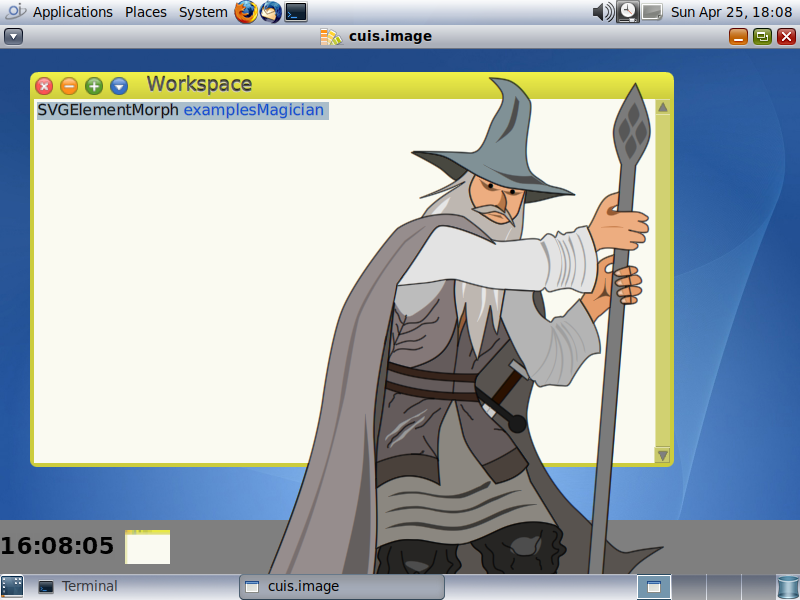

<!--

The contents of this Documentation are subject to the Public Documentation License Version 1.01
 (the "License"); you may only use this Documentation if you comply with the terms of this License.
A copy of the License is available at http://illumos.org/license/PDL.


The Original Documentation is at https://squeak.org/documentation/

The Initial Writer of this Documentation is David Stes Copyright (C) 2020.
All Rights Reserved. (https://sourceforge.net/u/stes/profile).

Contributor(s): David Stes.

-->


# Hipster Handbook - Squeak, Cuis and Smalltalk-80

The following notes document the steps to install Squeak and Cuis on OpenIndiana Hipster, and how to use these implementations of Smalltalk-80.

Squeak consists of a VM (virtual machine) and Smalltalk images.  You can find Smalltalk images at <a href= "http://files.squeak.org" target="_blank">files.squeak.org</a> or at <a href="http://cuis-smalltalk.org" target="_blank">cuis-smalltalk.org</a>.

Cuis and Squeak both use the Squeak VM, but they offer different Smalltalk images.  The Squeak images have traditional MVC (Model, View, Controller) and Morphic graphical user interface classes.   Cuis has Morphic-3, which is an enhanced set of Morphic classes.

See the <a href="http://www.squeak.org" target="_blank">Squeak website</a> for more and general information on Squeak, specifically the documentation section.  See <a href="http://cuis-smalltalk.org" target="_blank">cuis-smalltalk.org</a> for more info Cuis.  Also see the Squeak Wiki : <a href= "http://wiki.squeak.org" target="_blank">Squeak Wiki</a>

## Classic VM and OpenSmalltalk VM

There are currently three Squeak packages for OpenIndiana : squeak-4, squeak-5 and squeak-5c.

The squeak-4 package corresponds to the classic virtual machine (VM).  The squeak-5 packages are OpenSmalltalk based virtual machines, where squeak-5 is the OpenSmalltalk stack VM and squeak-5c is the OpenSmalltalk cog VM.

A first screenshot illustrates squeak-4, version 4.19.6, running on OpenIndiana,with an old style MVC (Model, View, Controller) look and feel :


The following screenshot illustrates squeak-4, version 4.19.3, with the (default) Morphic user interface, running on OpenIndiana, playing bachFugue through pulseaudio, and with a classical Smalltalk bouncing atoms animation :


Squeak has a Test Runner.  The following screenshot illustrates squeak-4 and the results of running a number of tests :


The last screenshot illustrates the squeak 4.19.6 running the Cuis Smalltalk system, with the Cuis Morphic userinterface and SVG (Scalable Vector Graphics) support.   The Squeak VM for OpenIndiana has a SVGPluginEngine for fast rendering and manipulation of Scalable Vector Graphics :



## OpenIndiana Prerequisites

Before installing, the OpenIndiana system should have some required packages installed.

To check the required dependencies for Squeak, use the command:

```none
        # pkg contents -r -t depend squeak-4
```

or

```none
        # pkg contents -r -t depend squeak-5
```

This will list a number of dependencies.  If those are not met, you should upgrade OpenIndiana before attempting to install Squeak.

You can upgrade OpenIndiana and check the dependencies again:

```none
        # pkg update -v
```

Squeak is in the OpenIndiana userland-incorporation package since version 0.5.11-2020.0.1.13018.

Use the following command to check the installed consolidation:

```none
        # pkg list userland-incorporation
```

The installed version should be more recent than 0.5.11-2020.0.1.13018.

Squeak is a graphically oriented system, and it is recommended to install a desktop (graphical) environment, such as the MATE desktop, on OpenIndiana, in order to use Squeak.  It is possible to run Squeak without display, or headless, but generally speaking it is a prerequisite to install a desktop to use the Squeak integrated development environment (IDE).

One way to get a MATE desktop (there exist other methods) is to run the OpenIndiana text installer and then install the group package "mate_install" and then enable the Light Display Manager as follows:

```none
        # pkg install -v --accept mate_install
```

```none
        # svcadm enable graphical-login/lightdm
```

This enables the "light display manager".

In any case, even if you do a direct desktop installation (without running through the text based installation of OpenIndiana), take care about the ip address and hostname of the system.

Squeak will try to use the ip address that corresponds to the hostname of the system as its ip address.

So multi-homed systems (with multiple network interfaces) may have some strange behavior for TCP/IP networking inside Squeak.  This may require some experimentation to see what works.

We've tested Squeak with a text-based installation with fixed IP address and hostname resolving is set up so that the fixed ip address corresponds to the hostname, and there were no other network interfaces on the test server.

## Installing squeak-4, the classic VM

On OpenIndiana install squeak-4 as follows:

```none
       # pkg install -v squeak-4
```

After installation, see the squeak(1) manpage for documentation:

```none
       # man squeak
```

After installation you can verify the installation as follows:

```none
       # pkg list squeak-4
       # pkg list squeak-4-nodisplay
```

The squeak-4-nodisplay package is for running squeak with the -nodisplay option, headless, without display.  squeak-4 depends on squeak-4-nodisplay.

During installation you may also notice:

```none
       Changed mediators:
         mediator squeak:
         version: None -> 4 (system default)
```

The OpenIndiana mediator squeak selects which version of Squeak to use: squeak-4 or squeak-5.

There is a utility included to start using Squeak :

```none
       # inisqueak
```

This is equivalent to downloading the Smalltalk sources and image from the Squeak website:

```none
       # unzip SqueakV46.sources.zip
```

and

```none
       # unzip Squeak4.6-15102.zip
```

You would then launch Squeak as follows (also see the manpage for further details) :

```none
       # squeak Squeak4.6-15102.image
```

## Installing squeak-5, the OpenSmalltalk VM

It is possible to simultaneously install squeak-4 and squeak-5 as follows:

```none
         # pkg install -v squeak-5
```

At the end of installation the hardlink squeak will point to the squeak-5 binary.  You will notice that the mediator changed to squeak-5.

```none
        # pkg mediator squeak
```

The system-administrator can override the OpenIndiana choice by using the pkg set-mediator or pkg unset-mediator commands.

After installation of squeak-5, it is possible again to use inisqueak :

```none
        # inisqueak
```

This is equivalent to downloading sources and Smalltalk images from the Squeak website :

```none
         # unzip SqueakV50.sources.zip
```

and

```none
         # unzip Squeak5.3-19431-64bit.zip
```

You would then launch squeak as follows:

```none
         # squeak Squeak5.3-19431-64bit.image
```

Squeak V5 can also run Cuis images.  See the Cuis website for more details.  Given the CuisV5.sources and Cuis5.0-4112.image :

```none
         # squeak Cuis5.0-4112.image
```

Because both packages can be installed simultaneously it is possible to run side-by-side Squeak 4.6 and Squeak 5.3, Cuis Smalltalk or Squeak 6.0 alpha images.

For most recent Squeak images it will be required to install squeak-5.

There is an additional package squeak-5c which is the Cog implementation of Squeak.  This is a faster implementation of the Squeak virtual machine.

It can be installed as follows:

```none
         # pkg install -v squeak-5c
```

During installation of the cog implementation, the mediator will be changed as follows:

```none
         Changed mediators:
         mediator squeak:
           version: None -> 5 (system default)
           implementation: None -> cog-spur (system default)
```

The squeak-5 and squeak-5c packages can be installed at the same time, and the system administrator can choose the implementation with the pkg unset-mediator and set-mediator commands.

## Modifying the policy.conf file for Squeak-5

The following notes do not apply to squeak-4, they only apply to OpenSmalltalk.

The OpenSmalltalk VM squeak-5 or squeak-5c will print the following error:

```none
        # pthread_setschedparam failed: Not owner
```

This is due to a lack of "proc_priocntl" privilege.

```none
        # ppriv -v -l proc_priocntl
```

This privilege allows a process to elevate its priority above its current level.  It allows a process to change its scheduling class to any scheduling class, including the RT class.

You can change the following in the /etc/security/policy.conf:

```none
        # cp /etc/security/policy.conf /etc/security/policy.conf.orig
```

change

```none
        #PRIV_DEFAULT=basic
```

to

```none
        PRIV_DEFAULT=basic,proc_priocntl
```

You can run squeak in a zone and do the above in a zone only.
If you run squeak-5 in a zone, you may also have to set the privilege limit:

```none
        # zonecfg -z example-zone info | grep limitpriv
        limitpriv: default,proc_priocntl
```

## Updating Squeak

The complete OpenIndiana system can be updated with:

```none
         # pkg update
```

to update the entire userland-incorporation.

If there is a need to install a different version of squeak, without upgrading the userland-incorporation, you can do :

```none
         # pkg change-facet facet.version-lock.runtime/squeak-5=false
```

and

```none
         # pkg change-facet facet.version-lock.runtime/squeak-5-nodisplay=false
```

This can make it possible to update squeak-5 without updating the userland-incorporation:

```none
         # pkg list userland-incorporation
```

and then update squeak-5 or any other squeak package separately:

```none
         # pkg update squeak-5
```

## Uninstalling Squeak

To uninstall squeak-4, the command is :

```none
         # pkg uninstall squeak-4 squeak-4-nodisplay
```

For squeak-5 :

```none
         # pkg uninstall squeak-5 squeak-5-nodisplay
```

Note that the nodisplay package is not necessarily uninstalled by uninstalling squeak-4 or squeak-5.

