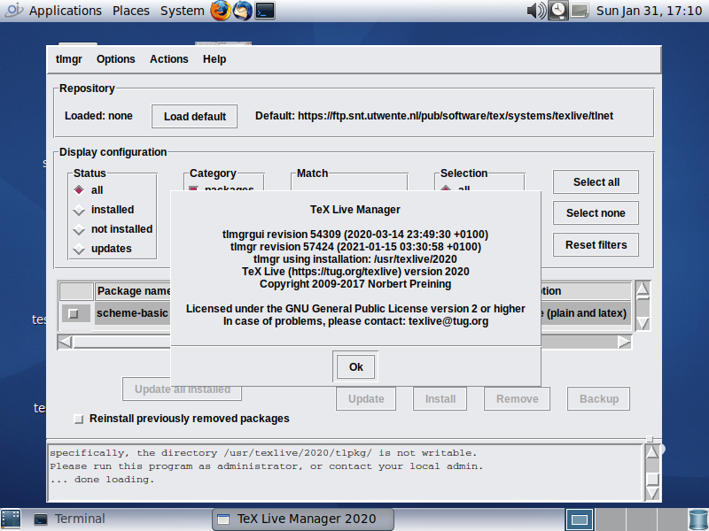

<!--

The contents of this Documentation are subject to the Public Documentation License Version 1.01
 (the "License"); you may only use this Documentation if you comply with the terms of this License.
A copy of the License is available at http://illumos.org/license/PDL.


The Original Documentation is at https://tug.org/texlive/

The Initial Writer of this Documentation is David Stes Copyright (C) 2021-2024.
All Rights Reserved. (https://sourceforge.net/u/stes/profile).

Contributor(s): David Stes.

-->

# TeX Live Typesetting Software

The following notes document the steps to install [TeX Live](http://tug.org/texlive) on OpenIndiana Hipster and how to update it using the tlmgr TeX Live package management tool.

To test a virtual machine running TeXLive on OpenIndiana, you can also run the texlive2021 example Vagrantfiles in the vagrantfiles repository :

```none
        # git clone https://github.com/openindiana/vagrantfiles
```

## TeX Live tlmgr Management Tool

The TeX Live Management Tool has both a command line interface and a GUI.  The GUI (tlmgr gui) uses Perl Tk and works on OpenIndiana.  The following screenshot illustrates tlmgr and the Opendiana MATE desktop :



## TeX Live Cross Platform Installer

See the full TeX Live guide at [http://tug.org/texlive](http://tug.org/texlive/doc/texlive-en/texlive-en.html#installation) for detailed information.

Download the TeX Live Cross Platform Installer from <http://mirror.ctan.org/systems/texlive/tlnet/install-tl-unx.tar.gz>.

There is a script in this package, called install-tl.   The goal is to install TeX Live using the cross platform installer as follows :

```none
        # install-tl
```

Before doing so, create a special BE (Boot Environment) if you plan to install TeX Live as root (installing as non-root user is recommended by TeX Live).

```none
        # beadm create -a texlive
```

Alternatively create a snapshot of the BE to have a possibility to rollback.

The install-tl script installs a utility called tlmgr, the package management utility for TeX Live and, in principle, tlmgr is able to remove (uninstall) a TeX Live installation:

```none
        # tlmgr remove --all
        If you answer yes here the whole TeX Live installation here,
        under /usr/texlive/2020, will be removed!
        Remove TeX Live (y/N): y
        Ok, removing the whole installation:
```

A snapshot of the old BE or a special BE for TeX Live, allows one to rollback to the situation before install without having to use tlmgr to uninstall.

After rebooting into a new BE, run the perl installer script :

```none
        # install-tl --help
```

If you wish to use the TeX Live GUI, install the OpenIndiana Perl Tk package (the tk-perl IPS package is available on OpenIndiana release 2022 or higher) :

```none
        # pkg install -v tk-perl
```

Then run the TeX Live installer GUI as follows :

```none
        # install-tl --gui
```

The next section discusses the interactive mode of the install-tl script.

## TeX Live Cross Platform Installer Main Menus

The cross platform installer version 57337 of install-tl incorrectly identifies OpenIndiana as Solaris on Intel :

```none
./install-tl --version
install-tl (TeX Live Cross Platform Installer) revision 57337
TeX Live (https://tug.org/texlive) version 2020
```

The command to detect the platform is:

```none
./install-tl --print-arch
i386-solaris
```

This is incorrect, but it may work in some cases.  Because OpenIndiana and Solaris are different systems, it may be necessary to download a TeX Live Cross Platform Installer script from the tlnet-archive, and use it with a --repository option.   For example, to install TeX Live 2023 :


```none
# ./install-tl --repository https://texlive.info/tlnet-archive/2023/10/10/tlnet/
```
It is also possible to download custom binaries, and install and use TeX Live with binaries that are not part of the original distribution :

```none
# ./install-tl --custom-bin=/tmp/foobin
```

See the instructions at [http://tug.org/texlive/custom-bin.html](http://tug.org/texlive/custom-bin.html) for detailed information.

The main menus in interactive mode are :

```none
./install-tl
Loading http://ctan.cs.uu.nl/systems/texlive/tlnet/tlpkg/texlive.tlpdb
Installing TeX Live 2020 from: http://ctan.cs.uu.nl/systems/texlive/tlnet (verified)
Platform: i386-solaris => 'Solaris on Intel x86'
Distribution: net  (downloading)
Using URL: http://ctan.cs.uu.nl/systems/texlive/tlnet
Directory for temporary files: /tmp/eCcsGDKJWY
======================> TeX Live installation procedure <=====================

======>   Letters/digits in <angle brackets> indicate   <=======
======>   menu items for actions or customizations      <=======

 Detected platform: Solaris on Intel x86

 <B> set binary platforms: 1 out of 16

 <S> set installation scheme: scheme-full

 <C> set installation collections:
     40 collections out of 41, disk space required: 7130 MB

 <D> set directories:
   TEXDIR (the main TeX directory):
     !! default location: /usr/local/texlive/2020

 <O> options:
   [ ] use letter size instead of A4 by default
   [X] allow execution of restricted list of programs via \write18
   [X] create all format files
   [X] install macro/font doc tree
   [X] install macro/font source tree
   [ ] create symlinks to standard directories

 <V> set up for portable installation

Actions:
 <I> start installation to hard disk
 <P> save installation profile to 'texlive.profile' and exit
 <H> help
 <Q> quit

Enter command:
```

To add the 64bit executables go into menu "B" :

```none
===============================================================================
Available platforms:

   a [ ] Cygwin on Intel x86 (i386-cygwin)
   b [ ] Cygwin on x86_64 (x86_64-cygwin)
   c [ ] MacOSX current (10.13-) on x86_64 (x86_64-darwin)
   d [ ] MacOSX legacy (10.6-) on x86_64 (x86_64-darwinlegacy)
   e [ ] FreeBSD on x86_64 (amd64-freebsd)
   f [ ] FreeBSD on Intel x86 (i386-freebsd)
   g [ ] GNU/Linux on ARM64 (aarch64-linux)
   h [ ] GNU/Linux on ARMv6/RPi (armhf-linux)
   i [ ] GNU/Linux on Intel x86 (i386-linux)
   j [ ] GNU/Linux on x86_64 (x86_64-linux)
   k [ ] GNU/Linux on x86_64 with musl (x86_64-linuxmusl)
   l [ ] NetBSD on x86_64 (amd64-netbsd)
   m [ ] NetBSD on Intel x86 (i386-netbsd)
   o [X] Solaris on Intel x86 (i386-solaris)
   p [ ] Solaris on x86_64 (x86_64-solaris)
   s [ ] Windows (win32)
```

Select "p" to add Solaris on x86_64 for the TeX Live binaries for that architecture.

TeX Live works with "schemes"; the basic scheme (TeX and latex) requires about 270 MB of space :

```none
===============================================================================
Select scheme:

 a [ ] full scheme (everything)
 b [ ] medium scheme (small + more packages and languages)
 c [ ] small scheme (basic + xetex, metapost, a few languages)
 d [X] basic scheme (plain and latex)
 e [ ] minimal scheme (plain only)
 f [ ] ConTeXt scheme
 g [ ] GUST TeX Live scheme
 h [ ] infrastructure-only scheme (no TeX at all)
 i [ ] teTeX scheme (more than medium, but nowhere near full)
 j [ ] custom selection of collections

Actions: (disk space required: 270 MB)
 <R> return to main menu
 <Q> quit
```

The default installation is going to /usr/local/texlive/2020, but in the Directories menu this can be changed :

```none
Directories customization:

 <1> TEXDIR:         /usr/texlive/2020
     main tree:      /usr/texlive/2020/texmf-dist

 <2> TEXMFLOCAL:     /usr/texlive/texmf-local
 <3> TEXMFSYSVAR:    /usr/texlive/2020/texmf-var
 <4> TEXMFSYSCONFIG: /usr/texlive/2020/texmf-config
 <5> TEXMFVAR:       ~/.texlive2020/texmf-var
 <6> TEXMFCONFIG:    ~/.texlive2020/texmf-config
 <7> TEXMFHOME:      ~/texmf
```

The installer can also create symbolic links such as /usr/bin/tex to the /usr/texlive/2020 binaries, as can be set in the Options menu :

```none
===============================================================================
Options customization:

 <P> use letter size instead of A4 by default: [ ]
 <E> execution of restricted list of programs: [X]
 <F> create all format files:                  [X]
 <D> install font/macro doc tree:              [X]
 <S> install font/macro source tree:           [X]
 <L> create symlinks in standard directories:  [X]
            binaries to: /usr/bin
            manpages to: /usr/share/man
                info to: /usr/share/info
```

## TeX Live Package Manager Queries

After installation of TeX Live, it is possible to make queries on what is exactly installed :

```none
# tlmgr info schemes
i scheme-basic: basic scheme (plain and latex)
  scheme-context: ConTeXt scheme
  scheme-full: full scheme (everything)
  scheme-gust: GUST TeX Live scheme
i scheme-infraonly: infrastructure-only scheme (no TeX at all)
  scheme-medium: medium scheme (small + more packages and languages)
i scheme-minimal: minimal scheme (plain only)
  scheme-small: small scheme (basic + xetex, metapost, a few languages)
  scheme-tetex: teTeX scheme (more than medium, but nowhere near full)
```

The above output shows that scheme-minimal, scheme-infraonly and scheme-basic were installed.

New updates can be retrieved from the repository.  Unless a special repository was used during installation (with the --repository switch for install-tl), the output of the default package repository can be something like :

```none
# tlmgr option repository
Default package repository (repository): http://ctan.cs.uu.nl/systems/texlive/tlnet
```

Information on specific packages can be obtained with tlmgr :

```none
# tlmgr info babel
package:     babel
category:    Package
shortdesc:   Multilingual support for Plain TeX or LaTeX
longdesc:    This package manages culturally-determined typographical (and other) rules for a wide range of languages. A document may select a single language to be supported, or it may select several, in which case the document may switch from one language to another in a variety of ways. Babel uses contributed configuration files that provide the detail of what has to be done for each language. Included is also a set of ini files for about 200 languages. Many language styles work with pdfLaTeX, as well as with XeLaTeX and LuaLaTeX, out of the box. A few even work with plain formats.
installed:   Yes
revision:    57530
sizes:       src: 1469k, doc: 809k, run: 3729k
relocatable: No
cat-version: 3.53
cat-license: lppl1.3
cat-topics:  multilingual
cat-related: polyglossia
cat-contact-repository: https://github.com/latex3/babel
cat-contact-bugs: https://github.com/latex3/babel/issues
collection:  collection-latex
```

## TeX Live Updating

Suppose that you have installed a version of TeX Live from a specific date :

```none
# ./install-tl --repository https://texlive.info/tlnet-archive/2020/12/28/tlnet/
```

After installation, you have TeX Live from December 28, 2020.

It is possible then to change the repository and update to the latest version.

```none
# tlmgr option repository https://texlive.info/tlnet-archive/2021/01/28/tlnet
tlmgr: setting default package repository to https://texlive.info/tlnet-archive/2021/01/28/tlnet
tlmgr: updating /usr/texlive/2020/tlpkg/texlive.tlpdb
```

To update the packages of TeX Live to the default repository :

```none
# tlmgr update --all
```

The TeX Live package management tool has its own mechanism of making backups:

```none
/usr/texlive/2020/tlpkg/backups
```

## Removing TeX Live

In principle, tlmgr is able to remove (uninstall) a TeX Live installation:

```none
        # tlmgr remove --all
        If you answer yes here the whole TeX Live installation here,
        under /usr/texlive/2020, will be removed!
        Remove TeX Live (y/N): y
        Ok, removing the whole installation:
```

If you have made a BE (boot environment) from before the TeX Live installation you can also rollback to an older BE as an alternative to uninstalling the software with tlmgr.


