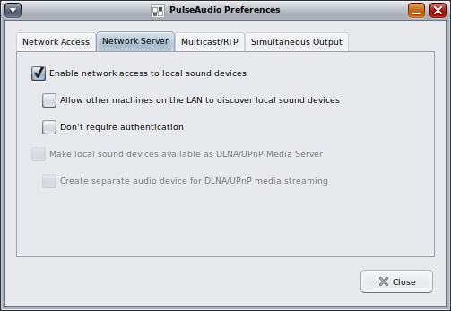

<!--

The contents of this Documentation are subject to the Public Documentation License Version 1.01
 (the "License"); you may only use this Documentation if you comply with the terms of this License.
A copy of the License is available at http://illumos.org/license/PDL.


The Original Documentation is at https://squeak.org/documentation/

The Initial Writer of this Documentation is David Stes Copyright (C) 2021.
All Rights Reserved. (https://sourceforge.net/u/stes/profile).

Contributor(s): David Stes.

-->

# Vagrant Installation

The following notes document the steps to install Vagrant on OpenIndiana Hipster.

Vagrant is a tool for building and managing virtual machine environments in a single workflow.  See [vagrantup.com](https://www.vagrantup.com/) or [hashicorp.com](https://www.hashicorp.com/) for more information.

The following notes explain how to build vagrant from source for OpenIndiana and how to use vagrant with VirtualBox as provider.

## Installing Ruby from source

Vagrant uses some tools such as git, curl, bsdtar and Ruby.  Although that Ruby is available in the OpenIndiana repositories, Hashicorp recommends NOT to use the system provided Ruby.  So we'll build Ruby from source as well.

Complete instructions from Hashicorp are available at :

[https://www.vagrantup.com/docs/installation/source](https://www.vagrantup.com/docs/installation/source)

Create a ZFS filesystem (or just a directory) to install Ruby and Vagrant :

```none
        # zfs create -o mountpoint=/scratch rpool/scratch
```

Make a non-root user the owner of that directory.  This is the user that you normally use to login into your OI system :

```none
        # chown <some-user> /scratch
```

Install the OpenIndiana development tools if you do not already have them :

```none
        # pkg install build-essential
```

You can use gcc 7.5 to build a 32bit executable, or use gcc 10.3 to build a 64bit ruby executable :

```none
        # pkg install gcc-10
        # pkg set-mediator -V 10 gcc
        # pkg mediator gcc
         MEDIATOR            VER. SRC. VERSION IMPL. SRC. IMPLEMENTATION
         gcc                 local     10      system
```

Check that automake and autoconf are installed :

```none
        # pkg install developer/build/autoconf
        # pkg install developer/build/automake
```

Then as ordinary non-root user continue.

As non-root user, you can now either build ruby from the git repo, or you can download a .tar.gz ruby source package.

If you clone the git repo, then do :

```none
        $ cd /scratch
        $ git clone https://github.com/ruby/ruby.git
        $ cd ruby
        $ git checkout ruby_3_0
        $ ./autogen.sh
```

The above commands set up the source tree using the autogen.sh script and checkout the 3.0 branch of ruby.

On the other hand, if you download Ruby version 3.0.2 (or 3.0.3 when it will be released) from :

[https://www.ruby-lang.org/en/downloads/](https://www.ruby-lang.org/en/downloads/)

then copy ruby-3.0.2.tar.gz to the scratch directory and extract it there :

```none
        $ cd /scratch
        $ gtar xvfz ruby-3.0.2.tar.gz
```

In this case, make sure that the bison grammar ripper.y is NOT rebuilt on OI.  This is minor issue currently at time of writing these notes with bison.  The Ruby sources are generated with bison 3.5.1 while OI currently runs a more recent version of bison (3.8.2) :

```none
        $ ls -l ruby-3.0.2/ext/ripper/ripper.*
        $ touch ruby-3.0.2/ext/ripper/ripper.c
```

You can verify that the grammar in the ruby source package is built using an older version of bison.  The touch command attempts to avoid a rebuild.

```none
        $ head ruby-3.0.2/ext/ripper/ripper.y
        $ ls -l ruby-3.0.2/ext/ripper/ripper.*
```

Then cd into the source directory of the downloaded source package :

```none
        $ cd ruby-3.0.2
```

Whether you have cloned the git repo, or downloaded the source package, continue now to configure Ruby 3.0.2 :

A first option is to build ruby with O3 and g3 optimisation and without DTrace :

```none
        $ ./configure --disable-dtrace --with-gcc --prefix=/scratch/ruby-30
```

A second option, is to enable DTrace and build with O3 and g1 optimisation :

```none
        $ ./configure --enable-dtrace --with-gcc --prefix=/scratch/ruby-30 debugflags="-g1"
```

Note in the above, if you enable DTrace, that the debugflags is set to -g1 (level g1).  Currently there is a problem with the DTrace build and g3 level debug information, while with level 1 debug info, the build with DTrace enabled, works.

Either way, whether you have configured Ruby 3.0.2 with or without DTrace, install it under /scratch/ruby-30 as follows :

```none
        $ gmake install
```

Modify the PATH to use Ruby 3.0.2 :

```none
        $ PATH=/scratch/ruby-30/bin:$PATH
        $ ruby --version
        ruby 3.0.3p150 (2021-11-06 revision 6d540c1b98) [i386-solaris2.11]
```

The ruby 3.0.3p150 string is from the git repo using the not-yet released ruby 3.0.3.  But the same procedure applies to ruby 2.7.4, 3.0.2 or even ruby 3.1.

If you used gcc 10.3 for the build, you should see x64_64 instead of i386 because then you should have built a 64bit ruby instead.

## Installing Vagrant from source

Complete instructions from Hashicorp are available at :

[https://www.vagrantup.com/docs/installation/source](https://www.vagrantup.com/docs/installation/source)

Create a vagrant directory as ordinary non-root user (same login user as used for the installation of Ruby 3.0.2) :

```none
        $ mkdir /scratch/vagrant
```

Git clone the Vagrant source code :

```none
        $ cd /scratch/vagrant
        $ git clone https://github.com/hashicorp/vagrant.git .
```

Make sure that bundle and bundler commands are from Ruby 3.0.2 :

```none
        $ type bundler
        bundler is a tracked alias for /scratch/ruby-30/bin/bundler
        ls /scratch/ruby-30/bin/
        bundle      htmldiff    listen      rdoc        rwinrm
        bundler     httpclient  racc        ri          rwinrmcp
        erb         irb         rake        rspec       thor
        gem         ldiff       rbs         ruby        typeprof
```

Follow the Hashicorp instructions for the install by running :

```none
        $ bundle install
```

The above is a non-root installation into /scratch/ruby-30.

Then create a binstub and add it to your path :

```none
        $ bundle --binstubs exec
        $ PATH=/scratch/vagrant/exec:$PATH
```

Note that the above adds the directory exec, not bin, to the PATH.  There also is a bin directory but that's not the binstub directory.

```none
        $ type vagrant
        vagrant is a tracked alias for /scratch/vagrant/exec/vagrant
        $ vagrant --version
        Vagrant 2.2.20.dev
```

## VirtualBox

Vagrant can use multiple providers, but in this case we use VirtualBox as provider:

```none
        # pkg list virtualbox
        NAME (PUBLISHER)                                  VERSION                    IFO
        system/virtualbox                                 6.1.30-2021.0.0.0          i--
```

Vagrant uses a Vagrantfile to describe the actions to build the virtual machine or machines.  Once you or someone else creates a single Vagrantfile, you just need to vagrant up and everything is installed and configured for you to work.

If the Vagrantfile uses internal networks, check first that internal networks are defined in VirtualBox under the File menu (Host Network Manager).

The following example shows a setup with two internal networks.  By default there will only be just one internal network :

```none
        # dladm show-phys | grep vbox
        vboxnet0     Ethernet             up         1000   full      vboxnet0
        vboxnet1     Ethernet             up         1000   full      vboxnet1
```

On VirtualBox 6.1.30 it also seems necessary to set up a file in /etc/vbox :

```none
        $ cat /etc/vbox/networks.conf
        * 192.168.56.0/16 192.168.99.0/16
```

With the VBoxManage command, check the available internal networks:

```none
        $ VBoxManage list hostonlyifs | grep 192
        IPAddress:       192.168.56.1
        IPAddress:       192.168.99.1
```

The above example is for 2 internal networks.  By default only the 192.168.56.1 is setup by the default VirtualBox installation.

## Testing Vagrant projects from Oracle

Many Vagrantfile are provided, for example some are by Oracle, for testing products such as the Oracle Database.

As ordinary login user do:

```none
        $ mkdir -p /scratch/oracle/vagrant-projects
```

Then clone the Oracle vagrant projects :

```none
        $ cd /scratch/oracle/vagrant-projects
        $ git clone https://github.com/oracle/vagrant-projects.git .
```

Some interesting Oracle Database products can be built :

```none
        $ cd /scratch/oracle/vagrant-projects
        $ cd OracleDatabase/
        $ ls
        11.2.0.2   12.2.0.1   18.4.0-XE  21.3.0
        12.1.0.2   18.3.0     19.3.0     README.md
```

For example to build a 21.3 Oracle Database provided you can download from OTN (Oracle Tech Net) the LINUX.X64_213000_db_home.zip Oracle product :

```none
        $ cd 21.3.0
        $ vagrant up
        Bringing machine 'oracle-21c-vagrant' up with 'virtualbox' provider...
        ==> oracle-21c-vagrant: Importing base box 'oraclelinux/8'...
        ==> oracle-21c-vagrant: Matching MAC address for NAT networking...

        ... lots of messages ---

        oracle-21c-vagrant: Oracle Database 21c Enterprise Edition Release 21.0.0.0.0 - Production
        oracle-21c-vagrant: Version 21.3.0.0.0
```

This is an example Vagrantfile to deploy a VirtualBox VM called oracle-21c-vagrant running Linux and Oracle Database 21c.

Many other Vagrantfiles exist in the cloud.

## Vagrant and Pulseaudio

A Vagrant VM can set the PULSE_SERVER environment variable and play sounds or music on the host, if the host is set up to accept remote connections.

This is similar to X11 forwarding over SSH : X11 can also be forwarded from a Vagrant VM to the host.

On platforms with the paprefs executable, this can be configured using paprefs :



If the paprefs command is not available, pulseaudio can be reconfigured with :

```none
        dconf load /org/freedesktop/pulseaudio/module-groups/ <<EOF
        [remote-access]
        args0=''
        args1=''
        enabled=true
        name0='module-native-protocol-tcp'
        name1='module-esound-protocol-tcp'
        EOF
```

Check using the pax11publish or pactl info commands that pulseaudio accepts remote connections :

```none
        $ pax11publish
        Server: {f6f2af56ea9e3944e926c6b946197a34b}unix:/tmp/pulse-K2hFZViPE4v5/native tcp:somehost:4713 tcp6:somehost:4713
```

On the host or in the Vagrant VM the pactl info command can be used to test the connection to the pulse server that is running on the host :

```none
        $ pactl info
        Server String: tcp:localhost:24713
        Library Protocol Version: 33
        Server Protocol Version: 33
        Is Local: no
        ...
        Server Name: pulseaudio
        Server Version: 13.0-rebootstrapped
        Default Sample Specification: s16le 2ch 44100Hz
        Default Channel Map: front-left,front-right
        Default Sink: oss_output.dsp0
        Default Source: oss_input.dsp0
        Cookie: a3f5:b8e8
```

Note that there is a Cookie that is normally set on the host and VM for authentication; it should not be required, but you could (if necessary) copy this cookie from the host to the VM (but this seems not needed usually).

```none
         cp $HOME/.config/pulse/cookie .
```

## OpenIndiana Vagrantfiles

See [https://app.vagrantup.com/openindiana/boxes/hipster](https://app.vagrantup.com/openindiana/boxes/hipster).

The oi-userland repository has for example also a Vagrantfile that can be used to create a VM to host oi-userland (by Adam Stevko and Michal Nowak).

A set of example Vagrantfiles that use the OpenIndiana Hipster operating system can be cloned from github by :

```none
        # git clone https://github.com/openindiana/vagrantfiles
```

These examples create various virtual machines running OpenIndiana.

