<!--

The contents of this Documentation are subject to the Public Documentation License Version 1.01
 (the "License"); you may only use this Documentation if you comply with the terms of this License.
A copy of the License is available at http://illumos.org/license/PDL.


The Original Documentation is _________________.

The Initial Writer of the Original Documentation is ___________ Copyright (C)_________[Insert year(s)].
All Rights Reserved. (Initial Writer contact(s):________________[Insert hyperlink/alias]).

Contributor(s): ______________________________________.

Portions created by ______ are Copyright (C)_________[Insert year(s)].
All Rights Reserved. (Contributor contact(s):________________[Insert hyperlink/alias]).

-->

# Getting Started with OpenIndiana

<div class="note" markdown="1">
!!! note
    This is a **DRAFT** document which may contain errors!

    Help us improve and expand this site.

    Please see the **Contrib** section for more details about joining the OpenIndiana Documentation Team.
</div>

## Introduction

Welcome to the OpenIndiana Handbook!

This collection of documents is aimed at providing a comprehensive source of guidance for both new and seasoned Unix administrators.
While our aim is to address as many facets of OpenIndiana use and administration as possible, some topics are simply too complex and beyond the scope of an introductory end user handbook.
In such cases external sources of information will be provided in the form of references to other web sites, man pages, or printed books.

## Conventions

### Commandlines

Commandlines starting with a # character means that they should be run as root.
Most of these examples can also be invoked with
[pfexec(1)](https://illumos.org/man/1/pfexec)
 or sudo(1m) instead.

You can login as root using [su(1m)](https://illumos.org/man/1m/su).

An example of a commandline intended to be invoked as root:

```
# dd if=image.usb of=/dev/sdb
```

Commandlines starting with a $ character means that they should be run as a
regular user.

An example of a commandline intended to be invoked as a regular user:

```
$ prstat
```

## Hipster Software Releases

Approximately every six months, the OpenIndiana project releases a snapshot of the Hipster rolling release branch.
Ideally suited for both workstations and servers, simply choose the installer type which best serves your needs.

| Workstation | Server | Minimal
| --- | --- | ---
| Live installer (Mate desktop) | Text Only (No GUI) | Text Only (No GUI)

For a full list of links to the various installer images, visit the [OpenIndiana Downloads](https://www.openindiana.org/downloads/) page.


<div class="note" markdown="1">
!!! note
    * The legacy oi-dev-151x branch is no longer maintained.
    * For details on installing/upgrading legacy OpenIndiana dev, [see this page](./legacy-branch.md)
</div>

<div class="caution" markdown="1">
!!! danger "Caution"
    Hipster is a rapid development branch where software versions are frequently updated.
    While every package is tested to ensure stability, caution is nevertheless warranted when deploying Hipster into mission critical production environments.
</div>

## System Requirements

<!--

The content for this section is pulled from the OpenIndiana FAQ (section 'What are the recommended hardware specifications?').
As the FAQ evolves, try to keep this section in sync.

-->

| Installation type | CPU | Disk Space | Memory (RAM)
| --- | --- | --- | ---
| Server | 64 Bit | 16GB (or more) | 2GB (or more)
| Desktop | 64 Bit | 20GB (or more) | 4GB (or more)


<div class="note" markdown="1">
!!! note
    * For the best performance (and to reduce the possibility of disk swapping), allocate 4GB RAM or more.
    * For desktops, ensure total system memory (RAM + swap) are at least 4GB or greater.
    * The default size of the OpenIndiana swap file is 50% of installed memory.
    * Minimum and maximum default swap allocations are 512MB and 32GB respectively.
</div>

## Exploring OpenIndiana Hipster

There are several ways in which you can explore OpenIndiana without having to perform a bare metal install.

* Live media (USB/DVD)
* Virtual machines (PC emulation via software)
* Vagrant (virtual machine image automation)


<div class="note" markdown="1">
!!! note
    While the Live Media environment provides an opportunity to use and explore many of the features of OpenIndiana, it is not possible to install additional software into the Live Media environment.
</div>

### Live Media

Available in both DVD and USB formats, the OpenIndiana GUI installer also functions as live media.
This allows you try OpenIndiana without the need to install it.
Exploring OpenIndiana via the live media is an especially good way to test your hardware compatibility prior to installing the operating system.


### Virtual machines

OpenIndiana is known to work with the following virtualization software:

* [VirtualBox](https://www.virtualbox.org)
* [VMWare Fusion](https://www.vmware.com/products/fusion.html)
* [VMWare Workstation Pro](https://www.vmware.com/products/workstation.html)
* [VMWare Workstation Player](https://www.vmware.com/products/player.html)
* [VMWare VSphere](http://www.vmware.com/products/vsphere.html)
* [Linux KVM](http://www.linux-kvm.org/page/Main_Page)
* illumos KVM - (The illumos port of Linux KVM)
* [bhyve](https://www.bhyve.org)

Virtual machines provide a PC emulation layer in which you install OpenIndiana just as you would on physical 'bare metal' hardware.


### Vagrant

Vagrant provides an excellent way to explore OpenIndiana as it fully automates the process of bringing a virtual machine online.
OpenIndiana comes with an official [Vagrant](https://www.vagrantup.com) box, which can be used for exploring OpenIndiana before installing it.

<div class="note" markdown="1">
!!! note
    At this time, the OpenIndiana Vagrant box is only available in the form of a text based console.  But because Vagrant supports X11 forwarding over ssh, graphical user interface applications can still be ran on this vagrant box over ssh.
    Additionally, Virtualbox is the only currently supported Vagrant provider.
    In the future the OpenIndiana project hopes to provide additional Vagrant box options.
</div>

<div class="note" markdown="1">
!!! note
    Vagrant is officially available for Mac OS X, Windows and Linux.  Vagrant is currently not packaged for OpenIndiana itself, but it can be compiled from source, and it works on OpenIndiana itself as well.
</div>

* Download and install the latest version of Vagrant for your platform from the [official download page](https://www.vagrantup.com/downloads.html).
* Download and install the latest version of Virtualbox for your platform from the [official download page](https://www.virtualbox.org/wiki/Downloads).


<div class="caution" markdown="1">
!!! danger "Caution"
    Older versions of Vagrant (as packaged by many LTS Linux distributions), may not support downloading the Vagrant box instance.
    To work around this limitation, be sure to remove any previously installed instances of Vagrant and obtain the latest Vagrant software directly from the Vagrant website.
</div>

* Run the following command to download and boot the OpenIndiana vagrant box:

```
$ mkdir ~/openindiana_test
$ cd ~/openindiana_test
$ vagrant init openindiana/hipster
$ vagrant up --provider virtualbox
```

This will create a file titled _Vagrantfile_ under the ~/openindiana_test directory.
The Vagrant box will also be booted.

* Once, the Vagrant box virtual machine is online, connect to it using the following command:

```
$ vagrant ssh
```

* To destroy the OpenIndiana Vagrant instance, issue the following command:

```
$ vagrant destroy
```


## Preparing to Install Hipster

Prior to installing OpenIndiana:

* Ensure your system meets the recommended hardware requirements.
* Ensure to consult the HCL.

<div class="caution" markdown="1">
!!! danger "Caution"
    Installing OpenIndiana on unsupported hardware may cause excessive CPU usage, instability, or other problems.

    Please be sure to consult the hardware compatibility list (HCL):

    * [Illumos HLC](https://www.illumos.org/hcl/)
    * [OpenIndiana HCL - components](../community-hcl/components.md)
    * [OpenIndiana HCL - systems](../community-hcl/systems.md)
</div>

### Backing up data

<div class="caution" markdown="1">
!!! danger "Caution"
    Before attempting to install OpenIndiana, first ensure you backup any important data.
    Do not save the data on another partition or on another disk within the same system.
    Instead save the data to an external device such as a USB hard drive, or external system (network backup service, or a networked system).
    Always verify your backed up data.
</div>

### Deciding where to install OpenIndiana

By default the OpenIndiana installer creates an EFI partition using a GPT partition table.
Using this option, OpenIndiana will use the entire disk.
No other operating system can share the same disk.

Optionally you may use an existing zpool.

Another option is to use a legacy MBR partition.
MBR partitions will allow you to create multiple partitions.
MBR will also support dual booting another operating system.

Another option is to install to a virtual machine.


### Gathering network information

If your network uses a DHCP server, OpenIndiana can be configured to automatically obtain it's network information.
If a DHCP server is not available, then you will need to manually configure your network settings.

Obtain the following information:

* IP address
* Subnet mask
* Gateway
* Network domain name
* Network DNS servers


### Downloading the software

<!--

The content for this section is pulled from the OpenIndiana FAQ (section 'Where can I download OpenIndiana Hipster?').
As the FAQ evolves, try to keep this section in sync.

-->
For a full list of links to the various installer images, visit the following page:

* [OpenIndiana Downloads](https://www.openindiana.org/downloads/)

For a complete list of alternate mirrors (Asia, Europe, North America, etc.)

* [OpenIndiana Download Mirrors](./openindiana-download-mirrors.md)

Download example:

```
$ wget "http://dlc.openindiana.org/isos/hipster/20170502/OI-hipster-gui-20170502.iso"
$ wget "http://dlc.openindiana.org/isos/hipster/20170502/OI-hipster-gui-20170502.iso.sha256sum"
```

### Checking the MD5/SHA

Checksum verification example:

```
$ sha256sum --check OI-hipster-gui-20170502.iso.sha256sum
OI-hipster-gui-20170502.iso: OK
$
```


## Creating a Hipster DVD


### BSD/illumos/Solaris

**UNIX Console** <i class="fa fa-sun-o" aria-hidden="true"></i>

The command to use for writing a CD or DVD is `cdrecord`.
The syntax of the command is: `cdrecord dev=device imagefile.iso`

Examples:

```# cdrecord dev=/dev/rdsk/c4t1d0p0 imagefile.iso```

```# cdrecord dev=4,1,0 imagefile.iso```


<div class="note" markdown="1">
!!! note
    If you are re-using a DVD-RW, be sure to blank it first.

    For example: `cdrecord dev=/dev/rdsk/c4t1d0p0 blank=fast`

    Warning: Blanking the disk will destroy all data on the disk.
</div>

Locating your DVD or CD writing device:

* For BSD, use `cdrecord -scanbus` to locate your device.

For example:

```
$ cdrecord -scanbus
Cdrecord-ProDVD-ProBD-Clone 3.00 (i386-pc-solaris2.11) Copyright (C) 1995-2010 Jörg Schilling
Warning: Using USCSI interface.
Using libscg version 'schily-0.9'.
scsibus4:
        4,0,0   400) 'ATA     ' 'HITACHI HTS72321' 'C50B' Disk
        4,1,0   401) 'HL-DT-ST' 'DVDRAM GSA-U20N ' 'HX12' Removable CD-ROM
        4,2,0   402) *
        4,3,0   403) *
        4,4,0   404) *
        4,5,0   405) *
        4,6,0   406) *
        4,7,0   407) *
$
```

<div class="note" markdown="1">
!!! note
    When using `cdrecord -scanbus` to determine the device name, specify the device using the SCSI bus ID.

    For example: `cdrecord dev=4,1,0 imagefile.iso`
</div>

* For illumos/Solaris, you may use either `cdrecord -scanbus` or `rmformat -l` to locate your device.

For example:

```
$ rmformat -l
Looking for devices...
     1. Logical Node: /dev/rdsk/c4t1d0p0
        Physical Node: /pci@0,0/pci17aa,20f8@1f,2/cdrom@1,0
        Connected Device: HL-DT-ST DVDRAM GSA-U20N  HX12
        Device Type: CD Reader
        Bus: <Unknown>
        Size: 810.2 MB
        Label: <None>
        Access permissions: Medium is not write protected.
$
```

<div class="note" markdown="1">
!!! note
    When using `rmformat -l` to determine the device name, specify the device using the _Logical Node_.

    For example: `# cdrecord dev=/dev/rdsk/c4t1d0p0 imagefile.iso`
</div>


**UNIX GUI**

Use the application specific to your desktop (Brasero, K3B, etc.)

### Linux

**Linux Console** <i class="fa fa-linux fa-lg" aria-hidden="true"></i>

The command to use to write a CD or DVD on Linux is `wodim`.

The syntax of the command is: `wodim -v dev=device -dao imagefile.iso`

For example:

`# wodim -v dev=/dev/sr0 -dao imagefile.iso`


Locating your DVD or CD writing device:

* On Linux use the `lsblk` command to locate your device.

For example:

```
$ lsblk
NAME   MAJ:MIN RM   SIZE RO TYPE MOUNTPOINT
sda      8:0    0 232.9G  0 disk
├─sda1   8:1    0 227.8G  0 part /
├─sda2   8:2    0     1K  0 part
└─sda5   8:5    0     4G  0 part
sr0     11:0    1  1024M  0 rom
$
```

**Linux GUI** <i class="fa fa-linux fa-lg" aria-hidden="true"></i>

There are several different CD/DVD writer applications available for Linux.

| Desktop | Application
| --- | ---
| GNOME | Brasero
| KDE | K3B

Other desktops may offer additional choices.
For further information, please consult the help documentation for your Linux distribution.


### Mac OS X

**MAC Console** <i class="fa fa-apple fa-lg" aria-hidden="true"></i>

<!-- had to specify java (other langs may work) to fix the formatting -->

```java
# growisofs -Z /dev/dvdrw=image.iso
```


**MAC GUI**

Applications > Utilities > Disk Utility


### Windows

**Windows Console** <i class="fa fa-windows fa-lg" aria-hidden="true"></i>

Isoburn is a Windows GUI utility which can be launched via the command prompt as follows:

```cmd
ISOBURN.EXE [/Q] [<drive letter>:] <disk image file name>
```

**Windows GUI** <i class="fa fa-windows fa-lg" aria-hidden="true"></i>

From within Windows Explorer:

* Browse to and select the ISO image file
* Right click the ISO image file
* From the right click menu, select "Burn Disk Image"


## Creating a Hipster USB Drive

<div class="note" markdown="1">
!!! note
    Old versions of OpenIndiana Hipster prior to the 2016.10 release (including legacy oi-dev-151x) require a different
    procedure for for creating bootable USB flash drives, [see this page for details](./legacy-branch.md)
</div>

<div class="caution" markdown="1">
!!! danger "Caution"
    Although that the current OpenIndiana Hipster releases support UEFI without secure boot, old versions of OpenIndiana Hipster did not support UEFI.

    * If you intend to install an old version of OpenIndiana Hipster on a system which supports UEFI boot, please boot the system in legacy (CSM) mode.
</div>

### Prerequisites

* USB flash drive - (2GB or larger).
* Download the OpenIndiana USB installer image.


### Identifying the path to your USB device

| Operating system | Command | Device
| --- | --- | ---
| BSD | `camcontrol devlist` | `/dev/da*`
| illumos/Solaris | `rmformat -l` | `/dev/rdsk/c*t*d*p0`
| Linux | `lsblk` | `/dev/sd*`
| MAC OS X | `diskutil list` | `/dev/disk*`

<div class="caution" markdown="1">
!!! danger "Caution"
    When issuing the USB copy command:

    * Make sure you identify the correct storage device as all data on the device will be erased.
    * Be sure to specify the entire USB device without appending any partition or slice number.

    For example:

    | Example | Device
    | --- |---
    | Correct | `/dev/sda`
    | Incorrect | `/dev/sda1`
    | Correct | `/dev/rdsk/c0t0d0p0`
    | Incorrect | `/dev/rdsk/c0t0d0p1`

    * In illumos, the whole disk device name is depending on partition type.
        * On x86, the whole disk name ends with p0
        * In the case of a GPT (EFI) partition, the whole disk device name ends with dX.
        * on sparc, the disk has usually VTOC partition and whole disk device name usually ends with s2.
        * Note, if on x86 and an MBR+VTOC is used, then the s2 device is addressing the Solaris2 MBR partition, not the whole disk.

    * If any file systems are located on the USB storage device, they must first be unmounted.
        * Desktops may automatically mount removable devices.
        * As necessary, select any desktop icons for the USB device and issue an 'Eject' or 'Unmount' command.
        * For Linux, use `umount <path>`.
        * For illumos/Solaris use `rmumount <path>`.
        * for MAC OS X use `diskutil unmountDisk <path>`.
        * Verify using the `mount` command.
</div>

### BSD/Linux/OS X

In the command below, replace `X` with the appropriate letter for your USB device. At least on Linux and FreeBSD you can add `status=progress` operand to print basic transfer statistics, refer to `dd(1)` man page of your platform for more information.


```
# dd bs=4M if=./image.usb of=/dev/sdX && sync
```


### illumos/Solaris

In the command below, replace each `X` with appropriate number for your USB device.

```
# /usr/bin/dd if=./image.usb of=/dev/rdsk/cXtXdXpX bs=4194304
```

### Windows

Newer releases can be written using [Win32 Disk Imager](https://sourceforge.net/projects/win32diskimager/).

<div class="note" markdown="1">
!!! note
    By default the Win32 Disk Imager utility is looking for `.img` files and won't see files with a `.usb` extension.
    To resolve this issue, be sure to select the `*.*` (all files) option from the file extension drop down menu.
</div>

## Booting the Hipster Installer

Insert the bootable media (DVD or USB flash drive) and boot (start/restart) your computer.
When you see the OpenIndiana boot menu, select a boot entry, and press the enter key to start OpenIndiana on your computer.
As it runs, you will be prompted with a few questions.

<div class="note" markdown="1">
!!! note
    For the computer to successfully boot from the media, you may be required to perform one of the following tasks:

    * Specify the appropriate boot device by pressing the boot order hotkey.
    * Change the boot device order found in your computer's system BIOS configuration.
</div>

<div class="caution" markdown="1">
!!! danger "Caution"
    OpenIndiana supports UEFI (Unified Extensible Firmware Interface) without secure boot:

    Secure boot (UEFI boot path validation) must be disabled (if it is enabled by default) because UEFI secure boot is currently not yet supported.

    For further information, consult the manufacturer's documentation for your computer hardware.
</div>

### Booting the OpenIndiana installer on virtual hardware

The most efficient way to boot a virtual machine is to boot directly from the DVD ISO file.
Alternately, you may use host-to-guest DVD/USB passthrough to boot from physical media.
See the notes below for optimizing OpenIndiana for several popular hypervisors.

| Hypervisor | Configuration Notes
| --- | ---
| Virtualbox | OS type = Solaris 11 64-bit
| Vmware player | OS type = Solaris 11 64-bit
| KVM | OS type = Sun OpenSolaris <br>Disk = SATA <br>Remove USB Tablet <br>NIC = e1000 <br>sound = AC97 <br>Processor = Copy host CPU configuration <br>Disable CPU feature _'xsave'_ <br>Video = VMVGA; may not be shown in virt-manager, edit XML to be as:<br/> <code>&lt;model type='vmvga' vram='131072' heads='1' primary='yes'/&gt;</code> <br>Display = VNC (Spice not supported)
| Hyper-V | Select single CPU, generation 1 VM, and legacy NIC.

<div class="note" markdown="1">
!!! note
    The OpenIndiana Project recommends the Oracle Virtualbox hypervisor as it provides the best support for illumos based distributions such as OpenIndiana.

    If you experience difficulties booting OpenIndiana on virtual hardware, or find virtual hardware devices which are either not properly recognized, or fail to function as expected, please report the problem to the upstream illumos Project. You may do so by submitting an issue using the [illumos project bug tracker](https://www.illumos.org/issues).
</div>

### The OpenIndiana installer boot menu

Introduced with the Hipster 2016.10 release, the FreeBSD boot loader has been ported to OpenIndiana.

The new boot loader provides many new capabilities:

* Booting to the first disk
* Single user mode
* Debugger options

<div class="note" markdown="1">
!!! note
    The OpenIndiana installer will automatically boot option # **1. Boot Multi User** within 10 seconds.

    * To pause the Autoboot timer, press the `Space` key.
</div>

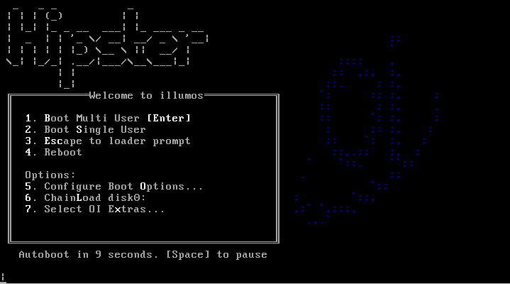

The OpenIndiana installer boot menu offers multiple choices.

| Main Menu Option | Description
| --- | ---
| 1. Boot Multi User | Normal boot (desktop or shell)
| 2. Boot Single user | Boots to rescue mode
| 3. Escape to loader prompt | Boots to forth shell
| 4. Reboot | Restarts the computer
| 5. Configure Boot Options | Enters into boot options menu
| 6. ChainLoad disk0 | Boots the OS found on 1st disk
| 7. Select OI Extras | Enters into extras menu

Select your boot option by pressing the associated number key.

* Options 1, 2, 3, 4, and 6, result in the immediate execution of the selected option.
* Options 5 and 7 provide interactive menus as shown below.

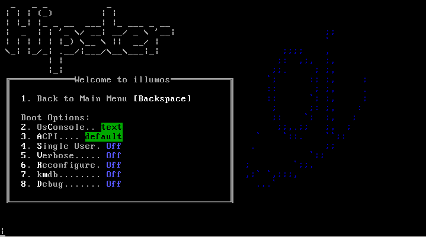

| Boot Option Menu | Description
| --- | ---
| 1. Back to Main Menu | Returns to main menu
| 2. OsConsole | Provides several tty options
| 3. ACPI | Toggles ACPI to ON, OFF, MADT, or Legacy
| 4. Single User | Toggles single user mode
| 5. Verbose | Toggles verbose boot messages
| 6. Reconfigure | Reconfigures hardware
| 7. kmdb | Toggles Kernel Mode Debugger
| 8. Debug | Toggles debug

Toggle (enable/disable) these options by selecting the associated number key.

For example:

* Pressing 5 enables verbose mode.
* Pressing 5 again, disables the verbose option.

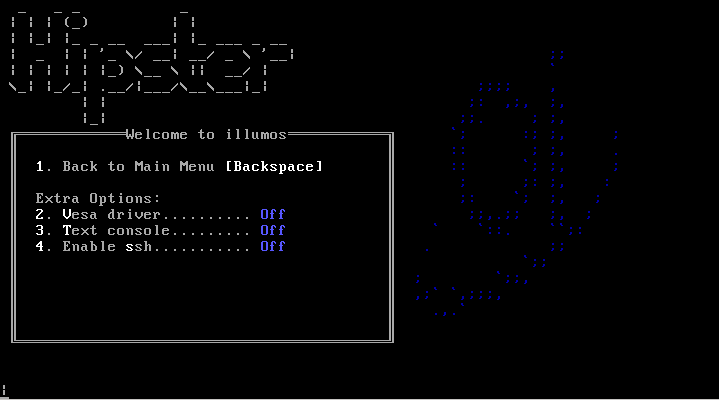

| OI Extras Menu | Description
| --- | ---
| 1. Back to Main Menu | Returns to main menu
| 2. Vesa driver | Forces the vesa driver
| 3. Text console | Enables the text console
| 4. Enable ssh | Enables ssh server for live desktop

Toggle (enable/disable) these options by selecting the associated number key.

For example:

* Pressing 2 forces the VESA driver.
* Pressing 2 again, disables the VESA driver.

<div class="note" markdown="1">
!!! note
    Even when booting the Mate Live Image, selecting option # 3 (text console) option will boot the system to a text based console.
    The logon credentials required to access the shell are jack/jack.
</div>

### Selecting keyboard layout and display language


OpenIndiana offers 47 different keyboard layouts.

* Select your keyboard layout by entering the number corresponding to your desired keyboard layout.
* For example, select `18` for German, or `35` for Russian, etc.
* The default keyboard layout is selection `47` US-English.

Once you have selected a keyboard layout, press the `Enter` key to continue.

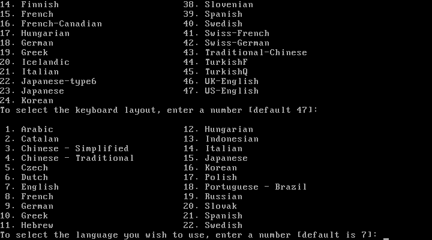

OpenIndiana offers 22 different language options.

* Select a language by entering the number corresponding to your desired language.
* For example, select `3` for Chinese - Simplified, or `18` for Portuguese - Brazil, etc.
* The default language selection is `7`for English.

Once you have selected a language, press the `Enter` key to continue.

<div class="note" markdown="1">
!!! note
    After selecting the keyboard layout and language, OpenIndiana will begin to search for hardware and configure devices.
    When the configuration process is complete, the system will load to either the Mate desktop, or a logon console.
</div>

### The live media desktop


The Live Media DVD and USB installers provide a graphical live environment where you can explore OpenIndiana and test the compatibility of your hardware.
When using Live Media, no changes are made to your system unless you explicitly choose to install OpenIndiana or alter the configuration of your disk using the Gparted Partition Editor.

The following options are available to you from the Live Media Desktop:

* Install OpenIndiana using the Text Installer
* Install OpenIndiana (graphical installer)
* Device Driver Utility
* Gparted Partition Editor


### Using the device driver utility

Available from the Live Media desktop, the _Device Driver Utility_ may be used to scan your hardware for compatibility.
The utility generates a list of hardware devices along with the corresponding driver in use for each device.
The utility will also show you devices for which there is no driver loaded.
The device driver utility allows you to check whether your hardware requires additional drivers.


### Using the Gparted Partition Editor

The Gparted partition editor allows you to add, remove, or resize partitions in preparation for installing OpenIndiana.

<div class="caution" markdown="1">
!!! danger "Caution"
    Editing partition tables is a potentially destructive process.
    While you are unlikely to physically damage the disk, there is a risk of losing data.
    Before using the partition editor, please be sure to back up your data to a remote system or device.
</div>

### Live media authentication

* The user login for the live media session is `jack` along with the password `jack`.
* For administrative or elevated access, prepend your commands with `sudo`.
* You may obtain root using the `su` command along with the password `openindiana`.


## Installing OpenIndiana

<div class="info" markdown="1">
!!! info "Documentation Team"
    For some guidance writing this section:

    * Installation walkthrough: [web link](http://technodrone.blogspot.com/2012/05/openindiana-installation-walkthrough.html)
    * Installation videos: [web link](https://www.youtube.com/watch?v=VVWP_5oAy3w)
</div>

<div class="caution" markdown="1">
!!! danger "Caution"
    Please be advised of the following important considerations:

    * The installation overwrites the whole disk layout if one of the following is true:
        * The disk table cannot be read.
        * The disk was not previously partitioned.
    * If an existing Solaris fdisk partition is on a multiboot system, and the user makes no modifications to the existing partitions, the installation overwrites the Solaris fdisk partition only.
    Other existing partitions are not changed.
</div>

### Installing OpenIndiana from live media

To install OpenIndiana from Live Media, you have two options.

* Install OpenIndiana using the Text Installer
* Install OpenIndiana (graphical installer)

Each of these options is represented by a desktop icon.
Select the appropriate installer option by clicking the corresponding desktop installer icon.

<div class="note" markdown="1">
!!! note
    **From Hipster 2016.10 release onwards**

    Selecting the ***Install OpenIndiana using the Text Installer*** desktop installer option provides new installation capabilities.

    In addition to installing OpenIndiana to single disks, the following are now also supported:

    * Mirrors
    * RAIDZ

    Yes, that's right, you can now install the rpool to logical disk arrays, created during the installation process.

    However, please keep in mind the following:

    * This capability applies only to the python based installer which runs within a console window.
    * The graphical installer does not yet have this capability.
</div>

### Install OpenIndiana (graphical installer)

To launch the OpenIndiana graphical installer, locate and double click the desktop icon labeled: _**Install OpenIndiana**_.

As shown below, and in the subsequent screens, the installer starts a new process, running within it's own window.

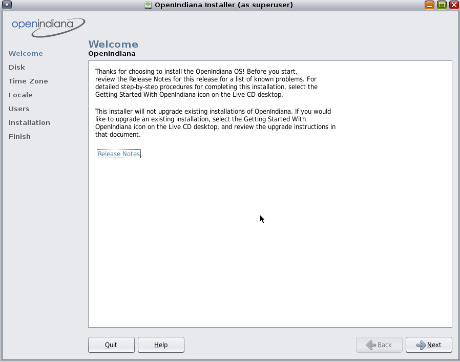

When the installer starts, the first screen you will see is the welcome page.
Please take some time to read the additional guidance provided below.
When ready to begin, click the _**Next**_ button to continue on with the installation process.

<div class="note" markdown="1">
!!! note
    Please disregard the reference to the getting started guide.
    This guide no longer exists on the Live Media installer.

    _**A bug has been opened for this issue and a new getting started guide is being created**_.

    Also, when clicking the link for the release notes, please click it only once and wait until Firefox finishes loading.
    The Firefox web browser will open to the 'OpenIndiana Releases' page of the OpenIndiana Wiki.
    This however, is not where you will find the release notes.
    _**A bug has been opened to correct this issue**_.


    The release notes can be found [on the main site](https://www.openindiana.org/).
</div>


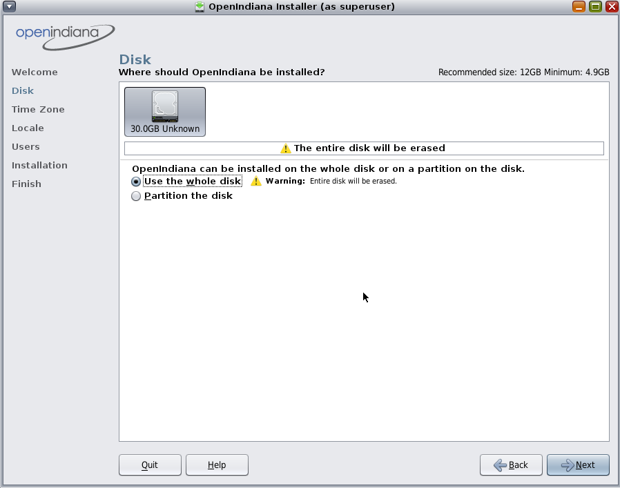

The top portion of the disk selection and partitioning screen shows all the disks found on the system, including removable disks.
Each disk is represented with a disk icon.
Below each disk icon the installer displays the size of each disk in Gigabytes (GB) and the disk type (IDE, ATA, etc.).
Within this upper panel, select the disk where you wish to install OpenIndiana.
The lower portion of this screen displays partitioning options.

Within the lower panel, select one of the following options:

| Option | Description
| --- | ---
| Use the whole disk | When the _Use the whole disk_ option is selected, the entire disk is used for the installation. For the selected disk, all existing partitions and any data which they may contain, will be overwritten with the OpenIndiana operating system.
| Partition the disk | When the _Partition the disk_ option is selected, the bottom portion of this panel displays the disk partitioning layout. Prior to selecting this option, please be sure to review all the informational notes and warnings concerning the use of the partitioning option.

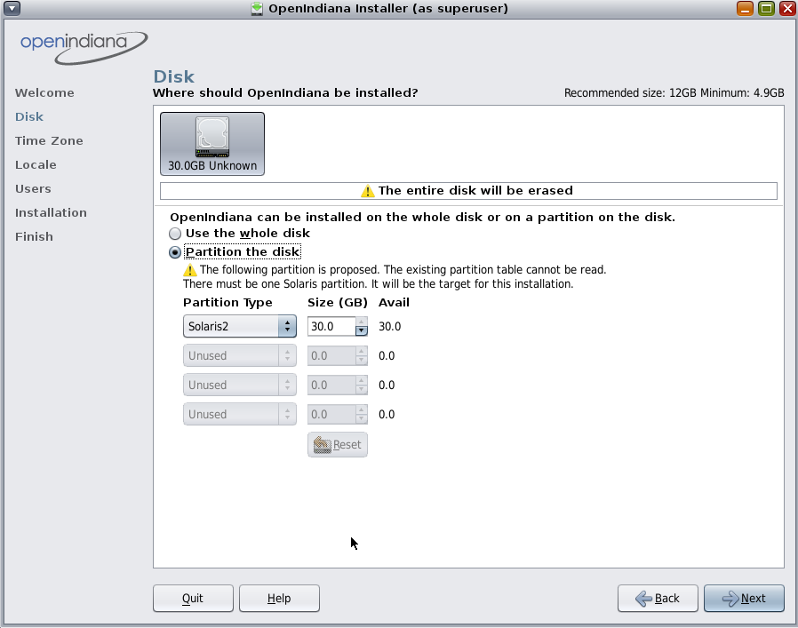
If you choose to partition the disk, you have additional options as shown above.
Please take some time to read the additional guidance provided below.
When you have revised the partitioning as needed, click the _**Next**_ button to continue.

<div class="note" markdown="1">
!!! note
    Regardless of the partitioning option chosen for the installation, manual control of the OpenIndiana file system layout is not supported.
    During the installation, the Solaris fdisk partition is reformatted with a default ZFS file system layout.
    All existing file systems on the Solaris partition are destroyed.
    The installation uses a Solaris fdisk partition to create a ZFS storage pool.
</div>

<div class="note" markdown="1">
!!! note
    If you choose to partition the disk, review the following partitioning guidelines, then revise the partitioning panel settings as needed.

    * Only one Solaris partition is allowed.
    If an existing Solaris partition is available, that Solaris partition will be the target for the installation.
    Or, if you do not have an existing Solaris partition, you can change any existing partition to a Solaris partition.
    * You can resize existing partitions, delete partitions, and create new partitions in this panel.
    For this option, one existing Solaris partition must be available as the target for the installation.
    * If you used a third-party partitioning tool such as GParted, then the Disk panel displays a partition named Linux-swap on which you can install OpenIndiana.
        * In this panel, use the drop-down list for the Linux-swap partition name to change the partition name to Solaris.
</div>

<div class="caution" markdown="1">
!!! danger "Caution"
    If the existing partition table cannot be read, a warning is displayed, and the panel displays proposed partitioning.
    In this case, all data on the selected disk is destroyed.

    If the table can be read, then the following information applies:

    * The partitions are displayed in physically sequential order as they are laid out on the disk.
    * Resizing a Solaris partition destroys the data on that partition and all physically subsequent partitions.
        * Existing data is not moved to conform to a new partition layout.
        * However, resizing the last partition or appending a new partition does not affect the data that already exists in other partitions.
    * Non-Solaris partitions cannot be resized.
    * To make additional space available, you can change an existing partition to Unused.
        * However, if you change an existing partition to Unused, all subsequent non-Solaris partitions are also changed to Unused.
    * New partitions can only use the available space that follows the last defined partition.
    * The installer cannot utilize unallocated chunks of space between existing defined partitions.
    * Use the fdisk(1M) command to create new partitions that use the free space between exiting partitions.
</div>


This screen enables you to type the correct time zone, date, and time for the system to be installed.
The top half of the panel displays a world map with major cities marked.
The bottom half of the panel provides drop-down selections.
You can choose the time zone either from the map or from the drop-down list.

* If you select the time zone from the map, click on a city or click anywhere on the map.

If you click on the map, but not on a city, the map automatically magnifies that area.
You can click on a location within that magnified area.
You can drag the cursor to move the magnified area to a different location on the map.
When you select a site on the map, the drop-down selections automatically populate with the time zone, date, and current time for that map selection.
You can right-click to undo magnification.

* Instead of using the map, you can make your selections in the drop-down fields.

Select your region, then select Location. Finally, select time zone.
The options for each drop-down field are determined by the selection made in the prior drop-down field.

<div class="note" markdown="1">
!!! note
    After making your selections, you may also edit the default date and time that is provided.
</div>

When the settings are correct, click Next to continue.


This screen enables you to select a language and locale.
These selections determine the language support, the default date and time, and other data formats for the installed system.

* You can accept the default language selection or change the selection.

* A language selection is required.
You can select “no default language support.”

* The language chosen automatically determines the available locales in the drop-down list.
Only one locale can be selected.


<div class="note" markdown="1">
!!! note
    Any time that you log in to the installed system, you can change either the locale for that particular session or the default locale by using the Options button in the Login dialog box.
</div>

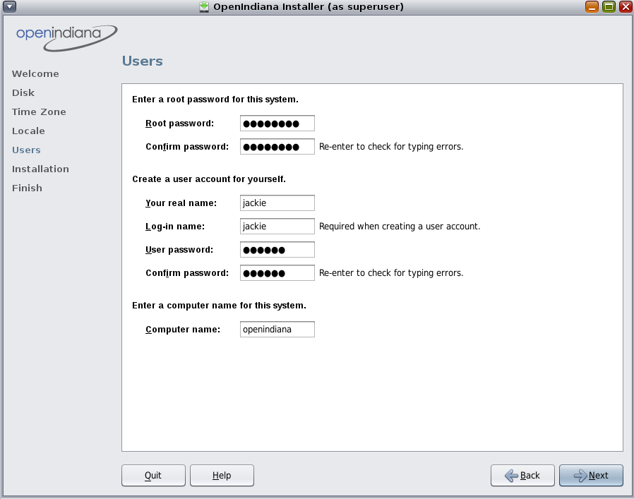

Review the following guidelines:


* Root login is not enabled either on the Live CD or on the installed system.
You must log in as the user that you create in this panel.
After you log in, you can then become root to configure the system.

<div class="note" markdown="1">
!!! note
    If you do not create a user account in this panel, root is set up as a normal account on the installed system, instead of as a role.
    This is the only situation where you can log in to the installed system as root.
</div>

* Both the root password and user account are optional.
However, for better security, do complete these fields.
If the root password is not defined, a reminder is displayed when you click Next.
If you do not want to define a root password, you can proceed.


* A user account requires only a Login name for the account to be valid.
For better security, however, do complete all fields.
If the user account information is not valid, a reminder is displayed when you click Next.
If you do not want to define a user account, you can proceed.


* Type a computer name or accept the default.
The computer name field cannot be blank.


This screen summarizes the configuration options which will be used to perform the installation.
Be sure to take the time to review this summary.
If a configuration option needs to be changed, you may do so by clicking the _**Back**_ button.
If the installation options are acceptable, click the _**Install**_ button to begin the installation.

<div class="caution" markdown="1">
!!! danger "Caution"
    Once you have clicked the _**Install**_ button, the option to _**Quit**_ the installation is no longer available.
    Do not attempt to interrupt an installation already in progress or the system will be left in an inconsistent state.
</div>


During the installation, a progress bar is displayed.
The time required to complete the installation is dependent on your hardware.


The final screen displays completion messages.
From within this panel you may review the installation log.
To view the installation log, click the link titled _**OpenIndiana Installation Log**_.
The installation log will open in a new window.


Using the slider located on the right side of the log viewer window, you may scroll up and down to view the entire log file.
After reviewing the log, you may exit the log viewer by clicking the _**Close**_ button.

**Congratulations!**
You have completed the installation of the OpenIndiana Hipster operating system.

From here you now have several options:

* Quit the installer by clicking the _**Quit**_ button and continue to explore the Live Media.
* Quit the installer by clicking the _**Quit**_ button and then manually shut down or restart your system.
* Reboot the computer by clicking the _**Reboot**_ button.

<div class="note" markdown="1">
!!! note
    To prevent the Live Media from starting again after the reboot, eject the Live Media as the next boot begins.
    Or alternately, when presented with the Live Media installer options menu, select the _**ChainLoad diskN**_ option.
</div>

<div class="note" markdown="1">
!!! note
    After you have installed OpenIndiana, if you have another operating system installed, you might need to update the loader configuration.
    Usually you can achieve the desired effect by chainloading partitions with other operating systems.
    To configure the illumos loader to show an additional entry for chainloading another loader, create a file in /boot/conf.d directory,
    containing the string
    `chain_disk="disk0:"`,
    where disk0 is the name of disk or partition to boot from.
    You can get the list of available disks from loader prompt using `lsdev` command.

    If you use GRUB2, you can configure it to show an entry for chainloading the illumos loader.
    Add the following to a file in the /etc/grub.d directory (usually the placeholder '40_custom' file can be used) of the Linux installation:

    ```
    menuentry "Chainload OpenIndiana" {
        set root=(hd0,2)
        chainloader +1
    }
    ```

    where hd0,2 is the location of the partition or disk containing the illumos loader.
    You can list detected disks/partitions from the GRUB prompt using the `ls` command.
    From Linux you can run `sudo fdisk -l` to list disks and partitions. The partition 'sda2' would map to 'hd0,2' in GRUB.
    After making changes you must run `sudo update-grub`,
    this updates the auto-generated GRUB configuration stored in /boot/grub/grub.cfg.
</div>


### Install OpenIndiana using the Text Installer

<div class="note" markdown="1">
!!! note
    The text based guided install starts and runs within a command line console.
    Navigation within the installer is performed by pressing specifically designated navigation keys (`F2`, Tab, etc.).

    The instructions for performing a text based install apply to the following installation scenarios:

    * Launching the text based installer icon from the Live Media (GUI) desktop.
    * Beginning a text based installation by booting from the OpenIndiana text based installer.


    **From the 2016.10 release onwards**

    Mirrors and RAIDZ are now supported install options!

    * To install to a mirror, select 2 or more disks.
    * To install to RAIDZ, select 3 or more disks.


    **GUI Desktop may be added post-installation**

    * To install MATE Desktop Environment (using a metapackage) and enable graphical login

    ```
    pkg install mate_install
    pkg uninstall mate_install
    svcadm enable -r /application/graphical-login/lightdm
    init 6
    ```

</div>

<a name="welcome-screen"></a>
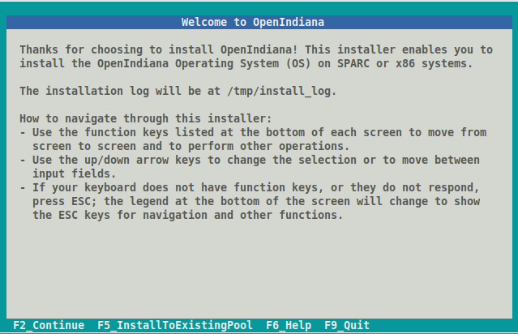

The text based installation process begins with the welcome screen, which provides the following information:

* Location of the installation log file
* Navigational guidance

<div class="note" markdown="1">
!!! note
    At any time during the installation process you may press the `F6` key for context specific help.
</div>

Text installer allows you to do either usual installation or installation to existing ZFS pool.

If you are doing clean installation, when ready to begin, press the `F2` key to continue.

If you intend to install OpenIndiana to existing ZFS pool, see [Install OpenIndiana to existing ZFS pool](#install-openindiana-to-existing-zfs-pool).

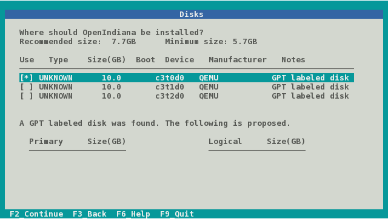

On this screen the installer displays the disks which have been discovered and are available for installation.

* Use the up and down arrow keys to navigate between the disks.
* To select a disk, press the space bar while the disk is highlighted.
* A disk is selected for installation when an asterisk appears next to the disk.

Once you have selected the appropriate disk, press the `F2` key to continue.

* If your system has only a single disk, it is already selected.
* If your system has multiple disks, select the appropriate disk(s).
    * To install to a mirror, select 2 or more disks.
    * To install to RAIDZ, select 3 or more disks.


<div class="note" markdown="1">
!!! note
    While the minimum and recommended disk sizes are technically accurate, they do not take into account periodic disk usage growth resulting from:

    * ZFS snapshots
    * Installation of additional software
    * New boot environments automatically created when running the `pkg update` command
    * New backup boot environments automatically created when running the `pkg install` command

    To account for this, your disk should be at least 20GB or more.
</div>


After pressing the `F2` key, you may be presented with warning shown above.
If reformatting the entire disk is acceptable with you, press the `Tab` key to select **_continue_** and then press the `Enter` key.
Otherwise press the `Enter` key to **_cancel_**.

If you select cancel, you will have the following options:

* Select another disk
* Abort the installation so you may provide remedial action such as:
    * Modifying the partition table using Gparted
    * Adding another disk to the system

<div class="caution" markdown="1">
!!! danger "Caution"
    If your disk contains a GPT disk label, the entire disk will be used.

    * Any existing GPT partitions will be destroyed
    * A new single GPT partition will be created.

    This warning serves as your advisory.
</div>

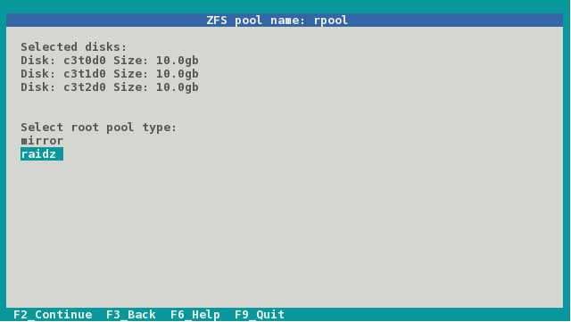

<div class="note" markdown="1">
!!! note
    This screen will be available only when **_2 or more disks_** have been selected.
</div>

* If 2 disks have been selected, the ZFS mirror option becomes available.
* If 3 or more disks have been selected, the ZFS RAIDZ option become available.

Select between the options using the up and down arrow keys.

When ready, press the `F2` key to continue.


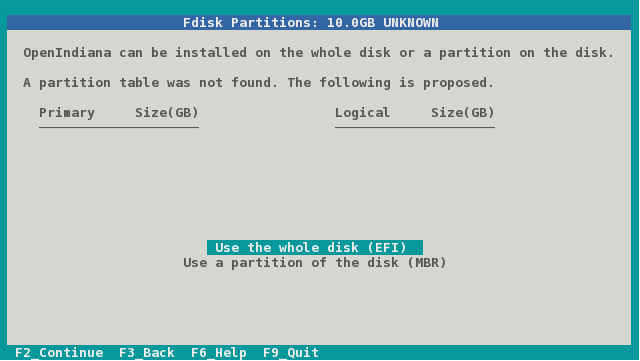

<div class="note" markdown="1">
!!! note
    This screen will be available only when a **_single disk_** has been selected.
</div>

In this screen you are presented with the following choices for how to partition the disk:

* Use the whole disk (EFI)
* Use a partition of the disk (MBR)

Select between the options using the up and down arrow keys.

When ready, press the `F2` key to continue.


<div class="note" markdown="1">
!!! note
    This screen will be available only when the **_Use a partition of the disk (MBR)_** option has been selected.
</div>

This screen provides the following options:

* Select the partition where you would like to install Openindiana.
* Change the partition type
* Change the partition size
* Free up space by deleting a partition

Navigate the fields using the arrow keys.
Change a partition type using the `F5` key.

When ready, press the `F2` key to continue.

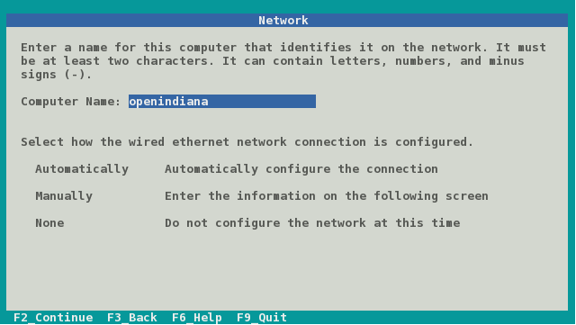

<div class="note" markdown="1">
!!! note
    We have illustrated this screen twice as 2 different tasks are required.
</div>

    In this step you will configure the hostname.

At the top portion of the screen specify the computer name (system hostname) you wish to use.
By default the computer name is **_openindiana_**.
Using the backspace key, you may remove the default hostname and provide another hostname.

When ready, proceed to the next screen shot below where you will be provided additional guidance for completing this screen.


<div class="note" markdown="1">
!!! note
    We have illustrated this screen twice as 2 different tasks are required.
</div>

    In this step you will select your network configuration type.

After configuring the system hostname, navigate to the lower portion of the screen to select your networking configuration.

From the lower portion of this screen you have the following choices:

* Automatically configure the (networking) connection (using DHCP)
* Manually configure the network settings by entering the information on the next screen
* Do not configure the network at this time

Select between the options using the up and down arrow keys.

When ready, press the `F2` key to continue.

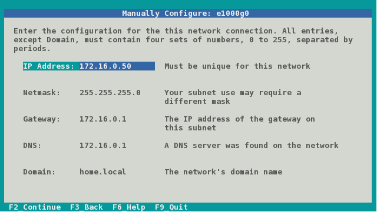

<div class="note" markdown="1">
!!! note
    This screen will be available only when the ***Manually*** configure network option has been selected.

    * The values illustrated above are for example only, do not use them.
    * Substitute each field with correct values for your network.
</div>

In the fields provided, enter in the following information:

* IP Address
* Netmask
* Gateway
* DNS
* Domain

Navigate between the fields using the up and down arrow keys.

When ready, press the `F2` key to continue.

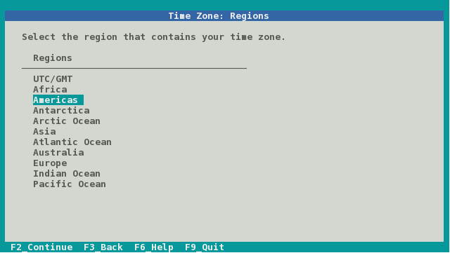

The next few screens illustrate time zone configuration.

Select your time zone **_region_** by navigating up and down with the arrow keys.

When ready, press the `F2` key to continue.

<div class="note" markdown="1">
!!! note
    When selecting the ***UTC/GMT*** time zone region, only this screen will be presented.
</div>

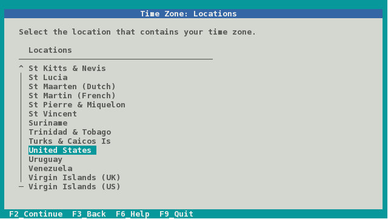

Select your time zone **_location_** by navigating up and down with the arrow keys.

When ready, press the `F2` key to continue.

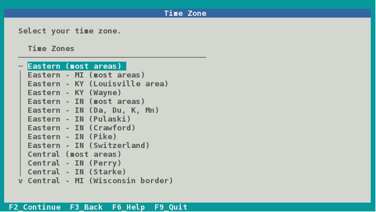

Select your **_time zone_** by navigating up and down with the arrow keys.

When ready, press the `F2` key to continue.

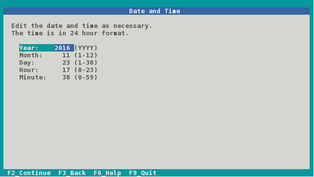

In this screen you may reconfigure the date and time as necessary.

Using the up and down arrow keys, navigate between the fields.

When ready, press the `F2` key to continue.

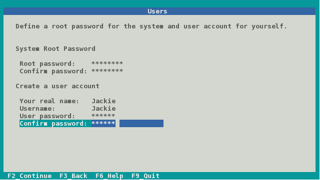

In this screen you are presented with several fields to configure.

* Root password
* Confirm Root password
* Real name
* User name
* User password
* Confirm user password

Using the up and down arrow keys, navigate between the fields and enter the required information.

When ready, press the `F2` key to continue.

<div class="note" markdown="1">
!!! note
    * The first user created on the system is granted the root role via _Role Based Access Control_ (RBAC).
    * In effect this means the following:
        * Without any further configuration, the specified user will be granted the authority to perform administrative task by assuming the root role as needed.

    Please take note the following additional information:

    * Immediately after installation the root password is automatically expired and needs to be changed prior to being used for any administrative task.
</div>

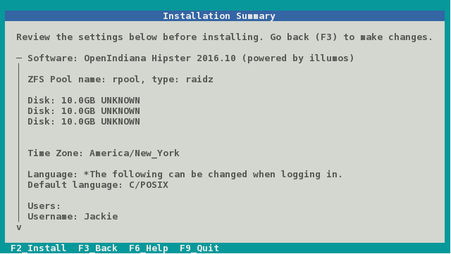

Now that you have completed the installation configuration, you are presented with an _Installation Summary_.

If these configuration settings are correct, you may begin the installation by pressing the `F2` key.

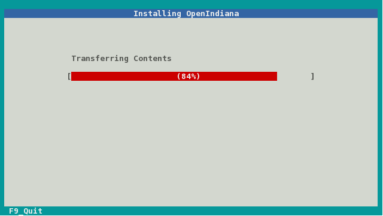

Depending on the speed of your computer, the installation may take several minutes to complete.
Installation progress is measured by means of a status bar.


When the installation is complete, a summary screen is presented.

* The installation logs are available by pressing the `F4` key.
* If you ran the installation from Live Media, you may exit the installation by pressing the `F9` key.
* Otherwise, you will want to reboot the system by pressing the `F8` key.


If you chose to view the installation logs, you will be presented with the screen above.

To return to the summary screen, press the `F3` key.

### Installing OpenIndiana using the text installer (DVD ISO or USB)

The text installer DVD ISO and USB installer options are not graphical nor do they provide a live environment.
When booting from the text based installer, you are presented with the following choices:

* Install OpenIndiana
* Spawn a shell to be used as a rescue disk.

The procedure for installing from the text based installer follows the same process as the previously described [Install OpenIndiana using the Text Installer](./getting-started.md#install-openindiana-using-the-text-installer)

### Install OpenIndiana to existing ZFS pool

Starting from OpenIndiana 2017.10, the text installer allows you to perform installation to existing ZFS pool.
It will create new boot environment in the pool and install OpenIndiana there.

This option can be useful when you want to do some customizations to root ZFS pool (for example, enable compression) or install
OpenIndiana to pool where another operating system is already installed (for example, prior version of OpenIndiana or even FreeBSD).
It is recommended to use minimal or server installation images to perform such installations.

<div class="note" markdown="1">
!!! note
    This feature is intended for advanced users.
    It's assumed you know what you are doing.
    Multi-booting of another operating system and OpenIndiana on the same root pool can be possible, but such configuration is out of scope of this tutorial and is not supported.
</div>

<div class="note" markdown="1">
!!! note
    OpenIndiana supports booting from a RAIDZ pool, however you must confirm that all vdevs are accessible from the boot loader.
    From the boot loader menu, choose Escape to loader prompt and run lsdev to confirm the disks are present.
</div>

To start installation to existing ZFS pool, press `F5` key when [Welcome Screen](#welcome-screen) is presented.

Installer will present you a 'Pools' screen.

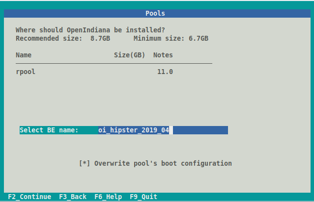

On this screen installer will allow you to select the root pool for your new installation and boot environment name (which should be unique).

By default installer will install OpenIndiana boot loader and activate created boot environment.
If you don't want installer to touch any boot-related options, uncheck `Overwrite pool's boot configuration` checkbox.
This can be useful when you install OpenIndiana to ZFS pool where another operating system is already installed and you want to configure boot loader manually.

If you don't see your pool in the list of available pools, check `/tmp/install_log`.
The most frequent issue is that there's not enough free space in the pool.

The next steps for [usual installation](#install-openindiana-using-the-text-installer) and installation to existing ZFS pool are the same.

As there's possibly already another OS instance installed to the selected ZFS pool, no additional users or filesystems (like `rpool/export`) are created during installation.
Swap and dump ZFS volumes also are not created and should be added manually after installation.
Only root user will be available in created boot environment.

## Troubleshooting Installations

* If you do not see a menu after booting your computer with the DVD or USB device, and instead see some text and a `boot:` prompt, there may be an error in your copy of the installer, or it was created incorrectly.
* If you see a `login:` prompt after selecting your keyboard and language and no desktop appears after several seconds, there may be a problem with the drivers for your graphics hardware.
    * Please let us know via IRC or the mailing list if this happens.
    * When you contact us, please include any error messages you see on the console, as well as the output of the `svcs -xv` command.
    * If possible, also include the contents of the file `/var/log/Xorg.0.log`.

## Post Installation Steps

### Boot Menu - Post Install

After successfully installing OpenIndiana Hipster, a new boot menu option becomes available.
As shown in the screen below, option # 6 allows you to select the boot environment.

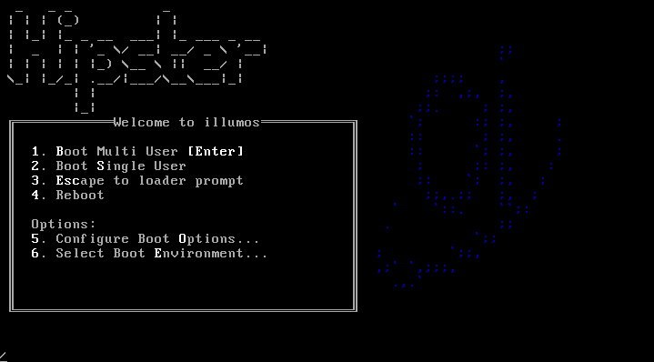

Each time you perform an update of software installed on OpenIndiana Hipster, a new boot environment may be created.
Option # 6 allows you to select from among them.


After using OpenIndiana for a period of time, several boot environments will accumulate, with the label for each environment incrementing numerically.
The image above illustrates what this looks like on a system with several boot environment choices.

### Resetting the root password

After installation, the root password is immediately expired and you will be required to change it.

Use the following steps to change the root password:

* Open a Terminal
* Execute `su -` and provide the password you chose for your account at installation time
* You will be informed that root's password has expired and prompted to change it
* Once changed you can exit the su session
* You should be able to login/authenticate as root now.

## Image Package System (IPS)

<div class="note" markdown="1">
!!! note
    The image packaging system is delivered as part of the OpenIndiana userland.
    As such, the pkg-related man pages are not available on the illumos.org website.
    These pages are only available by running the man page viewer locally on your system.
</div>

### Quick Start to IPS

As a desktop user, you will likely want to enable the `Software Installation` profile for
your user; you can use `sudo` instead of `pfexec` if you are just getting started with
OpenIndiana and are not yet familiar with RBAC (role-based authentication), being sure
to replace `username` with your actual username:


```
sudo usermod -P "Software Installation" username
```

Now you can use `pfexec` to execute `pkg install`


For instance, you may want to search for the `emacs` editor by running `pkg search -p emacs`

```
$ pkg search -p emacs
PACKAGE                                                PUBLISHER
pkg:/developer/exuberant-ctags@5.8-2020.0.1.1          openindiana.org
pkg:/editor/gnu-emacs/gnu-emacs-gtk@29.1-2023.0.0.1    openindiana.org
pkg:/editor/gnu-emacs/gnu-emacs-lisp@29.1-2023.0.0.1   openindiana.org
pkg:/editor/gnu-emacs/gnu-emacs-no-x11@29.1-2023.0.0.1 openindiana.org
pkg:/editor/gnu-emacs/gnu-emacs-x11@29.1-2023.0.0.1    openindiana.org
pkg:/editor/gnu-emacs@29.1-2023.0.0.1                  openindiana.org

```


Then you can install the one that you like by copying and pasting the FMRI (see more details on that later) into a `pkg install` command:


```
pfexec pkg install pkg:/editor/gnu-emacs/gnu-emacs-no-x11@29.1-2023.0.0.1
```


### IPS Overview

<!--The majority of the text below was taken from the PDL licensed document titled 'Getting Started with OpenSolaris 2008.11' -->

After an initial installation of the OpenIndiana Hipster operating system, you will find many of the software applications you use on a regular basis are not immediately available to you.
These software applications are available as packages in a remote Image Packaging System (IPS) repository for downloading and installing over the Internet.

Written in Python, IPS is a network-centric packaging system which enables users to connect to a remote repository for the purpose of downloading and installing packages.
OpenIndiana Hipster uses IPS for its packaging system.

Besides installing packages from a repository, users can also perform the following tasks:

* Create and publish their own IPS packages
* Set up an OpenIndiana Hipster repository
* Mirror an existing repository
* Publish existing packages to a repository

Once you have installed packages, IPS enables you to search, update, and manage those packages on your system.

With IPS , you can upgrade your system to a newer build of OpenIndiana Hipster, install and update your software to the latest available versions, and retrieve packages from mirror repositories.

If the system on which IPS is installed is located on a network, IPS can automatically access the OpenIndiana Hipster package repository.
For OpenIndiana Hipster, your IPS client can access the packages from <https://pkg.openindiana.org/hipster>.


### IPS packages

An IPS package is defined as a collection of files, directories, links, drivers and dependencies in a defined format.

Note the following points about IPS packages:

* An IPS package consists of a set of actions.
Actions are defined when an IPS package is created.
Actions are used for defining the files and directories of the package, setting package attributes, declaring dependencies on other packages, creating users and groups, and installing device drivers.
Some actions may optionally have tags that provide meta information about the action such as locale information and debug configuration.
* IPS packages can only be installed from an IPS repository.
    * IPS package repositories can be local to the system or on a remote networked system.


### IPS commands

The Image Packaging System software provides the following commands:

| Command | Description
| --- | ---
| `pkg`<sup>1</sup> | Use the `pkg`<sup>1</sup> command to create an image, to install packages to your image, and to manage packages on your image.
| `pkgsend`<sup>1</sup> | Use the `pkgsend`<sup>1</sup> command to publish packages from your image to an existing repository.
| `pkg.depotd`<sup>1M</sup> | Use the `pkg.depotd`<sup>1M</sup> command to create and manage your own network repository or set up a mirror repositories.
| `pkgrecv` | Use the `pkgrecv` command to download the contents of a package from a server. The user can then modify the contents by adding additional package attributes and republish the package with the `pkgsend` command.

<div class="note" markdown="1">
!!! note
    * The `pkg`<sup>5</sup> man page describes the overall Image Packaging System.
    * The `pkg`<sup>1</sup> man page describes the Image Packaging System retrieval client.
</div>

### pkg<sup>1</sup> uses FMRIs

Each IPS package is represented by a _Fault Management Resource Identifier_ (FMRI).
The pkg<sup>1</sup> command uses valid FMRI package information to perform its command actions.
The FMRI includes descriptive information about the package, such as the package name, version information, and date.

For example:

```
FMRI: pkg://openindiana.org/image/editor/gimp@2.8.16-2016.0.0.0:20160702T042138Z
```

* Scheme – pkg
* Authority – openindiana.org
* PackageName – gimp
* Version String – Consists of three components :
    * Build Version – 2.8.16
    * Branch Version – 2016.0.0.0
    * Timestamp – 20160702T042138Z


### Finding help with pkg

The primary source of help for any OpenIndiana command is to review the man page for the command.
Therefore, be sure to consult the `pkg`<sup>1</sup> man page for full command information and usage examples.

For example: `man pkg`

To reference command usage directly from the command line, use `pkg help`.

For example:

`pkg help`

```
Usage:    pkg [options] command [cmd_options] [operands]
The following commands are supported:

Package Information  : list           search         info      contents
Package Transitions  : update         install        uninstall
                       history        exact-install
Package Maintenance  : verify         fix            revert
Publishers           : publisher      set-publisher  unset-publisher
Package Configuration: mediator       set-mediator   unset-mediator
                       facet          change-facet
                       variant        change-variant
Image Constraints    : avoid          unavoid        freeze    unfreeze
Image Configuration  : refresh        rebuild-index  purge-history
                       property       set-property   add-property-value
                       unset-property remove-property-value
Miscellaneous        : image-create   dehydrate      rehydrate
For more info, run: pkg help <command>
```

To retrieve information about a specific command use: `pkg help [command]`

For example:

`pkg help update`

```
Usage:
        pkg update [-fnvq] [-C n] [-g path_or_uri ...] [--accept] [--ignore-missing]
            [--licenses] [--no-be-activate] [--no-index] [--no-refresh]
            [--no-backup-be | --require-backup-be] [--backup-be-name]
            [--deny-new-be | --require-new-be] [--be-name name]
            [-r [-z image_name ... | -Z image_name ...]]
            [--sync-actuators | --sync-actuators-timeout timeout]
            [--reject pkg_fmri_pattern ...] [pkg_fmri_pattern ...]
```


### Searching for packages

The `pkg search` command is used to search locally or remotely for information about packages.
The syntax of the command is `pkg search [options] [package]`.
If no search options are specified, the command defaults to performing a search of all the remote repositories defined on the system.
Using the `-l` option, you may restrict the search to the local system.

For example:

`pkg search xchat`

```
INDEX                ACTION VALUE                                   PACKAGE
pkg.summary          set    XChat IRC Client                        pkg:/desktop/irc/xchat@2.8.8-2016.0.0.5
pkg.summary          set    HexChat is an IRC client based on XChat pkg:/desktop/irc/hexchat@2.12.1-2016.0.0.1
basename             file   usr/bin/xchat                           pkg:/desktop/irc/xchat@2.8.8-2016.0.0.5
com.oracle.info.name set    xchat                                   pkg:/desktop/irc/xchat@2.8.8-2016.0.0.5
pkg.fmri             set    openindiana.org/desktop/irc/xchat       pkg:/desktop/irc/xchat@2.8.8-2016.0.0.5
```

As you can see, the search results include package names along with additional information.
To search for package names only, include the `-p` option.

For example:

`pkg search -p xchat`

```
PACKAGE                                    PUBLISHER
pkg:/desktop/irc/hexchat@2.12.1-2016.0.0.1 openindiana.org
pkg:/desktop/irc/xchat@2.8.8-2016.0.0.5    openindiana.org
```

<div class="note" markdown="1">
!!! note
    When using the `pkg search` command, remember it works much like the Unix `find` command.
    If you have difficulty finding a package you know should exist, try modifying your search by including wildcards.
</div>

The `pkg search` command may also be used to find the package containing a particular file.

For example:

`pkg search -l /usr/bin/gpg2`

```
INDEX      ACTION VALUE        PACKAGE
path       file   usr/bin/gpg2 pkg:/crypto/gnupg@2.0.28-2016.0.0.0
```


### Listing the status of packages

To list the status of locally installed packages, use the `pkg list [package]` command.

For example:

`pkg list bash`

```
NAME (PUBLISHER)                                  VERSION                    IFO
shell/bash                                        4.3.46-2016.0.0.0          i--
```

<div class="note" markdown="1">
!!! note
    To list all the packages installed on the local system, use `pkg list` without specifying a package.
</div>


### Listing information about packages

To list detailed information about a locally installed package, use the `pkg info [package]` command.
If the package is not installed on the local system, use the `-r` option to search the remote repositories defined on the system.

For example:

`pkg info -r gimp`

```
          Name: image/editor/gimp
       Summary: The Gimp image editor
      Category: Applications/Graphics and Imaging
         State: Not installed
     Publisher: openindiana.org
       Version: 2.8.16
        Branch: 2016.0.0.2
Packaging Date: July 30, 2016 12:04:41 AM
          Size: 65.01 MB
          FMRI: pkg://openindiana.org/image/editor/gimp@2.8.16-2016.0.0.2:20160730T000441Z
   Project URL: http://www.gimp.org/
    Source URL: http://download.gimp.org/pub/gimp/v2.8/gimp-2.8.16.tar.bz2
```


### Listing the contents of packages

To list the entire contents of a package, use the `pkg contents [package]` command.
If the package is not installed on the local system, use the `-r` option to search the remote repositories defined on the system.


### Listing the dependencies of packages

The `pkg contents` command can also be used to list the dependencies found in a package.
If the package is not installed on the local system, be sure to include the `-r` option.

For example:

`pkg contents -r -t depend -o fmri xchat`

```
FMRI
pkg:/library/desktop/gdk-pixbuf@2.31.6-2016.0.0.0
pkg:/library/desktop/gtk2@2.24.30-2016.0.0.0
pkg:/library/desktop/libsexy@0.1.11-2016.0.0.0
pkg:/library/desktop/pango@1.36.8-2016.0.0.2
pkg:/library/glib2@2.43.4-2016.0.0.3
pkg:/library/security/openssl@1.0.2.8-2016.0.0.3
pkg:/runtime/perl-522@5.22.1-2016.0.0.1
pkg:/runtime/python-27@2.7.12-2016.0.0.0
pkg:/runtime/tcl-8@8.5.19-2016.0.0.1
pkg:/system/library/libdbus-glib@0.100.2-2016.0.0.0
pkg:/system/library@0.5.11-2016.0.0.15685
pkg:/x11/library/libx11@1.6.3-2016.0.0.0
```


### Installing packages

Use the following command to install a package.

`pkg install [options] [packages]`

Some commonly used options are:

| Option | Description
| --- | ---
| -v | Issue verbose progress messages
| -n | Perform a dry run (no actual changes are made)
| -q | Hides progress messages


For example:

`pkg install xchat`

```
           Packages to install:   1
            Packages to update:   1
            Services to change:   2
       Create boot environment:  No
Create backup boot environment: Yes

DOWNLOAD                                PKGS         FILES    XFER (MB)   SPEED
Completed                                2/2         38/38      2.6/2.6  746k/s

PHASE                                          ITEMS
Removing old actions                             4/4
Installing new actions                         69/69
Updating modified actions                        2/2
Updating package state database                 Done
Updating package cache                           1/1
Updating image state                            Done
Creating fast lookup database                   Done
```


<div class="note" markdown="1">
!!! note
    * The `pkg install` command is also used to update specific packages on the system.
    * The `pkg install` command automatically checks for newer versions of specific packages or package groups and installs them if they are available.
    Any dependent packages are also automatically updated.
    * To install a specific version of a package you may substitute the common name for the FMRI.
</div>

### Updating packages

The command to use for updating packages on the system is:

`pkg update [options] [packages]`

Some commonly used options are:

| Option | Description
| --- | ---
| -v | Issue verbose progress messages
| -n | Perform a dry run (no actual changes are made)
| -q | Hides progress messages

To update all the packages installed on a system to their latest available version, use the `pkg update` command without specifying any package names.

For example:

`pkg update`

```
            Packages to remove:    4
           Packages to install:   11
            Packages to update: 1018
            Packages to change:    2
           Mediators to change:    1
       Create boot environment:  Yes
Create backup boot environment:   No

DOWNLOAD                                PKGS         FILES    XFER (MB)   SPEED
Completed                          1035/1035     7502/7502  303.4/303.4  886k/s

PHASE                                          ITEMS
Removing old actions                       3931/3931
Installing new actions                     6889/6889
Updating modified actions                11999/11999
Updating package state database                 Done
Updating package cache                     1022/1022
Updating image state                            Done
Creating fast lookup database                   Done

A clone of openindiana-1 exists and has been updated and activated.
On the next boot the Boot Environment openindiana-2 will be
mounted on '/'.  Reboot when ready to switch to this updated BE.
```


### Removing packages

To remove a package from the system, use the command: `pkg uninstall [options] [packages]`


### Downgrading packages

In addition to installing, upgrading, and removing packages, it is also possible to downgrade packages.
To downgrade packages, use the `pkg update` command and specify the versions of the packages you wish to install.
Where the package has dependencies, you will need to specify the versions of the dependencies as well.
The `pkg` utility will remove the newer versions and replace them with the versions you have specified.

For example:

```
pkg update pkg://userland/library/audio/gstreamer@0.10.36 \
library/audio/gstreamer/plugin/base@0.10.36 \
library/audio/gstreamer/plugin/good@0.10.31
```

<div class="note" markdown="1">
!!! note
    The OpenIndiana project uses package incorporations to ensure packages are maintained to specific versions.
    Where packages are included in an incorporation, it is not possible to revert to an earlier (or newer) version of the package without first relaxing the restrictions imposed by the incorporation.
    Where packages are not restricted by an incorporation, you may freely revert to earlier package versions.
</div>

To relax the restrictions on a package, the `pkg change-facet` command is used.

The syntax of the command is `pkg change-facet facet.version-lock.[package]=false`

For example:

```
pkg change-facet facet.version-lock.library/security/gstreamer=false
```


### IPS package repositories

As previously mentioned, the IPS repository is the remote network location where IPS packages reside.
Below is a list of commands for adding, removing, or replacing repositories.

| Task | Command |
| ---- | ---- |
| List configured repositories | `pkg publisher` |
| Add a repository | `pkg set-publisher -g <repository_URL> <repository_name>` |
| Remove a repository | `pkg set-publisher -G <repository_URL> <repository_name>` |
| Replace a repository | `pkg set-publisher -G <old_repository_URL> -g <new_repository_URL> <repository_name>` |

Example (Listing the repositories configured on the system):

`pkg publisher`

```
PUBLISHER                   TYPE     STATUS P LOCATION
openindiana.org             origin   online F https://pkg.openindiana.org/hipster/
hipster-encumbered          origin   online F https://pkg.openindiana.org/hipster-encumbered/
```

Example (Replacing a repository):

```
pkg set-publisher \
-G http://pkg.openindiana.org/hipster-2015 \
-g https://pkg.openindiana.org/hipster openindiana.org
```


### Listing information about repositories

While the `pkgrepo` command is primarily used for creating and working with IPS repositories.
It can also be used for querying the contents of a repository.

For example:

`pkgrepo info -s https://pkg.openindiana.org/hipster/`

```
PUBLISHER       PACKAGES STATUS           UPDATED
openindiana.org 3692     online           2016-08-21T07:03:11.566484Z
```

If you want to directly query the remote repository for a full list of all available packages, you can do so using the `pkgrepo list` command.

* `pkgrepo list -s <repo_URL>`

Do keep in mind you may want to filter the output of the command in some way to keep the list more manageable.
If not, you're likely to see thousands of lines scroll through your console window.


### IPS package repository precedence

When multiple remote IPS repositories are associated with a system and when using the `pkg` command-line interface with only package names, the following rules apply.
These rules can be overridden by using explicit publishers and package version numbers.

| Package Installation Type | Rules When Only Package Names Are Provided
| --- | ---
| New package installations | The latest available version of new packages are always installed from the preferred publisher unless the publisher is provided in the FMRI during installation. Even if later versions of the package are available in other publishers, those later versions are not installed by default.
| Package updates: package originally installed from preferred publisher | If the package was originally installed from the preferred publisher, then the latest available update of the package can be installed from the _current_ preferred publisher. The package can be install from the _current_ preferred even if the preferred publisher designation had been moved to another publisher after the package had been originally installed. Even if later versions of the package are available in other publishers, those later versions are not installed by default.
| Package updates: package originally installed from non-preferred publisher | If the package was originally installed from a non-preferred publisher, then the latest available update of the package is installed from the publisher from which the package was originally installed. Even if later versions of the package are available in other publishers, those later versions are not installed by default.


### Listing package history

To list the IPS transactional history, use the `pkg history` command.

For example:

`pkg history`

```
START                    OPERATION                CLIENT             OUTCOME
2016-04-21T03:30:04      purge-history            pkg                Succeeded
2016-07-02T16:09:56      uninstall                pkg                Succeeded
2016-07-02T16:10:33      uninstall                pkg                Succeeded
2016-07-02T16:11:08      uninstall                pkg                Succeeded
2016-07-02T16:11:42      uninstall                pkg                Succeeded
2016-07-02T16:12:18      set-property             pkg                Succeeded
2016-07-02T16:12:22      set-property             pkg                Succeeded
2016-07-02T16:37:06      refresh-publishers       pkg                Succeeded
2016-07-02T16:37:06      update                   pkg                Succeeded
2016-07-02T16:37:32      rebuild-image-catalogs   pkg                Succeeded
2016-07-02T17:33:44      install                  pkg                Succeeded
2016-07-02T17:35:11      install                  pkg                Succeeded
2016-07-02T18:31:39      install                  pkg                Succeeded
2016-07-04T19:49:19      install                  pkg                Succeeded
2016-07-04T19:49:23      refresh-publishers       pkg                Succeeded
2016-07-04T19:49:56      rebuild-image-catalogs   pkg                Succeeded
2016-07-09T01:16:43      install                  pkg                Succeeded
2016-07-09T01:16:45      refresh-publishers       pkg                Succeeded
2016-07-09T01:17:20      rebuild-image-catalogs   pkg                Succeeded
2016-07-09T11:33:05      install                  pkg                Succeeded
2016-07-09T11:33:07      refresh-publishers       pkg                Succeeded
2016-07-09T11:33:37      rebuild-image-catalogs   pkg                Succeeded
2016-07-09T12:27:23      update                   pkg                Succeeded
```

To view more details of a particular IPS transaction, use the command:

`pkg history [-l] [-t time_stamp]`

For example:

`pkg history -l -t 2016-07-09T11:33:05`

* The `-l` option provides comprehensive details of each transaction
* The `-t` option allows you to specify a particular transaction


### IPS package archives (.p5p)

When the IPS system was originally conceived there was no standard on-disk format for an IPS package.
Hence, unlike a .rpm file, an SVR4 package, or a .nbm file, it was not possible to transfer IPS packages from system to system.
The remote IPS repository where the IPS package resided was the only source for the package.
This is because in its native state, the IPS package is not something you can normally download as a single archive file.

Recognizing this limitation of IPS, the `.p5p` IPS archive format was developed.
For IPS archives, files are stored in the pax archive format, along with additional metadata, such as IPS manifest files, and a specific layout of the contents.

IPS p5p archives are not like Linux packages where you can install software directly from the package.
Instead p5p archives are a portable repository format containing a collection of packages.
This allows you to create p5p archives for transfer to non-networked systems.
IPS package archives are also useful for sharing packages for the purpose of testing.

IPS archives allow you to:

* Download one or more packages (along with all necessary dependencies) into a p5p archive file.
* Create a local repository based on the contents of the p5p archive file.
* Install packages from the locally created repository.


#### Creating the p5p package

To create an IPS archive, the `pkgrecv` command is used.

For example, to create a `.p5p` IPS package archive containing the package `userland/web/browser/firefox` and all of its dependencies from the repository located at `http://example.com:10000`, use the following command:

```
pkgrecv -s http://example.com:10000 -d ~/firefox_test.p5p -a -r pkg://userland/web/browser/firefox@45.3.0-2016.0.0.0:20160817T064143Z
```


#### Listing the contents of a p5p package

There are at least two different ways to view the contents of an IPS archive.

`pkgrepo -s ~/firefox_test.p5p list`

```
PUBLISHER NAME                                          O VERSION
userland  library/expat                                   2.1.0-2015.0.1.1:20150901T125810Z
userland  library/glib2                                   2.43.4-2016.0.0.4:20160705T121550Z
userland  library/glib2/charset-alias                     2.43.4-2016.0.0.4:20160705T121609Z
userland  system/library/fontconfig                       2.11.95-2016.0.0.0:20160512T122747Z
userland  web/browser/firefox                             45.3.0-2016.0.0.0:20160817T064143Z
userland  x11/library/toolkit/libxt                       1.1.4-2016.0.0.0:20160706T165209Z
```

This also works:


`pkg list -f -g  ~/firefox_test.p5p`

```
NAME (PUBLISHER)                                  VERSION                    IFO
library/expat (userland)                          2.1.0-2015.0.1.1           ---
library/glib2 (userland)                          2.43.4-2016.0.0.4          ---
library/glib2/charset-alias (userland)            2.43.4-2016.0.0.4          ---
system/library/fontconfig (userland)              2.11.95-2016.0.0.0         ---
web/browser/firefox (userland)                    45.3.0-2016.0.0.0          ---
x11/library/toolkit/libxt (userland)              1.1.4-2016.0.0.0           ---
```


#### Adding the package as a local repository

`pkg set-publisher -p firefox_test.p5p`


#### Installing software from the local repository

`pkg install firefox@45.3.0-2016.0.0.0:20160817T064143`


### Legacy package management tools

OpenIndiana continues to support the use of legacy package tools for managing SVR4 packages.
Here are some of the available tools:

* `pkginfo`
* `pkgadd`
* `pkgrm`


### 3rd party package management tools


<div class="info" markdown="1">
!!! info "Documentation Team"
    ITEMS TO WRITE ABOUT:

    * Need to answer the question “Where and how can I install more software?”
    * Discuss 3rd party package managers ([pkgin](http://pkgin.net/), etc.)
    * Discuss the various 3rd party repos, what's available in them, and which
      might break compatibility, etc.:
        * [pkgsrc](https://pkgsrc.org/)
          ([wiki page](https://wiki.openindiana.org/oi/pkgsrc+in+OI),
          [NetBSD wiki page](https://wiki.netbsd.org/pkgsrc/how_to_use_pkgsrc_on_solaris/))
        * [MNX's pkgsrc binary packages](https://pkgsrc.smartos.org/)
          ([install on illumos](https://pkgsrc.smartos.org/install-on-illumos/),
          [wiki page](https://wiki.openindiana.org/oi/3.+Installing+software+and+package+management))
        * [opencsw](http://sfe.opencsw.org/)
        * [SFE (spec-files-extra)](http://pkgbuild.sourceforge.net/spec-files-extra/)
          ([wiki page](https://wiki.openindiana.org/oi/SFE),
          [other wiki page](https://wiki.openindiana.org/oi/Spec+Files+Extra+Repository)):
          describe and explain how it differs from OI and other repos.
    * How to add additional repos, etc.
    * How to compile your own software.
        * Existing wiki pages:
          [Knowledge base](https://wiki.openindiana.org/oi/Knowledge+Base+for+Compiling+and+Installing+Software+Not+Available+in+Package+Form),
          [Compiling software on OpenIndiana](https://wiki.openindiana.org/oi/Compiling+software+on+OpenIndiana)
        * Also could look here (might be outdated):
          [Compiling Software on Solaris](http://www.inetdaemon.com/tutorials/computers/software/operating_systems/unix/Solaris/compiling_software.shtml)
    * Given the limited number of IPS packages currently available, these are
      pretty important subjects to write about.
</div>

In addition to IPS and SVR4 package management tools, it is also possible to use `pkgsrc`.

For more information about pkgsrc, see the [MNX pkgsrc website](https://pkgsrc.smartos.org/).

<div class="caution" markdown="1">
!!! danger "Caution"
    The use of 3rd party repositories and package managers increases the likelihood of conflicts between package versions and their dependencies.
    Furthermore, the OpenIndiana project cannot guarantee the qualify of packages obtained from 3rd party repositories.
    Therefore, use 3rd party repositories and 3rd party package tools at your own risk.
</div>

## Managing Boot Environments

A boot environment is a bootable instance of an OpenIndiana operating system image plus any other application software packages installed into that image.
You can maintain multiple boot environments on your system, and each boot environment could have different software versions installed.
Upon the initial installation of OpenIndiana onto your system, a boot environment is created.
Use the `beadm`<sup>1M</sup> utility to administer additional boot environments on your system.

The `beadm` utility is designed to work in concert with the ZFS file system and the IPS package manager.

### Why use multiple boot environments?

With multiple boot environments, the process of updating software becomes a low risk operation because you can create backup boot environments before making any software updates to your system.
If needed, you have the option of booting a backup boot environment.

Here are some specific examples where having more than one OpenIndiana boot environment, and managing them with the `beadm` utility, is useful:

* When you use the `pkg update` command to update all the packages in your active OpenIndiana boot environment, this process automatically creates a clone of that boot environment.
The packages are updated in the clone rather than in the original boot environment.
After successfully completing the updates, the new clone is activated.
Then, the clone will become the new default boot environment on the next reboot.
You can boot the original boot environment explicitly selecting it from loader menu.
`beadm list` command can be used to see a list of all boot environments on the system, including the backup boot environment that still has its original, unchanged software.
If you are not satisfied with the updates made to the environment, you can use the `beadm activate` command to specify that the backup will become the default boot environment on the next reboot.

* If you are modifying a boot environment, you can take a snapshot of that environment at any stage during modifications by using the `beadm create` command.
A snapshot is a read-only image of a dataset or boot environment at a given point in time.
You can create custom names for each snapshot that identify when or why the snapshot was created.
For example, if you are doing monthly upgrades to your boot environment, you can capture snapshots for each monthly upgrade.
You can use the `beadm list -s` command to view the available snapshots for a boot environment.
A snapshot is not bootable.
But, you can create a boot environment, based on that snapshot, by using the `-e` option for the `beadm create` command.
Then you can use the `beadm activate` command to specify that this boot environment will become the default boot environment on the next reboot.

* You can maintain more than one boot environment on your system, and perform various upgrades on each of them as needed.
For example, you can clone a boot environment by using the `beadm create` command.
A clone is a bootable copy of a boot environment.
Then, you can install, test, and update different software packages on the original boot environment and on its clone.
Although only one boot environment can be active at a time, you can mount an inactive boot environment by using the `beadm mount` command.
Then you can use the `pkg update` command with the `-R` option to update all the packages in that inactive, mounted environment.
Or, use the `pkg install packagename` with the `-R` option to update specific packages on that environment.

<div class="note" markdown="1">
!!! note
    When `pkg` creates new boot environment, it determines its name using `auto-be-name` image property.
    When prefixed with "time:" string, the remaining part of property is interpreted as `strftime(3C)` argument.
    If `pkg` can't produce unique boot environment name based on auto-be-name image property,
    it uses the property as base to generate unique name, appending numerical suffix prefixed by "-" symbol.
    Note, that due to name generation rules, any numerical suffix, prefixed by "-", can be incremented to
    generate unique name, so given "time:openindiana-%Y-%m-%d" `auto-be-name image` property value
    (which is not recommended), `pkg` will produce boot environment names ending with current date, current date + 1 and so on.
    By default `auto-be-name` is set to "time:openindiana-%Y:%m:%d", so that boot environments are named like
    "openindiana-2019:03:29". You can get current value using `pkg property` command and set it with `pkg set-property`.
</div>

### Features of the beadm utility

The `beadm` utility has the following features:

* The `beadm` utility aggregates all datasets in a boot environment and performs actions on the entire boot environment at once.
You no longer need to perform ZFS commands to modify each dataset individually.

* The `beadm` utility manages the dataset structures within boot environments.
For example, when the `beadm` utility clones a boot environment that has shared datasets, the utility automatically recognizes and manages those shared datasets for the new boot environment.

* The `beadm` utility enables you to perform administrative tasks on your boot environments.
These tasks can be performed without upgrading your system.

* The `beadm` utility manages and updates the `<root pool>/boot/menu.lst` file used by loader to list boot environments.
When you use the `beadm` utility to create a new boot environment, that environment is automatically added to this file.

The `beadm` utility enables you to perform the following tasks:

* Create a new boot environment based on the active boot environment
* Create a new boot environment based on an inactive boot environment
* Create a snapshot of an existing boot environment
* Create a new boot environment based on an existing snapshot
* Activate an existing, inactive boot environment
* Mount a boot environment
* Unmount a boot environment
* Destroy a boot environment
* Destroy a snapshot of a boot environment
* Rename an existing, inactive boot environment
* Display information about your boot environment snapshots and datasets


### beadm command reference

|Command | Description
| --- | ---
| `beadm` | Displays command usage
| `beadm activate <BE>` | Makes the specified boot environment the active boot environment upon the next reboot.
| `beadm create <BE>` | Creates a new boot environment with the name specified. Unless the `-e` option is provided, the new boot environment is created as a clone of the currently running boot environment.
| `beadm create <BE@snapshot>` | Creates a snapshot of the existing boot environment with the specified snapshot name.
| `beadm destroy <BE>` | Destroys the boot environment named BE or destroys an existing snapshot, BE@snapshot, of a boot environment. Prompts for confirmation before destroying the boot environment.
| `beadm list <BE>` | Lists information about the specified boot environment, or lists information for all boot environments if a boot environment name is not provided. The default is to list boot environments without any additional information.
| `beadm mount <BE> <mountpoint>` | Mounts the specified boot environment at the specified mount point. The mount point must be an already existing, empty directory.
| `beadm rename <old BE> <new BE>` | Renames the specified boot environment.
| `beadm unmount [-f] <BE>` | Unmounts the specified boot environment. `-f` – Forcefully unmounts the boot environment even if it is currently busy.

For detailed instructions about the `beadm` utility, see the `beadm`<sup>1M</sup> man page.

### beadm zones support

Zones partitioning technology is used to virtualize operating system services and provide an isolated and secure environment for running applications.
Each OpenIndiana system is a global zone.
Within a global zone, specific non-global zones can be created.

### Zones support limitations

Note the following limitations of support for non-global zones in the beadm utility and in related processes:

* When using the `pkg update` command, the `-r` switch is required to upgrade all zones.
* Non-global zone support is limited to ZFS support.
Zones are not supported unless they are on ZFS.
* Zones are not supported in the rpool/ROOT namespace.
Non-global zones are cloned or copied only when the original zone is within the shared area for the global zone, for example, within rpool/export or within rpool/zones.
* Although the `beadm` utility affects the non-global zones on your system, the `beadm` utility does not display zones information.
Use the `zoneadm` utility to view changes in the zones in your boot environment.
For example, use the `zoneadm` list command to view a list of all current zones on the system.

For further information, see the `zoneadm`<sup>1M</sup> man page.


### Zones support specifications

The beadm command impacts the non-global zones in your boot environments as follows:

| Command | Support Details
| --- | ---
| `beadm create` | When you clone a boot environment by using the beadm create command, all zones in that boot environment are copied into the new boot environment.
| `beadm destroy` | When you destroy an inactive boot environment, the zones that belong to that boot environment are also destroyed.
| `beadm mount` | When you mount a boot environment, the zones in that environment are mounted relative to the mount points for the environment.
| `beadm unmount`| When you unmount a boot environment, the zones in that environment are also unmounted. All mount points are returned to their states prior to being mounted.
| `beadm rename` | When you rename a boot environment, that change does not impact the names of the zones or the names of the datasets that are used for those zones in that boot environment. The change does not impact the relationships between the zones and their related boot environments.


## The X-Window System

<div class="info" markdown="1">
!!! info "Documentation Team"
    Write about:

    * How to create and use an xorg.conf file.
    * Graphics drivers are found in the `/usr/lib/xorg/modules/drivers/amd64/` graphics driver directory
        * modinfo only shows kernel drivers, not Xorg drivers, since Xorg drivers are just driver.so files dlopen'ed by a userspace process, not loaded into the kernel address space.
        * To see what drivers Xorg loaded, either check `/var/log/Xorg.0.log` or run `pldd` on the Xorg process.
</div>

### Video card support (2D)

* Nearly all cards can use the VESA driver, and are therefore supported for 2D.
* 2D acceleration for NVidia GPU's is provided by the Nvidia binary driver.
* An effort is underway to further improve Radeon (2D) acceleration for both legacy and modern AMD GPU's.

### Video card support (3D)

* Nearly all NVidia GPU's are supported by the Nvidia binary driver.
* Beginning with the July 2016 experimental release, most Intel GPU's are now also supported.
* No 3D support is currently available for AMD GPU's.

<div class="info" markdown="1">
!!! info "Documentation Team"
    Write about:

    * The expected behavior when booting the live CD from a system with an NVIDIA card.
    * Discuss procedure for adding an NVIDIA card to a system that was using VESA or some other non-3d video driver.
    * Troubleshooting - what logs to look at, manual configuration, etc.
    * Walk through NVIDIA utility screens.
</div>

## Device Drivers

<div class="info" markdown="1">
!!! info "Documentation Team"
    Write about:

    * Finding hardware id's
    * Searching for drivers
    * Installing and loading drivers
        * Using the `modinfo` command to list information about loaded kernel driver modules
        * Using `modload` to load kernel driver modules
        * Using `modunload` to unload kernel driver modules
        * Using the `add_drv` command
    * Adding device ID's to `/etc/driver_aliases`, and `/etc/driver_classes`, etc.
