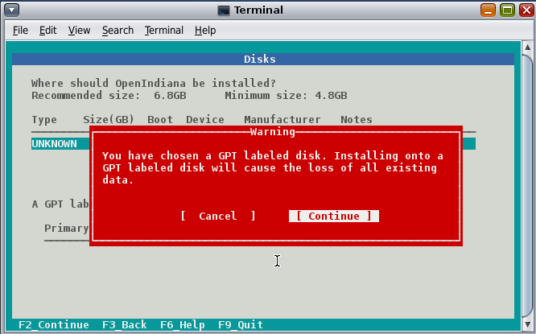
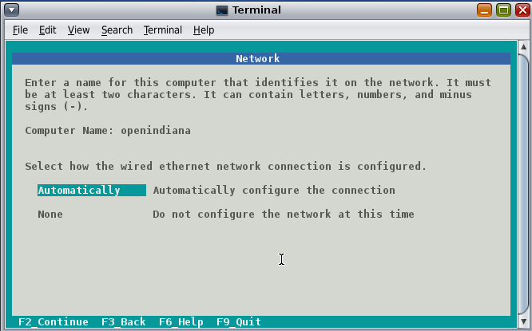
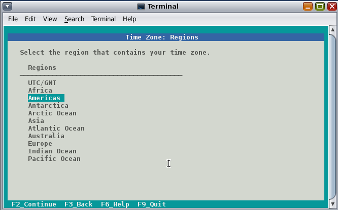
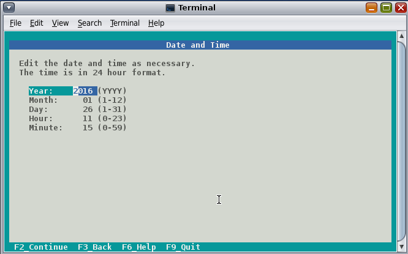
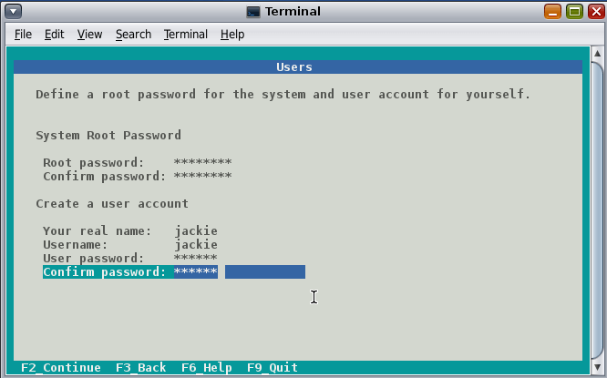
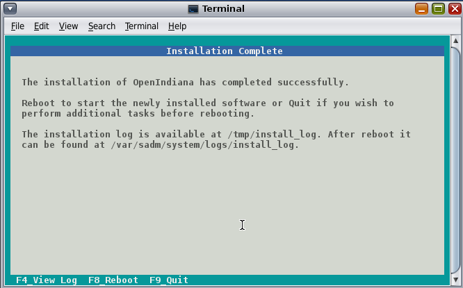

<!--

The contents of this Documentation are subject to the Public Documentation License Version 1.01
 (the "License"); you may only use this Documentation if you comply with the terms of this License.
A copy of the License is available at http://illumos.org/license/PDL.


The Original Documentation is _________________.

The Initial Writer of the Original Documentation is ___________ Copyright (C)_________[Insert year(s)].
All Rights Reserved. (Initial Writer contact(s):________________[Insert hyperlink/alias]).

Contributor(s): ______________________________________.

Portions created by ______ are Copyright (C)_________[Insert year(s)].
All Rights Reserved. (Contributor contact(s):________________[Insert hyperlink/alias]).

-->

# Getting started - (Draft) - work in progress

Import and validate (compare with FAQ, etc.): [old handbook intro](http://wiki.openindiana.org/oi/1.+Introduction)

## Introduction

The OpenIndiana project is the open source community which develops, maintains, and supports the [OpenIndiana](https://en.wikipedia.org/wiki/OpenIndiana) distribution, an [illumos](https://en.wikipedia.org/wiki/Illumos) based Unix-like operating system derived from OpenSolaris.
The purpose of the OpenIndiana Project is to ensure the continued availability of an openly developed distribution based on OpenSolaris.
The OpenIndiana project is also a continuation of the collaborative effort and community spirit of the [OpenSolaris project](https://en.wikipedia.org/wiki/OpenSolaris).

For a comprehensive history of the OpenSolaris project, see Jim Grisanzio's [OpenSolaris timeline](https://jimgrisanzio.wordpress.com/opensolaris/).

## OpenIndiana Software Releases

<!--

The content for this section is pulled from the OpenIndiana FAQ (section 'What is the OpenIndiana Release Schedule?').
As the FAQ evolves, try to keep this section in sync.

-->

Approximately every six months, the OpenIndiana project releases a snapshot of the Hipster rolling release branch.
Ideally suited for both workstations and servers, simply choose the installer type which best serves your needs.

| Workstation | Server
| --- | ---
| Live installer (Gnome desktop) | Text installer (command line console)

<!-- NOTE: --> <i class="fa fa-info-circle fa-lg" aria-hidden="true"></i> **NOTE:**
<div class="well">
OpenIndiana releases from the legacy oi-dev-151x branch are no longer maintained.
For those desiring to upgrade from legacy installations, Hipster IPS repositories are available.
While upgrades from the legacy branch are possible, the most trouble free method is to perform a clean install.
</div>

<!-- CAUTION: --> <i class="fa fa-exclamation-triangle fa-lg" aria-hidden="true"></i> **CAUTION:**
<div class="well">
Hipster is a rapid development branch where software versions are frequently updated.
While every package is tested to ensure stability, caution is nevertheless warranted when deploying Hipster into mission critical production environments.
</div>


## System Requirements

<!--

The content for this section is pulled from the OpenIndiana FAQ (section 'What are the recommended hardware specifications?').
As the FAQ evolves, try to keep this section in sync.

-->

| CPU | Disk Space | Memory (RAM)
| --- | --- | ---
| 64 Bit | 20GB (or more) | 4GB (or more)


## Preparation for Installing OpenIndiana Hipster

### Downloading the software

<!--

The content for this section is pulled from the OpenIndiana FAQ (section 'Where can I download OpenIndiana Hipster?').
As the FAQ evolves, try to keep this section in sync.

-->

* [Primary Mirror](http://dlc.openindiana.org/isos/hipster)
* [Vim.org Alternate Mirror](http://ftp.vim.org/os/openindiana.org/dlc/isos/hipster)
* [Torrents](http://dlc.openindiana.org/torrents/)

If you wish to purchase a ready made DVD or USB drive there is also [OSDISC.COM](https://www.osdisc.com/products/solaris/openindiana).

## Creating a bootable OpenIndiana DVD

* Obtain the software from the download site
* Check MD5/SHA
* Burn it to a DVD

#### BSD

```bash
cdrecord dev=device imagefile.iso
```

Note: Use the `cdrecord -scanbus` command to locate your CD/DVD writer device.


#### Illumos/Solaris

< Place holder for content >

#### Linux

**Linux Console** <i class="fa fa-linux fa-lg" aria-hidden="true"></i>

```bash
$ wget "http://dlc.openindiana.org/isos/hipster/OI-hipster-gui-20160421.iso"
$ wget "http://dlc.openindiana.org/isos/hipster/OI-hipster-gui-20160421.iso.sha256sum"
$ sha256sum --check OI-hipster-gui-20160421.iso.sha256sum
OI-hipster-gui-20160421.iso: OK
$ wodim -v dev=/dev/sr0 -dao OI-hipster-gui-20160421.iso

```

**Linux GUI** <i class="fa fa-linux fa-lg" aria-hidden="true"></i>
<div class="well">
There are many different CD/DVD writer applications available for Linux.

| Desktop | Application
| --- | ---
| GNOME | Brasero
| KDE | K3B

Other desktops may offer additional choices.
For further information, please consult the help documentation for your Linux distribution.
</div>

#### Mac OS-X

**MAC Console** <i class="fa fa-apple fa-lg" aria-hidden="true"></i>

```bash
growisofs -Z /dev/dvdrw=image.iso
```


**MAC GUI** <i class="fa fa-apple fa-lg" aria-hidden="true"></i>
<div class="well">
Applications > Utilities > Disk Utility
</div>

#### Windows

**Windows Console** <i class="fa fa-windows fa-lg" aria-hidden="true"></i>

Isoburn is a Windows GUI utility which can be launched via the command prompt as follows:

```cmd
ISOBURN.EXE [/Q] [<drive letter>:] <disk image file name>
```

**Windows GUI** <i class="fa fa-windows fa-lg" aria-hidden="true"></i>
<div class="well">
From within Windows Explorer:

* Browse to and select the ISO image file
* Right click the ISO image file
* From the right click menu, select "Burn Disk Image"
</div>

## Creating a bootable OpenIndiana USB Flash Drive

#### Prerequisites

* USB flash drive - (2GB or larger)
* Download the OpenIndiana USB Live Media installer
* Download the appropriate OpenIndiana 1G or 2G header file

<!-- NOTE: --> <i class="fa fa-info-circle fa-lg" aria-hidden="true"></i> **NOTE:**
<div class="well">
At this time, creating a bootable flash drive requires the use of a header file.

- There are 2 unique USB header files (1G and 2G).
- Please ensure you have selected the correct file.
    - The 1G.header is only suitable for use with the text installer (Command line console).
    - The 2G.header is only suitable for use with the live installer (Gnome desktop).
    - The files are *NOT* interchangeable.

Failure to use the correct USB header file can result in the USB drive either failing to boot, or only partially booting (and falling back to systems maintenance mode with KSH93 errors).
</div>

<!-- CAUTION: --> <i class="fa fa-exclamation-triangle fa-lg" aria-hidden="true"></i> **CAUTION:**
<div class="well">
OpenIndiana Hipster does not yet support USB 3.0.

* When attaching backward compatible USB 3.0 devices to your system, please ensure they are *NOT* attached to a USB 3.0 port.
</div>

#### Live Media Creation Methods

| Operating System | Method |
| --- | --- |
| BSD | `dd` |
| illumos/Solaris | `dd` |
| Linux | ``dd`` |
| MAC OS X | ``dd`` |
| Windows | ``OpenSolaris Live USB Creator`` |

<!--

TODO:

Add link for Solaris USBCOPY tool.

-->

#### Identifying the path to your USB device

| Operating system | Command | Device
| --- | --- | ---
| BSD | `camcontrol devlist` | `/dev/da*`
| illumos/Solaris | `rmformat -l` | `/dev/rdsk/c*t*d*`
| Linux | `lsblk` | `/dev/sd*`
| MAC OS X | `diskutil list` | `/dev/disk*`
| Windows | N/A | N/A


<!-- CAUTION: --> <i class="fa fa-exclamation-triangle fa-lg" aria-hidden="true"></i> **CAUTION:**
<div class="well">
When issuing the USB copy command, be sure to specify the entire USB device.

* Do not including any partition or slice number.
    * For example use `sda`, not `sda1`; `c0t0d0`, not `c0t0d0p1`.
* Make sure you identify the correct storage device.
    * All data on the device will be erased.
* If any filesystems are located on the USB storage device, they must first be unmounted.
    * Desktops may automatically mount removable devices.
    * As necessary, select any desktop icons for the USB device and issue an 'Eject' or 'Unmount' command.
    * For Linux, use `umount <path>`.
    * For illumos/Solaris use `rmumount <path>`.
    * for MAC OS X use `diskutil unmountDisk <path>`.
    * Verify using the `mount` command.
</div>


### BSD/Linux/OS X

```bash
$ cat 1G.header OI-hipster-text-20160421.usb | sudo dd bs=1024k of=/dev/sdX
# or if you have a live image larger then 1G
$ cat 2G.header OI-hipster-gui-20160421.usb | sudo dd bs=1024k of=/dev/sdX
# where "X" is the letter of your USB device
```

### illumos/Solaris

< Place holder for content >

### Windows

Doc Team Note: The FreeBSD project recommends [Win32 Disk Imager](https://sourceforge.net/projects/win32diskimager/) to write USB keys on the Windows operating system. This is a more modern application than the old "OpenSolaris Live USB creator" utility. We'll need to test this to ensure this works with the OpenIndiana USB images.


## Testing Openindiana Using Live Media

The Live Media DVD and USB installers provide a graphical live environment where you can explore OpenIndiana and test the compatibility of your hardware.
When using Live Media to explore OpenIndiana, no changes are made to your system, unless you explicitly choose to install OpenIndiana.

Although it is possible to use it over a network with SSH X forwarding if you enable SSH.


## Booting OpenIndiana

Insert the bootable media (DVD or USB flash drive) and boot (start/restart) your computer.
When you see the boot menu, press the enter key to start OpenIndiana on your computer.
As it runs, you will be prompted with a few questions.

<!-- NOTE: --> <i class="fa fa-info-circle fa-lg" aria-hidden="true"></i> **NOTE:**
<div class="well">

For the computer to boot from the media, you may need to specify the device by pressing the boot order hotkey.
Alternately, you may need to change the boot device order in your BIOS configuration.

</div>

<!-- CAUTION: --> <i class="fa fa-exclamation-triangle fa-lg" aria-hidden="true"></i> **CAUTION:**
<div class="well">

OpenIndiana does not yet support UEFI (Unified Extensible Firmware Interface) or secure boot.
These technologies must be disabled prior to booting an OpenIndiana DVD or USB stick.

</div>


#### Booting Physical Hardware

<!-- CAUTION: --> <i class="fa fa-exclamation-triangle fa-lg" aria-hidden="true"></i> **CAUTION:**
<div class="well">

Booting OpenIndiana on unsupported hardware may cause excessive CPU usage, instability, or other problems.

Please be sure to consult the hardware compatibility list (HCL):

* [Illumos HLC](https://www.illumos.org/hcl/)
* [OpenIndiana HCL - components](http://wiki.openindiana.org/oi/Components)
* [OpenIndiana HCL - systems](http://wiki.openindiana.org/oi/Systems)

</div>

**DOC TEAM NOTE:**

* Gigabyte motherboards with Intel socket 775 and ICH10 chipset don't work well with OI.
    * Kernel CPU usage can range from 40-80% cpu @ idle.
* Seems to work OK on Intel brand desktop motherboards though.
* Works well with HP Zxxx class workstation hardware.


#### Booting Virtual Hardware

The most efficient way to boot a virtual machine is to boot directly from the DVD ISO file.
Alternately, you may use host to guest DVD/USB passthrough to boot from physical media.

| Hypervisor | Configuration Notes
| --- | ---
| Virtualbox | OS type = Solaris 11 64-bit
| Vmware player | OS type = Solaris 11 64-bit
| KVM | OS type = Sun OpenSolaris


### Authenticating when using the OpenIndiana LiveDVD

The user login for the text session is username 'jack' along with the password 'jack'.
For administrative or elevated access, prepend your commands with `pfexec`.
You may also use the `sudo` command.

You may obtain root using the `su` command along with the password 'openindiana'.


### Using the Device Driver Utility

Available from the LiveDVD, the _Device Driver Utility_ allows you to check whether your hardware requires additional drivers.


## Preparing to Install OpenIndiana

< Place Holder for section introduction content >


### Backing up data

< Place holder for content >


### Deciding where to install OpenIndiana

< Place holder for content >


### Gathering Network Information

< Place holder for content >


## Installing OpenIndiana


**DOC TEAM NOTE:**

For some guidance writing this section: 

Installation walkthrough: [web link](http://technodrone.blogspot.com/2012/05/openindiana-installation-walkthrough.html)

Installation videos: [web link](https://www.youtube.com/watch?v#VVWP_5oAy3w)


### Installing OpenIndiana from Live Media

To install OpenIndiana from Live Media, you have two options.

* GUI based guided install.
* Text based guided install.

Each of these options is represented by a desktop icon.
Select the appropriate installer option by clicking the corresponding desktop installer icon.


#### GUI based Guided Install

< Place Holder for Content >


#### Text based Guided Install

The text based guided install start and runs within a command line console.
Navigation within the installer is performed by pressing specifically designated navigation keys (F2, Tab, etc.).

<!-- NOTE: --> <i class="fa fa-info-circle fa-lg" aria-hidden="true"></i> **NOTE:**
<div class="well">
The non-graphical text based bootable media installer also uses this very same _Text based Guided Install_.
</div>

Start the Text based Guided Install by double clicking the Text based Guided Install icon.


When you begin the Text based Guided Install, you are presented with the welcome screen.
Press F2 to continue.


The installer identifies the disks which are available for installation.
If you have only a single disk, it is already selected.
If you have multiple disks, use the arrow keys to select the appropriate disk.
When finished, press F2 to continue.

<!-- NOTE: --> <i class="fa fa-info-circle fa-lg" aria-hidden="true"></i> **NOTE:**
<div class="well">
Disregard the minimum and recommended sizes as they do not take into account periodic disk usage growth as the result of ZFS snapshots.
To account for this, your disk should be at least 25GB or more.
</div>



If your disk contains a GPT disk label, the entire disk will be reformatted.
This warning serves as your advisory.
If this is acceptable, press F2 to continue.
Otherwise use the arrow keys to select cancel.


In this screen you are presented with the choice of how to partition the disk.
You may select to use an EFI partition (which uses the entire disk), or you may choose to create MBR partitions.
Using the arrow keys select the appropriate choice and press F2 to continue.


Specify the computer name you wish to use.
By default the computer name is _openindiana_.



This screen is the same as as the previous.
We have illustrated it twice to help clarify the 2 distinct configuration tasks which need to be completed on the screen.

After configuring the computer name, now you need to decide whether to automatically configure networking (DHCP), or leave network unconfigured.
Use the arrow keys to select your choice.
Press the F2 key to continue.



In this screen (and the following 2 screens) you will configure your time zone.
If you select UTC/GMT, you will only be presented with this single screen.
Using the arrow keys select the appropriate region.
Press F2 to continue.


Using the arrow keys, select your time zone location.
Press F2 to continue.


Using the arrow keys, select the appropriate time zone.
Press F2 to continue.



In this screen you may configure the date and time.
Using the arrow keys navigate between the fields.
Press F2 to continue.



In this screen you are presented with several different fields to configure.
Using the arrow keys navigate between the fields.
Press F2 to continue.

<!-- NOTE: --> <i class="fa fa-info-circle fa-lg" aria-hidden="true"></i> **NOTE**
<div class="well">
The regular user specified on this screen is granted the _root_ role.
In effect this means by default (and without any further configuration) this user can perform administrative task by assuming the root role as needed.
Also, after installation the root password is automatically expired and needs to be changed prior to being used for any administrative task.
</div>


Now that you have completed the installation configuration, you are presented with an _Installation Summary_.
If these configuration settings are correct, begin the installation by pressing the F2 key.


Installation progress is measured by means of a status bar.



After the installation completes you are presented with a summary screen.
The installation logs are available by pressing the F4 key.
If you ran the installation from Live Media, can exit the installation by pressing F9.
Otherwise, you will want to reboot the system using the F8 key.

### Installing OpenIndiana using the Text Installer

The text installer is not graphical nor does it have a live environment.
When you boot from the text installer, you have the following choices:

* Install OpenIndiana
* Spawn a shell to be used as a rescue disk.

The text installer installation process uses the previously described _Text based Guided Install_.


## Troubleshooting Installations

* If you do not see a menu after booting your computer with the DVD or USB device, and instead see some text and a ``grub>`` prompt, there may be an error in your copy of the installer, or it was created incorrectly.
* If you see a ``login:`` prompt after selecting your keyboard and language and no desktop appears after several seconds, there may be a problem with the drivers for your graphics hardware.
    * Please let us know via IRC or the mailing list if this happens.
    * When you contact us, please include any error messages you see on the console, as well as the output of the `svcs -xv` command.
    * If possible, also include the contents of the file `/var/log/Xorg.0.log`.


### USB 3.0 issues

**DOC TEAM NOTE:**

Bring this guidance in alignment with the USB 3.0 warnings found elsewhere in the handbook, FAQ, etc.

* OpenIndiana Hipster does not currently support USB3.
* You cannot boot a USB thumbdrive installer from a USB3 port.


## Using OpenIndiana

< place holder >


## Installing Applications

Import and validate: [pgk cheat sheet](http://wiki.openindiana.org/oi/pkg+Cheat+Sheet)


## Xorg

< placeholder >


### Video Card Support (3D)

Nearly all cards are supported for 2nd, but only Nvidia is supported for 3D.
Work is progressing to provide support for AMD and Intel.


#### Nvidia

* Talk about the expected behavior when booting the live CD from a system with an NVIDIA card.
* Discuss procedure for adding an NVIDIA card to a system that was using VESA or some other non-3d video driver.
* Troubleshooting - what logs to look at, manual configuration, etc.
* Walk through NVIDIA utility screens.


#### AMD

* Currently no 3rd support, VESA driver only.


#### Intel

* Still working to incorporate this into Hipster.


### How does one add a missing device driver?

< Write about finding hardware id's, searching for drivers, installing, loading, /etc/driver_alias'es file. >


