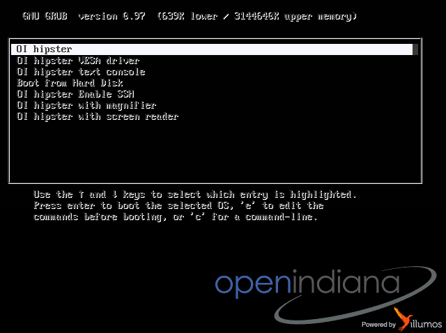
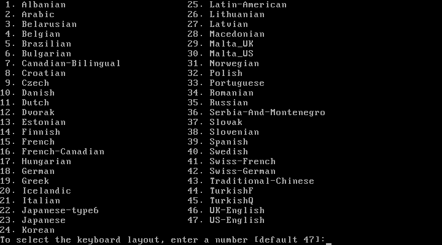
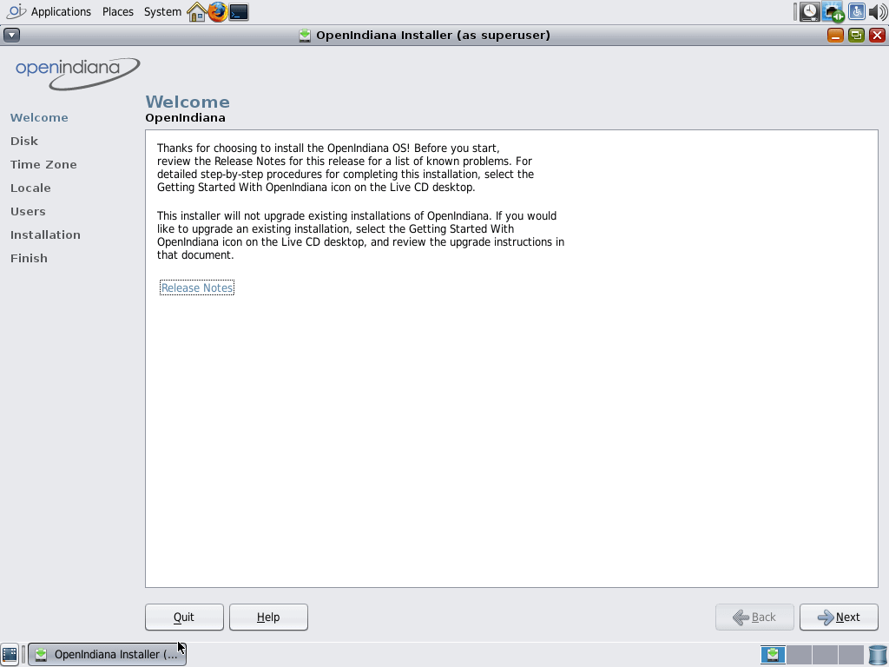
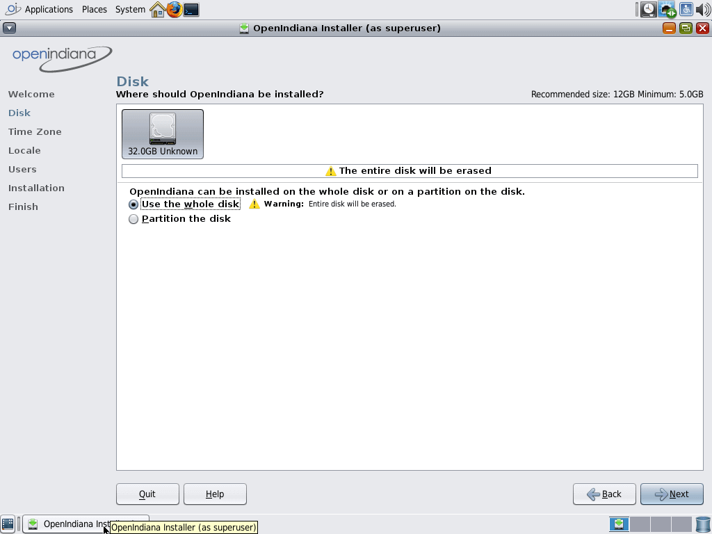
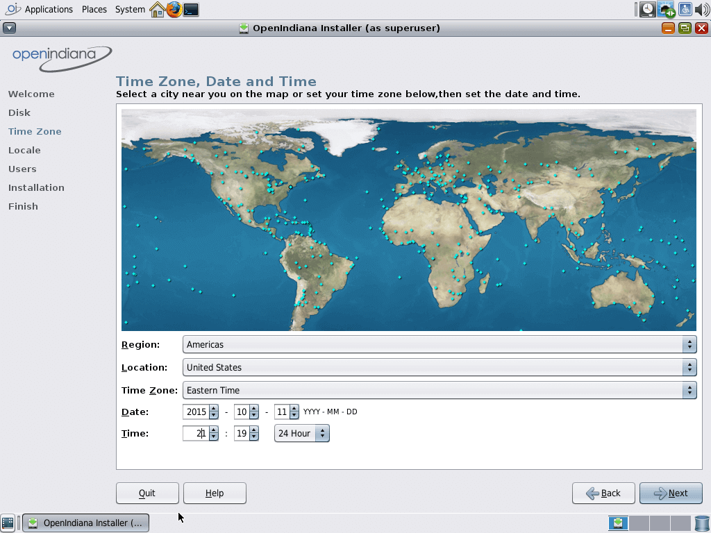
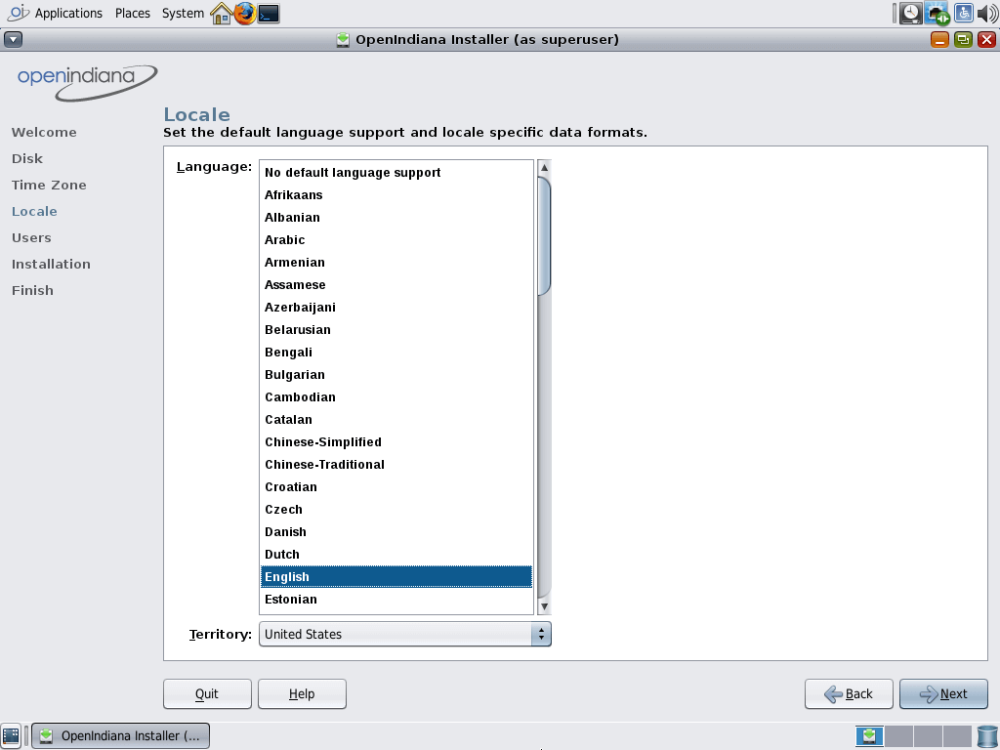
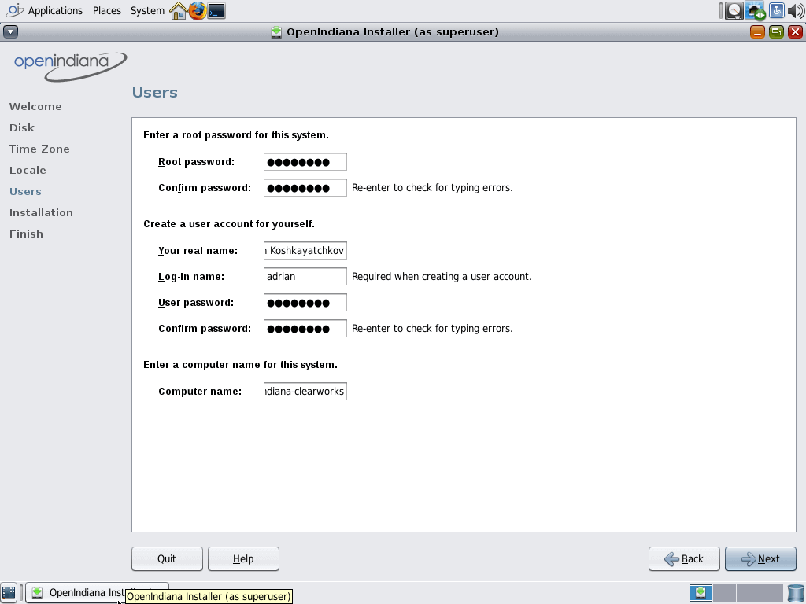
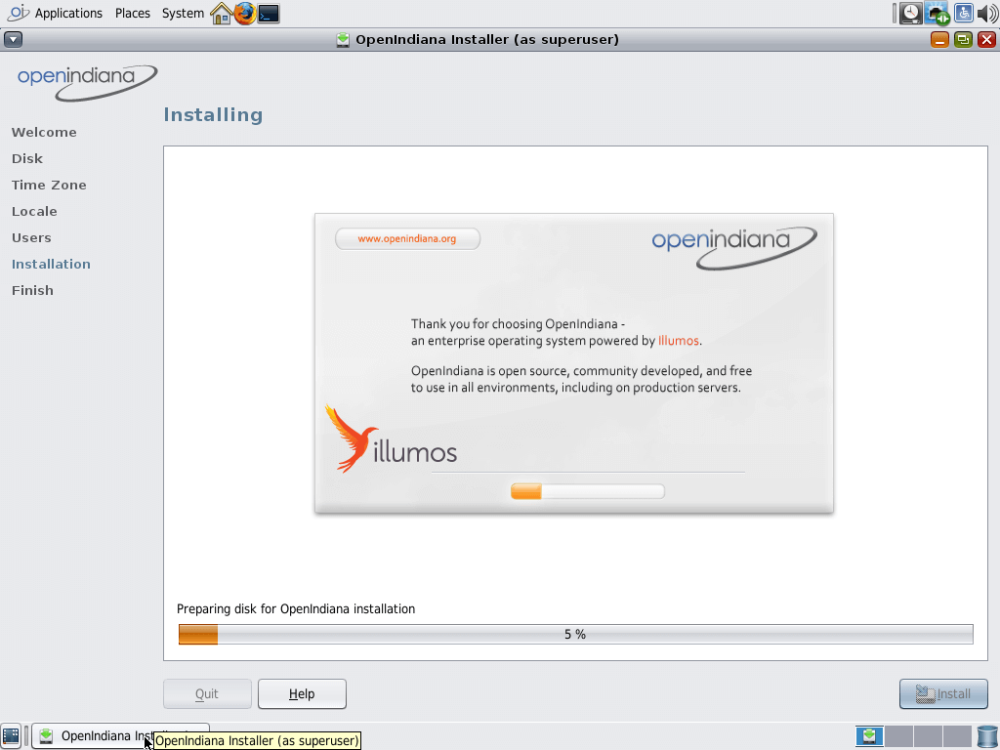
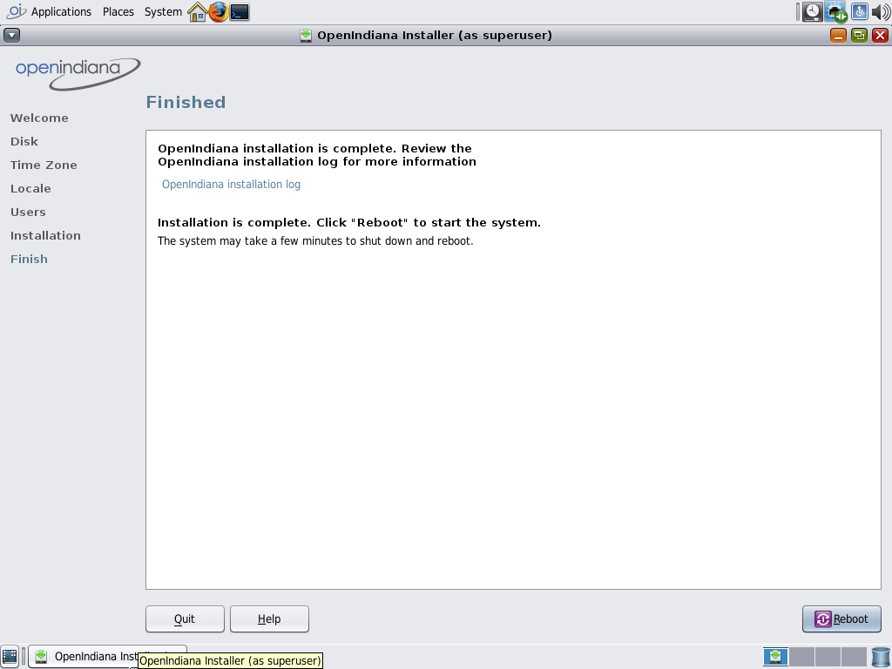

<!--

The contents of this Documentation are subject to the Public Documentation License Version 1.01
 (the "License"); you may only use this Documentation if you comply with the terms of this License.
A copy of the License is available at http://illumos.org/license/PDL.


The Original Documentation is _________________.

The Initial Writer of the Original Documentation is ___________ Copyright (C)_________[Insert year(s)].
All Rights Reserved. (Initial Writer contact(s):________________[Insert hyperlink/alias]).

Contributor(s): ______________________________________.

Portions created by ______ are Copyright (C)_________[Insert year(s)].
All Rights Reserved. (Contributor contact(s):________________[Insert hyperlink/alias]).

-->

# OpenIndiana Handbook - Getting Started

<!-- NOTE: --> <i class="fa fa-info-circle fa-lg" aria-hidden="true"></i> **NOTE:**
<div class="well">

This document is a work in progress (draft).

</div>

Import and validate (compare with FAQ, etc.): [old handbook intro](http://wiki.openindiana.org/oi/1.+Introduction)

## Introduction

The OpenIndiana project is the open source community which develops, maintains, and supports the [OpenIndiana](https://en.wikipedia.org/wiki/OpenIndiana) distribution, an [illumos](https://en.wikipedia.org/wiki/Illumos) based Unix-like operating system derived from OpenSolaris.
The purpose of the OpenIndiana Project is to ensure the continued availability of an openly developed distribution based on OpenSolaris.
The OpenIndiana project is also a continuation of the collaborative effort and community spirit of the [OpenSolaris project](https://en.wikipedia.org/wiki/OpenSolaris).

For a comprehensive history of the OpenSolaris project, see Jim Grisanzio's [OpenSolaris timeline](https://jimgrisanzio.wordpress.com/opensolaris/).

## OpenIndiana software releases

<!--

The content for this section is pulled from the OpenIndiana FAQ (section 'What is the OpenIndiana Release Schedule?').
As the FAQ evolves, try to keep this section in sync.

-->

Approximately every six months, the OpenIndiana project releases a snapshot of the Hipster rolling release branch.
Ideally suited for both workstations and servers, simply choose the installer type which best serves your needs.

| Workstation | Server
| --- | ---
| Live installer (Gnome desktop) | Text installer (command line console)

<!-- NOTE: --> <i class="fa fa-info-circle fa-lg" aria-hidden="true"></i> **NOTE:**
<div class="well">

* The legacy oi-dev-151x branch is no longer maintained.
* While upgrades to Hipster are possible, the most trouble free method is to perform a clean install.

</div>

<!-- CAUTION: --> <i class="fa fa-exclamation-triangle fa-lg" aria-hidden="true"></i> **CAUTION:**
<div class="well">

Hipster is a rapid development branch where software versions are frequently updated.
While every package is tested to ensure stability, caution is nevertheless warranted when deploying Hipster into mission critical production environments.

</div>


## System requirements

<!--

The content for this section is pulled from the OpenIndiana FAQ (section 'What are the recommended hardware specifications?').
As the FAQ evolves, try to keep this section in sync.

-->

| CPU | Disk Space | Memory (RAM)
| --- | --- | ---
| 64 Bit | 20GB (or more) | 2GB (or more)


<!-- NOTE: --> <i class="fa fa-info-circle fa-lg" aria-hidden="true"></i> **NOTE:**
<div class="well">

* For the best performance (and to reduce the possibility of disk swapping), allocate 4GB RAM or more.
* For desktops, ensure total system memory (RAM + swap) are at least 4GB or greater.
* The default size of the OpenIndiana swap file is 50% of installed memory.
    * Minimum and maximum default swap allocations are 512MB and 32GB respectively.

</div>


## Preparation for installing OpenIndiana

Prior to installing OpenIndiana:

* Ensure your system meets the recommended hardware requirements.
* Ensure to consult the HCL.


<!-- CAUTION: --> <i class="fa fa-exclamation-triangle fa-lg" aria-hidden="true"></i> **CAUTION:**
<div class="well">

Installing OpenIndiana on unsupported hardware may cause excessive CPU usage, instability, or other problems.

Please be sure to consult the hardware compatibility list (HCL):

* [Illumos HLC](https://www.illumos.org/hcl/)
* [OpenIndiana HCL - components](http://wiki.openindiana.org/oi/Components)
* [OpenIndiana HCL - systems](http://wiki.openindiana.org/oi/Systems)

</div>

**DOC TEAM NOTE:**

* Gigabyte motherboards with Intel socket 775 and ICH10 chipset don't work well with OI.
    * Kernel CPU usage can range from 40-80% cpu @ idle.
* Seems to work OK on Intel brand desktop motherboards though.
* Works well with HP Zxxx class workstation hardware.


### Backing up data

<!-- CAUTION: --> <i class="fa fa-exclamation-triangle fa-lg" aria-hidden="true"></i> **CAUTION:**
<div class="well">

Before attempting to install OpenIndiana, first ensure you backup any important data.
Do not save the data on another partition or on another disk within the same system.
Instead save the data to an external device such as a USB hard drive, or external system (network backup service, or a networked system).
Always verify your backed up data.

</div>


### Deciding where to install OpenIndiana

By default the OpenIndiana installer creates an EFI partition using a GPT partition table.
Using this option, OpenIndiana will use the entire disk.
No other operating system can share the same disk.

Optionally you may use a legacy MBR partition.
MBR partitions will allow you to create multiple partitions.
MBR will also support dual booting another operating system.

Another option is to install to a virtual machine.


### Gathering network information

If you network uses a DHCP server, OpenIndiana can be configured to automatically obtain it's network information.
If a DHCP server is not available, then you will need to manually configure your network settings.

Obtain the following information:

1. IP address
2. Subnet mask
3. Gateway
4. Network domain name
5. Network DNS servers


### Downloading the software

<!--

The content for this section is pulled from the OpenIndiana FAQ (section 'Where can I download OpenIndiana Hipster?').
As the FAQ evolves, try to keep this section in sync.

-->

* [Primary Mirror](http://dlc.openindiana.org/isos/hipster)
* [Vim.org Alternate Mirror](http://ftp.vim.org/os/openindiana.org/dlc/isos/hipster)
* [Torrents](http://dlc.openindiana.org/torrents/)

If you wish to purchase a ready made DVD or USB drive there is also [OSDISC.COM](https://www.osdisc.com/products/solaris/openindiana).

Download Example:

```bash
wget "http://dlc.openindiana.org/isos/hipster/OI-hipster-gui-20160421.iso"
wget "http://dlc.openindiana.org/isos/hipster/OI-hipster-gui-20160421.iso.sha256sum"
```

### Checking the MD5/SHA

Checksum Verification Example:

```bash
sha256sum --check OI-hipster-gui-20160421.iso.sha256sum
OI-hipster-gui-20160421.iso: OK
```


## Creating a bootable OpenIndiana DVD


### BSD/illumos/Solaris

**UNIX Console** <i class="fa fa-sun-o" aria-hidden="true"></i>

```bash
cdrecord dev=device imagefile.iso
```

To locate your device:

* For BSD, use the `cdrecord -scanbus`
* For illumos/Solaris, use `rmformat -l`


**UNIX GUI** <i class="fa fa-sun-o" aria-hidden="true"></i>
<div class="well">

Use the application specific to your desktop (Brasero, K3B, etc.)

</div>

### Linux

**Linux Console** <i class="fa fa-linux fa-lg" aria-hidden="true"></i>

```bash
wodim -v dev=device -dao imagefile.iso
```

**Linux GUI** <i class="fa fa-linux fa-lg" aria-hidden="true"></i>
<div class="well">

There are many different CD/DVD writer applications available for Linux.

| Desktop | Application
| --- | ---
| GNOME | Brasero
| KDE | K3B

Other desktops may offer additional choices.
For further information, please consult the help documentation for your Linux distribution.

</div>


### Mac OS-X

**MAC Console** <i class="fa fa-apple fa-lg" aria-hidden="true"></i>

```bash
growisofs -Z /dev/dvdrw=image.iso
```


**MAC GUI** <i class="fa fa-apple fa-lg" aria-hidden="true"></i>
<div class="well">

Applications > Utilities > Disk Utility

</div>


### Windows

**Windows Console** <i class="fa fa-windows fa-lg" aria-hidden="true"></i>

Isoburn is a Windows GUI utility which can be launched via the command prompt as follows:

```cmd
ISOBURN.EXE [/Q] [<drive letter>:] <disk image file name>
```

**Windows GUI** <i class="fa fa-windows fa-lg" aria-hidden="true"></i>
<div class="well">

From within Windows Explorer:

* Browse to and select the ISO image file
* Right click the ISO image file
* From the right click menu, select "Burn Disk Image"

</div>


## Creating a bootable OpenIndiana USB flash drive


### Prerequisites

* USB flash drive - (2GB or larger)
* Download the OpenIndiana USB Live Media installer
* Download the appropriate OpenIndiana 1G or 2G header file

<!-- NOTE: --> <i class="fa fa-info-circle fa-lg" aria-hidden="true"></i> **NOTE:**
<div class="well">

At this time, creating a bootable flash drive requires the use of a header file.

* There are 2 unique USB header files (1G and 2G).
* Please ensure you have selected the correct file.
    * The 1G.header is only suitable for use with the text installer (Command line console).
    * The 2G.header is only suitable for use with the live installer (Gnome desktop).
    - The files are **NOT** interchangeable.

Failure to use the correct USB header file can result in the USB drive either failing to boot, or only partially booting (and falling back to systems maintenance mode with KSH93 errors).

</div>

<!-- CAUTION: --> <i class="fa fa-exclamation-triangle fa-lg" aria-hidden="true"></i> **CAUTION:**
<div class="well">

OpenIndiana Hipster does not yet support USB 3.0.

* When attaching backward compatible USB 3.0 devices to your system, please ensure they are *NOT* attached to a USB 3.0 port.

</div>


#### Identifying the path to your USB device

| Operating system | Command | Device
| --- | --- | ---
| BSD | `camcontrol devlist` | `/dev/da*`
| illumos/Solaris | `rmformat -l` | `/dev/rdsk/c*t*d*`
| Linux | `lsblk` | `/dev/sd*`
| MAC OS X | `diskutil list` | `/dev/disk*`
| Windows | N/A | N/A


<!-- CAUTION: --> <i class="fa fa-exclamation-triangle fa-lg" aria-hidden="true"></i> **CAUTION:**
<div class="well">

When issuing the USB copy command, be sure to specify the entire USB device.

* Do not including any partition or slice number.
    * For example use `sda`, not `sda1`; `c0t0d0`, not `c0t0d0p1`.
* Make sure you identify the correct storage device.
    * All data on the device will be erased.
* If any filesystems are located on the USB storage device, they must first be unmounted.
    * Desktops may automatically mount removable devices.
    * As necessary, select any desktop icons for the USB device and issue an 'Eject' or 'Unmount' command.
    * For Linux, use `umount <path>`.
    * For illumos/Solaris use `rmumount <path>`.
    * for MAC OS X use `diskutil unmountDisk <path>`.
    * Verify using the `mount` command.

</div>


### BSD/illumos/Solaris/Linux/OS X

```bash
$ cat 1G.header OI-hipster-text-20160421.usb | sudo dd bs=1024k of=/dev/sdX
```

For live images larger than 1GB, use the following command instead.

```bash
$ cat 2G.header OI-hipster-gui-20160421.usb | sudo dd bs=1024k of=/dev/sdX

# where "X" is the letter of your USB device
```


### Windows

**Doc Team Note:**

The FreeBSD project recommends [Win32 Disk Imager](https://sourceforge.net/projects/win32diskimager/) to write USB keys on the Windows operating system.
This is a more modern application than the old "OpenSolaris Live USB creator" utility.
We'll need to test this to ensure this works with the OpenIndiana USB images.


## Booting OpenIndiana

Insert the bootable media (DVD or USB flash drive) and boot (start/restart) your computer.
When you see the boot menu, press the enter key to start OpenIndiana on your computer.
As it runs, you will be prompted with a few questions.

<!-- NOTE: --> <i class="fa fa-info-circle fa-lg" aria-hidden="true"></i> **NOTE:**
<div class="well">

For the computer to boot from the media, you may need to specify the device by pressing the boot order hotkey.
Alternately, you may need to change the boot device order in your BIOS configuration.

</div>

<!-- CAUTION: --> <i class="fa fa-exclamation-triangle fa-lg" aria-hidden="true"></i> **CAUTION:**
<div class="well">

OpenIndiana does not yet support UEFI (Unified Extensible Firmware Interface) or secure boot.
These technologies must be disabled prior to booting an OpenIndiana DVD or USB stick.

</div>


### Booting OpenIndiana on virtual hardware

The most efficient way to boot a virtual machine is to boot directly from the DVD ISO file.
Alternately, you may use host to guest DVD/USB passthrough to boot from physical media.
See the notes below for optimizing OpenIndiana for several popular hypervisors.

| Hypervisor | Configuration Notes
| --- | ---
| Virtualbox | OS type = Solaris 11 64-bit
| Vmware player | OS type = Solaris 11 64-bit
| KVM | <ul><li>OS type = Sun OpenSolaris</li><li>Remove USB Tablet</li><li>NIC = e1000</li><li>sound = AC97</li><li>Processor = Copy host CPU configuration</li><li>Disable CPU feature _'xsave'_</li><li>Video = QXL</li></ul>

### The OpenIndiana boot menu

<!-- NOTE: --> <i class="fa fa-info-circle fa-lg" aria-hidden="true"></i> **NOTE:**
<div class="well">

OpenIndiana will automatically boot the selected entry within 30 seconds.
To stop the boot timer, press the escape key.
To edit a boot entry, press the [e]dit key.
For a command line press the [c]ommand key.

</div>



The OpenIndiana boot menu offers multiple choices.
Use the arrow keys to select a boot entry.

* OI Hipster (normal boot)
* OI Hipster VESA driver
* OI Hipster text console
* Boot from Hard Disk
* OI Hipster Enable SSH
* OI Hipster with mangnifier
* OI Hipster with screen reader


### Selecting keyboard layout and display language



Select your keyboard layout by entering the number corresponding to your desired keyboard layout.
For example, select 47 for US-English, or 46 for UK-English, etc.
The default is US-English.


Select your language by entering the number corresponding to your desired language.
The default is English.


### The live media desktop


The Live Media DVD and USB installers provide a graphical live environment where you can explore OpenIndiana and test the compatibility of your hardware.
When using Live Media, no changes are made to your system unless you explicitly choose to install OpenIndiana.


### Live media authentication

The user login for the live media session is `jack` along with the password `jack`.
For administrative or elevated access, prepend your commands with `sudo`.
You may also use the `pfexec` command.

You may obtain root using the `su` command along with the password `openindiana`.


### Using the device driver utility

Available from the LiveDVD, the _Device Driver Utility_ allows you to check whether your hardware requires additional drivers.


## Installing OpenIndiana


**DOC TEAM NOTE:**

For some guidance writing this section:

Installation walkthrough: [web link](http://technodrone.blogspot.com/2012/05/openindiana-installation-walkthrough.html)

Installation videos: [web link](https://www.youtube.com/watch?v#VVWP_5oAy3w)


### Installing OpenIndiana from live media

To install OpenIndiana from Live Media, you have two options.

* GUI based guided install.
* Text based guided install.

Each of these options is represented by a desktop icon.
Select the appropriate installer option by clicking the corresponding desktop installer icon.


#### GUI based guided install



As soon as the desktop loads, click the ``Install OpenIndiana`` icon and this
window will appear, click next. (if you get error dialogue boxes, just close
them)



Here you can just select ``Use the whole disk`` if you're only going to install
OpenIndiana on this system, otherwise you can Selection ``Partition the disk``
and partition it accordingly.



On this screen you select your region, location, time zone, date, time, and
whether you want 24 hour or 12 hour time.



This screen is for setting up the ``locale`` which controls things like default
language support, date formats, etc.



Enter your ``root password``, your ``real name``, ``username`` and your users
``password``, Also set a ``hostname`` (computer-name).



The ``OS`` is now installing.
Go make a cup of coffee, or something! It might be a while.



Your installation of OpenIndiana installed correctly,
You can now reboot into your new shiny system!


#### Text based guided install

The text based guided install start and runs within a command line console.
Navigation within the installer is performed by pressing specifically designated navigation keys (F2, Tab, etc.).

<!-- NOTE: --> <i class="fa fa-info-circle fa-lg" aria-hidden="true"></i> **NOTE:**
<div class="well">
The non-graphical text based bootable media installer also uses this very same _Text based Guided Install_.
</div>

Start the Text based Guided Install by double clicking the Text based Guided Install icon.


When you begin the Text based Guided Install, you are presented with the welcome screen.
Press F2 to continue.


The installer identifies the disks which are available for installation.
If you have only a single disk, it is already selected.
If you have multiple disks, use the arrow keys to select the appropriate disk.
When finished, press F2 to continue.

<!-- NOTE: --> <i class="fa fa-info-circle fa-lg" aria-hidden="true"></i> **NOTE:**
<div class="well">
Disregard the minimum and recommended sizes as they do not take into account periodic disk usage growth as the result of ZFS snapshots.
To account for this, your disk should be at least 25GB or more.
</div>


If your disk contains a GPT disk label, the entire disk will be reformatted.
This warning serves as your advisory.
If this is acceptable, press F2 to continue.
Otherwise use the arrow keys to select cancel.


In this screen you are presented with the choice of how to partition the disk.
You may select to use an EFI partition (which uses the entire disk), or you may choose to create MBR partitions.
Using the arrow keys select the appropriate choice and press F2 to continue.


Specify the computer name you wish to use.
By default the computer name is _openindiana_.


This screen is the same as as the previous.
We have illustrated it twice to help clarify the 2 distinct configuration tasks which need to be completed on the screen.

After configuring the computer name, now you need to decide whether to automatically configure networking (DHCP), or leave network unconfigured.
Use the arrow keys to select your choice.
Press the F2 key to continue.


In this screen (and the following 2 screens) you will configure your time zone.
If you select UTC/GMT, you will only be presented with this single screen.
Using the arrow keys select the appropriate region.
Press F2 to continue.


Using the arrow keys, select your time zone location.
Press F2 to continue.


Using the arrow keys, select the appropriate time zone.
Press F2 to continue.


In this screen you may configure the date and time.
Using the arrow keys navigate between the fields.
Press F2 to continue.


In this screen you are presented with several different fields to configure.
Using the arrow keys navigate between the fields.
Press F2 to continue.

<!-- NOTE: --> <i class="fa fa-info-circle fa-lg" aria-hidden="true"></i> **NOTE**
<div class="well">
The regular user specified on this screen is granted the _root_ role.
In effect this means by default (and without any further configuration) this user can perform administrative task by assuming the root role as needed.
Also, after installation the root password is automatically expired and needs to be changed prior to being used for any administrative task.
</div>


Now that you have completed the installation configuration, you are presented with an _Installation Summary_.
If these configuration settings are correct, begin the installation by pressing the F2 key.


Installation progress is measured by means of a status bar.


After the installation completes you are presented with a summary screen.
The installation logs are available by pressing the F4 key.
If you ran the installation from Live Media, can exit the installation by pressing F9.
Otherwise, you will want to reboot the system using the F8 key.


### Installing OpenIndiana using the text installer

The text installer is not graphical nor does it have a live environment.
When you boot from the text installer, you have the following choices:

* Install OpenIndiana
* Spawn a shell to be used as a rescue disk.

The text installer installation process uses the previously described _Text based Guided Install_.


## Troubleshooting installations

* If you do not see a menu after booting your computer with the DVD or USB device, and instead see some text and a ``grub>`` prompt, there may be an error in your copy of the installer, or it was created incorrectly.
* If you see a ``login:`` prompt after selecting your keyboard and language and no desktop appears after several seconds, there may be a problem with the drivers for your graphics hardware.
    * Please let us know via IRC or the mailing list if this happens.
    * When you contact us, please include any error messages you see on the console, as well as the output of the `svcs -xv` command.
    * If possible, also include the contents of the file `/var/log/Xorg.0.log`.


### USB 3.0 issues

**DOC TEAM NOTE:**

Bring this guidance in alignment with the USB 3.0 warnings found elsewhere in the handbook, FAQ, etc.

* OpenIndiana Hipster does not currently support USB3.
* You cannot boot a USB thumbdrive installer from a USB3 port.


## The Image Package System (IPS)

<!-- NOTE: --> <i class="fa fa-info-circle fa-lg" aria-hidden="true"></i> **DOC TEAM NOTE:**
<div class="well">

Have a look at: [pgk cheat sheet](http://wiki.openindiana.org/oi/pkg+Cheat+Sheet) to see whether there is anything there which we might want to import and validate.

</div>

### Introduction

<!--The majority of the text below was taken from the PDL licensed document titled 'Getting Started with OpenSolaris 2008.11' -->

After an initial installation of the OpenIndiana Hipster operating system, you will find that many of the software applications that you use on a regular basis are not immediately available to you.
These software applications are available as packages in an Image Packaging System (IPS) repository for downloading and installing over the Internet.
A repository is a source for packages.

IPS is a network-centric packaging system written in Python.
IPS enables users to connect to the repository for the purpose of downloading and installing packages.
OpenIndiana Hipster uses IPS for its packaging system.

Besides installing packages from a repository, users can also perform the following tasks:

* Create and publish their own IPS packages
* Set up an OpenIndiana Hipster repository
* Mirror an existing repository
* Publish existing packages to a repository

Once you have installed packages, IPS enables you to search, update, and manage those packages on your system.

With IPS , you can upgrade your system to a newer build of OpenIndiana Hipster, install and update your software to the latest available versions in a repository, and retrieve packages from mirror repositories.

If the system on which IPS is installed is on the network, IPS can automatically access the OpenIndiana Hipster package repository.
For OpenIndiana Hipster, your IPS client can access the packages from <http://pkg.openindiana.org/hipster>.


### IPS packages

An IPS package is defined as a collection of files, directories, links, drivers and dependencies in a defined format.

Note the following points about IPS packages :

* An IPS package consists of a set of actions.
Actions are defined when an IPS package is being created.
Actions are used for defining the files and directories of the package, setting package attributes, declaring dependencies on other packages, creating users and groups, and installing device drivers.
Some actions may optionally have tags that provide meta information about the action such as locale information and debug configuration.


### IPS package archives (.p5p)

When the IPS system was originally conceived there was no standard on-disk format for an IPS package.
Hence, unlike a .rpm file, an SVR4 package, or a .nbm file, it was not possible to transfer an IPS package from system to system.
The repository where the IPS package resided was the only source for the package.
This is because in its native state, the IPS package is not something you can download from the IPS repository as a single archive file.

Recognizing this limitation of IPS, the `.p5p` IPS archive format was developed.
For `.p5p` IPS archives, files are stored in the pax archive format, along with additional metadata, such as IPS manifest files, and a specific layout of the contents.
The `pkgrecv` command is used to create `.p5p` IPS archives.

For example, to create a `.p5p` IPS package archive containing the package `editor/gnu-emacs` and all of its dependencies from the repository located at `http://example.com:10000`, use the following command:

```bash
pkgrecv -s http://example.com:10000 -d /my/emacs.p5p -a -r editor/gnu-emacs
```


### IPS commands

The Image Packaging System software provides the following commands:

| Command | Description
| --- | ---
| `pkg`<sup>1</sup> | Use the `pkg`<sup>1</sup> command to create an image, to install packages to your image, and to manage packages on your image.
| `pkgsend`<sup>1</sup> | Use the `pkgsend`<sup>1</sup> command to publish packages from your image to an existing repository.
| `pkg.depotd`<sup>1M</sup> | Use the `pkg.depotd`<sup>1M</sup> command to create and manage your own network repository or set up a mirror repositories.
| `pkgrecv` | Use the `pkgrecv` command to download the contents of a package from a server. The user can then modify the contents by adding additional package attributes and republish the package with the `pkgsend` command.

<!-- NOTE: --> <i class="fa fa-info-circle fa-lg" aria-hidden="true"></i> **NOTE:**
<div class="well">

* The `pkg`<sup>5</sup> man page describes the overall Image Packaging System.
* The `pkg`<sup>1</sup> man page describes the image packaging retrieval client.

</div>


### pkg<sup>1</sup> uses FMRIs

Each IPS package is represented by a _Fault Management Resource Identifier_ (FMRI).
The pkg<sup>1</sup> command uses valid FMRI package information to perform its command actions.
The FMRI includes descriptive information about the package, such as the package name, version information, and date.

For example:

FMRI: pkg://openindiana.org/image/editor/gimp@2.8.16-2016.0.0.0:20160702T042138Z

* Scheme – pkg
* Authority – openindiana.org
* PackageName – gimp
* Version String – Consists of three components :
    * Build Version – 2.8.16
    * Branch Version – 2016.0.0.0
    * Timestamp – 20160702T042138Z


### Searching for packages

The search command searches in the installed image if no options are specified.
With the `-r` option, the command searches for the package in the repository or repositories associated with the current image.

For example: `pkg search -r xchat`


### Listing information about packages

To list information about packages installed on the local system use the command `pkg list <package-name>`.

For example:

```bash
pkg list gimp
NAME (PUBLISHER)                                  VERSION                    IFO
image/editor/gimp                                 2.8.16-2016.0.0.2          i--
```

To list the entire contents of a package, use the command: `pkg contents <package-name>`.
If the package is not installed on the local system, use the `-r` option.


### Installing packages

Use the following command to install a package.

`pkg install [-v] pkg_fmri | <package-name>`

While packages can be installed by specifying their FMRI, it is often easier to substitute the FMRI for the common name of the package.
Also, use of the `-v` (verbose) switch is entirely optional.

For example:

```bash
pkg install xchat
           Packages to install:   1
            Packages to update:   1
            Services to change:   2
       Create boot environment:  No
Create backup boot environment: Yes

DOWNLOAD                                PKGS         FILES    XFER (MB)   SPEED
Completed                                2/2         38/38      2.6/2.6  746k/s

PHASE                                          ITEMS
Removing old actions                             4/4
Installing new actions                         69/69
Updating modified actions                        2/2
Updating package state database                 Done
Updating package cache                           1/1
Updating image state                            Done
Creating fast lookup database                   Done
```


<!-- NOTE: --> <i class="fa fa-info-circle fa-lg" aria-hidden="true"></i> **NOTE:**
<div class="well">

The `pkg install` command is also used to update specific packages on the system.
The `pkg install` command automatically checks for newer versions of specific packages or package groups and installs them if they are available.
Any dependent packages are also automatically updated.

</div>


### Updating packages

To update all the packages installed on a system to their latest available version, use the `pkg update` command.

For example:

```bash
pkg update
            Packages to remove:    4
           Packages to install:   11
            Packages to update: 1018
            Packages to change:    2
           Mediators to change:    1
       Create boot environment:  Yes
Create backup boot environment:   No

DOWNLOAD                                PKGS         FILES    XFER (MB)   SPEED
Completed                          1035/1035     7502/7502  303.4/303.4  886k/s

PHASE                                          ITEMS
Removing old actions                       3931/3931
Installing new actions                     6889/6889
Updating modified actions                11999/11999
Updating package state database                 Done
Updating package cache                     1022/1022
Updating image state                            Done
Creating fast lookup database                   Done

A clone of openindiana-1 exists and has been updated and activated.
On the next boot the Boot Environment openindiana-2 will be
mounted on '/'.  Reboot when ready to switch to this updated BE.


---------------------------------------------------------------------------
NOTE: Please review release notes posted at:

http://wiki.openindiana.org/display/oi/oi_hipster
---------------------------------------------------------------------------
```


### Removing packages

To remove a package from the system, use the command: `pkg uninstall <package-name>`


### IPS package repositories

As previously mentioned, the IPS repository is the remote network location where IPS packages reside.

To list the IPS repositories configured on your system, use the command `pkg publisher`.

To add a new publisher, use the command: `pkg set-publisher -g repository_url repository_name`

To change an existing publisher, use the following command syntax (substituting appropriate values):

```bash
pkg set-publisher \
-G http://pkg.openindiana.org/hipster-2015 \
-g http://pkg.openindiana.org/hipster openindiana.org
```

### IPS package repository precedence

When multiple repositories are associated with an installation image and when using the `pkg` command-line interface (CLI) with only package names, the following rules apply.
These rules can be overridden in the CLI by using explicit publishers and package version numbers.

| Package Installation Type | Rules When Only Package Names Are Provided
| --- | ---
| New package installations | The latest available version of new packages are always installed from the preferred publisher unless the publisher is provided in the FMRI during installation. Even if later versions of the package are available in other publishers, those later versions are not installed by default.
| Package updates: package originally installed from preferred publisher | If the package was originally installed from the preferred publisher, then the latest available update of the package can be installed from the _current_ preferred publisher. The package can be install from the _current_ preferred even if the preferred publisher designation had been moved to another publisher after the package had been originally installed. Even if later versions of the package are available in other publishers, those later versions are not installed by default.
| Package updates: package originally installed from non-preferred publisher | If the package was originally installed from a non-preferred publisher, then the latest available update of the package is installed from the publisher from which the package was originally installed. Even if later versions of the package are available in other publishers, those later versions are not installed by default.


### Listing package history

To list the IPS history, use the `pkg history` command.

For example:

```bash
pkg history
START                    OPERATION                CLIENT             OUTCOME
2016-04-21T03:30:04      purge-history            pkg                Succeeded
2016-07-02T16:09:56      uninstall                pkg                Succeeded
2016-07-02T16:10:33      uninstall                pkg                Succeeded
2016-07-02T16:11:08      uninstall                pkg                Succeeded
2016-07-02T16:11:42      uninstall                pkg                Succeeded
2016-07-02T16:12:18      set-property             pkg                Succeeded
2016-07-02T16:12:22      set-property             pkg                Succeeded
2016-07-02T16:37:06      refresh-publishers       pkg                Succeeded
2016-07-02T16:37:06      update                   pkg                Succeeded
2016-07-02T16:37:32      rebuild-image-catalogs   pkg                Succeeded
2016-07-02T17:33:44      install                  pkg                Succeeded
2016-07-02T17:35:11      install                  pkg                Succeeded
2016-07-02T18:31:39      install                  pkg                Succeeded
2016-07-04T19:49:19      install                  pkg                Succeeded
2016-07-04T19:49:23      refresh-publishers       pkg                Succeeded
2016-07-04T19:49:56      rebuild-image-catalogs   pkg                Succeeded
2016-07-09T01:16:43      install                  pkg                Succeeded
2016-07-09T01:16:45      refresh-publishers       pkg                Succeeded
2016-07-09T01:17:20      rebuild-image-catalogs   pkg                Succeeded
2016-07-09T11:33:05      install                  pkg                Succeeded
2016-07-09T11:33:07      refresh-publishers       pkg                Succeeded
2016-07-09T11:33:37      rebuild-image-catalogs   pkg                Succeeded
2016-07-09T12:27:23      update                   pkg                Succeeded
```

To view more details of a particular IPS transaction, use the command:

`pkg history -t 2016-07-09T11:33:05 -l`

The `-t` switch allows you to specify a particular transaction and the `-l` switch provides extended details of that transaction.


### Finding help with pkg

The primary source of help for any OpenIndiana command is to review the man page for the command.
Therefore, be sure to consult the `pkg`<sup>1</sup> man page for full information and usage examples.

To quickly reference command usage directly from the command line, use `pkg help`.

To retrieve additional information about a specific command use: `pkg help <command name>`

For example:

```bash
pkg help update
Usage:
        pkg update [-fnvq] [-C n] [-g path_or_uri ...] [--accept] [--ignore-missing]
            [--licenses] [--no-be-activate] [--no-index] [--no-refresh]
            [--no-backup-be | --require-backup-be] [--backup-be-name]
            [--deny-new-be | --require-new-be] [--be-name name]
            [-r [-z image_name ... | -Z image_name ...]]
            [--sync-actuators | --sync-actuators-timeout timeout]
            [--reject pkg_fmri_pattern ...] [pkg_fmri_pattern ...]
```


### Legacy package management tools

OpenIndiana continues to support the use of legacy package tools for managing SVR4 packages.
Here are some of the available tools:

* pkginfo
* pkgadd
* pkgrm


### 3rd party package management tools

In addition to IPS and SVR4 package management tools, it is also possible to use `pkgsrc`.

For more information about pkgsrc, see the [Joyent package source website](https://pkgsrc.joyent.com/).

<!-- CAUTION: --> <i class="fa fa-exclamation-triangle fa-lg" aria-hidden="true"></i> **CAUTION:**
<div class="well">

The use of 3rd party repositories and package managers increases the likelihood of conflicts between package versions and their dependencies.
Furthermore, the OpenIndiana project cannot guarantee the qualify of packages obtained from 3rd party repositories.
Therefore, use 3rd party repositories and 3rd party package tools at your own risk.

</div>


## Managing boot environments

< Place Holder >


## Xorg

< placeholder >


### Video card support (3D)

Nearly all cards are supported for 2nd, but only Nvidia is supported for 3D.
Work is progressing to provide support for AMD and Intel.


#### Nvidia

* Talk about the expected behavior when booting the live CD from a system with an NVIDIA card.
* Discuss procedure for adding an NVIDIA card to a system that was using VESA or some other non-3d video driver.
* Troubleshooting - what logs to look at, manual configuration, etc.
* Walk through NVIDIA utility screens.


#### AMD

* Currently no 3rd support, VESA driver only.


#### Intel

* Still working to incorporate this into Hipster.


### How does one add a missing device driver?

< Write about finding hardware id's, searching for drivers, installing, loading, /etc/driver_alias'es file. >


